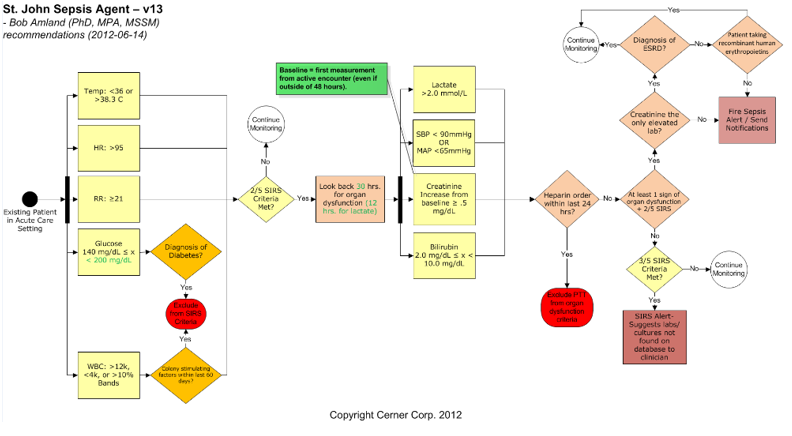

## Statistics Class


## Review Roll of Statistics

1.  Being an informed "Information Consumer"
2.  Understanding and Making Decisions
3.  Evaluate Decisions That Affect Your Life

### Announcements

* Chapter 9 homework due Friday
* Start reading chapter 10

# Chapter 10 Hypothesis Testing: Large-Sample for p 

## Hypothesis Structure

The **null hypothesis**, denoted $H_0$ is a statement or claim about a population characteristic that is initially assumed to be true.   

The **alternate hypothesis**, denoted by $H_a$ is the competing claim.   
The alternate hypothesis is a statement about the same population characteristic that is used in the null hypothesis   

Typically one assumes the null hypothesis to be true and then one of the following conclusions are drawn.  

1.  Reject $H_0$
    + Equivalent to saying that $H_a$ is correct or true
2.  Fail to reject $H_0$
    + Equivalent to saying that we have failed to show a statistically significant deviation from the claim

<div class="notes">
*  The null hypothesis is so named because it is the starting point for the investigation
*  Rejection of the null hypothesis will imply the acceptance of this alternative hypothesis
*  Example of judicial trial where assume a defendant is innocent ($H_0$) and present evidence to show guilt (reject $H_0$)
</div>

## Hypothesis Form

The form of the null hypothesis is  

$H_0$: population characteristic = hypothesized value   
where the hypothesized value is a specific number determined by the problem context.  

The alternative (or alternate) hypothesis will have one of the following three forms:   

* $H_a$: population characteristic > hypothesized value
* $H_a$: population characteristic < hypothesized value
* $H_a$: population characteristic $\ne$ hypothesized value

<div class="notes">
*  The null hypothesis must contain the equal sign
*  The alternate hypothesis should be what you are really attempting to show to be true
</div>

## Form Example

A researcher speculates that because of difference in diet, Japanese children may have a lower mean blood cholesterol level than U.S. children do.  Suppose that the mean level for U.S. children in known to be 170.   
Let $\mu$ represent the mean blood cholesterol level for all Japanese children.   

What hypothesis should the researcher test?

<div class="notes">
Problem 10.8  

*  $H_0: \mu = 170$
*  $H_a: \mu < 170$
</div>

## Errors in Hypothesis Testing

**Type I error (False Positive)** : The error of rejecting $H_0$ when $H_0$ is true.  Probability of a Type I error is denoted $\alpha$ and is called the **level of significance** of the test.  

**Type II error (False Negative)**: The error of failing to rejected $H_0$ when $H_0$ is false.  Probability of a Type II error is denoted by $\beta$.  

Null hypothesis $H_0$ | Valid/True | Invalid/False 
----------------|------------|----------------
Reject $H_0$ |$\begin{align}
\mbox{Type I error, } \alpha \\
\mbox{(False Positive)}  \\
\end{align}$| $\begin{align}
\mbox{Correct inference, Power} \\
\mbox{(True Positive)}  \\
\end{align}$
Fail to reject $H_0$ |$\begin{align}
\mbox{Correct inference} \\
\mbox{(True Negative)}  \\
\end{align}$| $\begin{align}
\mbox{Type II error, } \beta \\
\mbox{(False Negative)}  \\
\end{align}$

<br>
[Wiki on Type I or II errors](https://en.wikipedia.org/wiki/Type_I_and_type_II_errors)

## Error Example

A hospital has recently implemented an alert to have an early identification of sepsis, which is a life-threatening condition that arises when the body's responding to an infection.  Here are the results after the first month:

Alert | Sepsis Patient | Not Sepsis Patient 
----------------|------------|----------------
Sepsis Alert | 20 | 190  
No Sepsis Alert | 30 | 10

<br>

1.  What is the probability of a Type I Error (alpha) ?
2.  What is the probability of a Type II Error (beta) ?
3.  The hospital has the ability to change the parameters of the alert to be more or less [sensitive](https://en.wikipedia.org/wiki/Sensitivity_and_specificity).  What do you recommend?  

<div class="notes">
1.  20/50 = .4  therefore sensitivity is 60%
2.  10/190 = .05 therefore specificity is 95%
3.  More sensitive since it is a lower cost for over alert compared to saving lives  

Generally, with everything else held constant, decreasing one type of error causes the other to increase
</div>

## Algorithm Example



## Power of a test

The **power of a test** is the probability of rejecting the null hypothesis

When $H_0$ is false, the power is the probability that the null hypothesis is rejected. Specifically,  power = 1 - $\beta$.

Effects of Various Factors on Power  

1. The larger the size of the discrepancy between the hypothesized  value and the true value of the population characteristic, the higher the power.
2. The larger the significance level, $\alpha$ the higher the power of the test.
3. The larger the sample size, the higher the power of the test.  

What was the power sepsis alert on the previous example?

## Testing hypothesis for a population proportion

A **test statistic** is the function of sample data on which a conclusion to reject or fail to reject $H_0$ is based.

The  **P-value** (also called the **observed significance level**) is a measure of inconsistency between the hypothesized value for a population characteristic and the observed sample.

<div class="notes">
*  The P-value is the probability, assuming that $H_0$ is true, of obtaining a test statistic value at least as inconsistent with $H_0$ as what actually resulted.
</div>

A decision as to whether $H_0$ should be rejected results from comparing the P-value to the chosen $\alpha$:

* Reject $H_0$  if P-value $\le \alpha$.
* Fail to reject $H_0$ if P-value > $\alpha$.

## Computing P-Values

Null hypothesis:  $H_0$: p = hypothesized value  
Test statistic:   $\text{z} = \frac{\hat{p}- \text{hypothesized value}}{\sqrt{\frac{\text{hypothesized value}(1-\text{hypothesized value})}{n}}}$  

Alternative Hypothesis  | P-Value
------------- | -------------
$H_a$: p > hypothesized value  | Area under z curve to right of calculated z
$H_a$: p < hypothesized value  | Area under z curve to left of calculated z
$H_a$: p $\ne$ hypothesized value  |$\begin{align}
\mbox{(1) 2(area to right of z) if z is positive}\\
\mbox{(2) 2(area to left of z) if z is negative}\\
\end{align}$

<div class="notes">
Assumptions  

1. $\hat{p}$ is the sample proportion from a *random sample*
2. The *sample size is large*.  This test can be used if n satisfies both n(hypothesized value) $\ge$ 10 and n(1 - hypothesized value) $\ge$ 10
3.  If sampling is without replacement, the sample size is no more than 10% of the population size.
</div>

## P-Value Example

The paper "Teens and Distracted Driving" (Pew Internet & American Life Project, 2016) reported that in a representative sample of 283 American teens age 16 to 17, there were 74 who indicated that they had sent a text message while driving.   

Does this data provide convincing evidence that more than a quarter of Americans age 16 to 17 have sent a text message while driving?   

Test the appropriate hypothesis using a significance level of 0.01.

<div class="notes">
Problem 10.33  

*  $H_0$: p = .25
*  $H_a$: p > .25
*  z = 0.446
*  P-value = 0.328
*  Fail to reject $H_0$
</div>

## Steps in a Hypothesis-Testing Analysis {.smaller}

1.  Describe (determine) the population characteristic about which hypotheses are to be tested.
2.  State the null hypothesis $H_0$.
3.  State the alternate hypothesis $H_a$.
4.  Select the significance level $\alpha$ for the test.
5.  Display the test statistic to be used, with substitution of the hypothesized value identified in step 2 but without any computation at this point.
6.  Check to make sure that any assumptions required for the test are reasonable.
7.  Compute all quantities appearing in the test statistic and then the value of the test statistic itself.
8.  Determine the P-value associated with the observed value of the test statistic
9.  State the conclusion in the context of the problem, including the level of significance.

## Practice the form and steps

You are a quality director at a hospital and expect your incidence sepsis is higher than the national average.  You take a random sample of 100 cases and count 15 patients that had a complication of sepsis.

Does this provide significant evidence that your hospital is higher than the national average?

1.  What is the 95% confidence interval of the sample porportion, $\hat{p}$?
2.  Test the appropriate hypothesis using a significance level of 5%.

[National Complications Statistics](https://data.medicare.gov/Hospital-Compare/Complications-National/cvcs-xecj )

<div class="notes">
n<-100  
s<-15  
p<-s/n  
cl<-.95  
cv<-qnorm((1-cl)/2)*-1  
bound<-cv*(sqrt(p*(1-p)/n))  
ci<-c(p-bound,p+bound)  
hv<-.102  
z<-(p-hv)/sqrt(hv*(1-hv)/n)  
p_value<-dnorm(z)  
</div>

## Solution

<iframe width='100%' height='300' src='http://www.r-fiddle.org/#/embed?id=IJmQI00m&version=7' allowfullscreen='allowfullscreen' frameborder='0'></iframe>

## Excel vs R syntax {.smaller}

Excel  | R | Use
------------- | ------------- | -------------
sum() | sum() | sum of data
sqrt()  | sqrt() | sqrt of data
average() | mean() | mean of data
norm.dist() | pnorm() | area under z distribution
norm.inv() | qnorm() | lookup Z score with probability
t.dist() | pt() | area under t distribution
t.inv() | qt() | lookup t score with probability
$f_x$ button | help() | help on function


[Reference Card](https://cran.r-project.org/doc/contrib/Short-refcard.pdf) |[Cheat Cheet](https://www.rstudio.com/wp-content/uploads/2016/10/r-cheat-sheet-3.pdf)

## Why learn R or other statistical language

  

## Cool things in R

<iframe width='100%' height='300' src='http://www.r-fiddle.org/#/embed?id=IJmQI00m&version=6' allowfullscreen='allowfullscreen' frameborder='0'></iframe>

## Statistical Languages
[Statistical Languages](http://datacamp.wpengine.com/wp-content/uploads/2014/05/infograph.png)|[Awesome Link](http://students.brown.edu/seeing-theory/index.html)


<br>
<div class="columns-2">
Research: R with RStudio   

Computer Science: Python with Microsof Visual Studio 
</div>

# Chapter 10 Hypothesis Testing: One-Sample for $\mu$

## Hypothesis Test for a Population Mean

Null hypothesis:  $H_0$: $\mu$ = hypothesized value  
Test statistic:   $t = \frac{\bar{x}-\text{hypothesized value}}{\frac{s}{\sqrt{n}}}$

Alternative Hypothesis  | P-Value
------------- | -------------
$H_a: \mu$ > hypothesized value  | Area under calculated t under t curve to right of calculated z
$H_a: \mu$ < hypothesized value  | Area under calculated t under t curve to left of calculated z
$H_a: \mu$ $\ne$ hypothesized value  |$\begin{align}
\mbox{(1) 2(area to right of t) if t is positive}\\
\mbox{(2) 2(area to left of t) if t is negative}\\
\end{align}$  

<div class="notes">
Assumptions  

1. $\bar{x}$ and s are the sample mean and sample standard deviation from *a random sample*.
2.  The *sample size is large* (generally n $\ge$ 30) or the *population distribution is at least approximately normal*

</div>

## Practice Form {.smaller}

Newly-commissioned lifeguards at the local beach resorts must complete a timed exercise that simulates various rescue conditions. This exercise includes swimming out to the second buoy, dragging a 200-pound dummy to shore in the wake of a riptide, and providing resuscitation for 4 minutes.   
The times, in minutes, it takes to complete the exercise are recorded for a sample of 100 lifeguards. The mean completion time based on data collected for the past 5 years is 7.5 minutes. The examiner has reason to believe that this year's recruits are less physically-fit than in years past.   
To test this claim, 

What are the null and alternative hypotheses?

<div class="notes">
$H_0: \mu = 7.5 vs H_a > 7.5$
</div>

## Example Big Mac Price

*The Economist* collects data each year on the price of a Big Mac in various countries around the world.  Here is a 2014 price sample for Europe:

```{r echo = FALSE, warning=FALSE, message=FALSE, results='hide'}
library(googleVis)
op <- options(gvis.plot.tag='chart')
df<-data.frame(West = c(5.18,4.95,4.07,4.68,5.22,4.67), East = c(4.14,4.98,5.15,5.56,5.36,4.60))
```

```{r echo = FALSE, warning=FALSE, message=FALSE, results='asis'}
Table <- gvisTable(df)
plot(Table)
```

<br>

The mean price of a Big Mac in the U.S was $4.62.  
Does the sample provide convincing evidence that the mean price of a Big Mac in Europe is greater than the reported U.S. price?

Test the relevant hypothesis using $\alpha = .05$

<div class="notes">
Problem 10.50 

*  $H_0$: $\mu$ = 4.62
*  $H_a$: $\mu$ > 4.62
*  t = 1.95
*  P-value = 0.039
*  Reject $H_0$
*  Yes, the sample indicates higher European price is higher. 
</div>

## Summary Formulas {.smaller}

Test | Null hypothesis | Alternative Hypothesis | Test statistic | P-Value | 
------------- | ------------ | ------------ | ------------ | ------------
Large-Sample for p | p = hypothesized value | $\begin{align}
p > \text{hypothesized value}\\
p < \text{hypothesized value}\\
p \ne \text{hypothesized value}\\
\end{align}$ | $\text{z} = \frac{\hat{p}- \text{hypothesized value}}{\sqrt{\frac{\text{hypothesized value}(1-\text{hypothesized value})}{n}}}$ | $\begin{align}
\text{Area right of z}\\
\text{Area left of z}\\
2\text{(Area right or left of z)}\\
\end{align}$
One-Sample for $\mu$ | $\mu$ = hypothesized value | $\begin{align}
\mu > \text{hypothesized value}\\
\mu < \text{hypothesized value}\\
\mu \ne \text{hypothesized value}\\
\end{align}$| $t = \frac{\bar{x}-\text{hypothesized value}}{\frac{s}{\sqrt{n}}}$ | $\begin{align}
\text{Area right of t}\\
\text{Area left of t}\\
\text{2(Area right or left of t)}\\
\end{align}$

## Homework Update

Completion Points  | Excel/Google Sheets | R
------------- | ------------- | -------------
-1 | Without PDF | Without Word or PDF 
-2 | No link to workbook | Link to each problem solution
-1 | For each problem late | For each problem late
-1 | For a day late | For a day late
Bonus | | +2 Using [R-Fiddle](http://www.r-fiddle.org/#/)  

<br>
Addition Practice:  Expect a practice test for exam 3.

## Homework

Chapter 10: Large-Sample for p

* 10.7, 10.10, 10.12, 
* 10.13, 10.22, 10.35  

Chapter 10: One-Sample for $\mu$

* 10.37, 10.42, 10.47
* 10.49, 10.61, 10.63   
