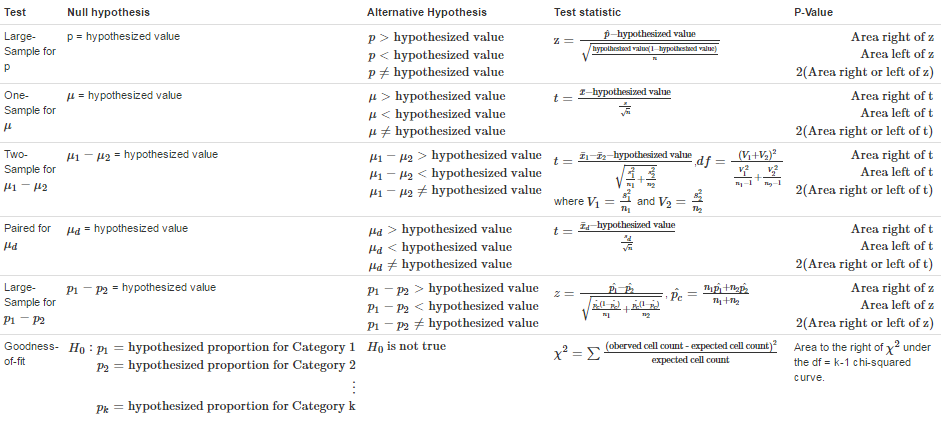

## Statistics Class Week 10

<div class="columns-2">
   


* One half of pumpkin production is grown in only 6 states
* Largest pumpkin as of 2016 Google search is 2,261.5 LB.   
</div>

### Announcements

* Chapter 11 homework due Wednesday, start reading chapter 12
* Exam 3 over chapter 8 - 11 next Monday

# Chapter 12 Categorical Data and Goodness-of-Fit Tests

## Categorical Data and Goodness-of-Fit

Univariate categorical data is best summarized in a **one-way frequency table**, which gives the number of times (frequencies) each of the possible categories in the data set occurs. 

Bivariate categorical data can be summarized in a **two-way freqency table** or **contingency table**.  Additionally **margin totals** are obtained by adding the observed cell counts in each row and column of the table. 

```{r echo = FALSE, warning=FALSE, message=FALSE, results='hide'}
library(googleVis)
op <- options(gvis.plot.tag='chart')
```

```{r echo = FALSE, warning=FALSE, message=FALSE, results='hide'}
library(dplyr)
library(reshape2)
library(ggplot2)
op <- options(gvis.plot.tag='chart')
a<-melt(midwest, id.vars = c("state"), measure.vars = c("popwhite","popblack","popamerindian","popasian","popother"))
a$variable<-gsub("pop","",a$variable)

df<-dcast(a,formula = variable ~ state,fun.aggregate = sum, margins = c("state", "variable"))
```
<div class="centered">
```{r echo = FALSE, warning=FALSE, message=FALSE, results='asis'}
Table <- gvisTable(df)
plot(Table)
```
</div>
<div class="notes">
Question for Goodness-of-Fit   

1. Is each category the as expected or the same (homogeneous)?
1. Is each category the independent?

Reminder Categorical examples

1. Time - Weekday, Month, Season
2. Demographic - Age group, sex, education levels or location

</div>

## Goodness-of-Fit Test {.smaller}

Hypothesis:   

$\begin{align}H_0: p_1  = \text{hypothesized proportion for Category 1}\\
p_2  = \text{hypothesized proportion for Category 2}\\
\vdots\\
p_k  = \text{hypothesized proportion for Category k}
\end{align}$  
$H_a = H_0 \text{ is not true}$   

Test statistic:   $\chi^2 = \sum{\frac{(\text{oberved cell count - expected cell count})^2}{\text{expected cell count}}}$

P-Values:  When $H_0$ is true and all expected counts are a least 5, $\chi^2$ has approximately a chi-squared distribution with df = k-1.  The P-values associated with the computed test statistic value is the area to the right of $\chi^2$ under the df = k-1 chi-squared curve.

<div class="notes">
Assumptions  

1. Observed cell counts are based on *random samle*.
2. The *sample size is large*.  The sample size large enough for the chi-squared test to be appropriate as long as every expected cell count at least 5.

</div>

##  Chi-Squared Distribution

<iframe src="http://shiny.albany.edu/stat/chisq/" width="760" height="800" frameborder="0" marginheight="0" marginwidth="0">Loading...</iframe>

<div class="notes">
App link is http://shiny.albany.edu/stat/chisq/ and is an example of an app built using [Shiny](http://shiny.rstudio.com/) by [Rstudio](https://www.rstudio.com/) and [R](https://www.r-project.org/), the Statistical Programming Language.   

The Chi-squared distribution is a special case of the gamma distribution in the two-parameter (shape and scale) family of continuous probability distributions.  Properties of the chi squared distribution include:

* The mean of the distribution is equal to the number of degrees of freedom
* The variance is equal to two times the number of degrees of freedom
* As the degrees of freedom increase, the chi-square curve approaches a normal distribution
</div>

## Testing the fairness of a die


Here is a sample of a 100 rolls from a die,  is this die fair?  Test with a significance level of .05

```{r echo = FALSE, warning=FALSE, message=FALSE, results='hide'}
set.seed(33)
unfair_die<-c(1,1,2,3,3,4,5,5,6)
ds<-sample(unfair_die,100,replace = TRUE)

actual<-c(length(ds[ds==1]),length(ds[ds==2]),length(ds[ds==3]),length(ds[ds==4]),length(ds[ds==5]),length(ds[ds==6]))
chisq.test(actual)
```

Roll a one  | Roll a two | Roll a three | Roll a four | Roll a five | Roll a six
------------- | ------------- | ------------- | ------------- | ------------- | -------------
`r length(ds[ds==1])`  | `r length(ds[ds==2])`  | `r length(ds[ds==3])`  | `r length(ds[ds==4])`  | `r length(ds[ds==5])`  | `r length(ds[ds==6])`   

<br>
Any guess how the die is weighted?

<div class="notes">

$\chi^2 = 10.16$, df = 5 
P-Value = `r 1-round(pchisq(10.16,5),4)`   
Fail to Reject $H_0$

R - chisq.test(actual)
</div>

## $\chi^2$ Test for Homogeneity {.smaller}

Null Hypothesis: $H_0$: The category proportions are the same for all the populations or treatments  
Alternative Hypothesis: $H_a$: The category proportions are not all the same for all of the populations or treatments.   
Test statistic:   $\chi^2 = \sum{\frac{(\text{oberved cell count - expected cell count})^2}{\text{expected cell count}}}$

The expected cell counts are estimated from the sample data (assuming that $H_0$ is true) using the formula
$$\text{expected cell count}=\frac{(\text{row marginal total})(\text{column marginal total})}{\text{grand total}}$$

P-Values:  When $H_0$ is true and the assumptions of the $\chi^2$ test are satisfied, $\chi^2$ has approximately a chi-squared distribution with
$$df = (\text{number of rows}-1)(\text{number of columns}-1)$$
The P-values associated with the computed test statistic value is the area to the right of $\chi^2$ under the df = k-1 chi-squared curve.

<div class="notes">
Assumptions  

1. The data are from **independently chosen random samle or from subjects who are assigned at random to treatment groups*.
2. The *sample size is large*: all expected counts are at least 5.  If some expected counts are less than 5, rows or columns of the table may be combined to achieve a table with satisfactory expected counts.

</div>

## $\chi^2$ Test for Independence {.smaller}

Null Hypothesis: $H_0$: The two variables are independent  
Alternative Hypothesis: $H_a$: The two variables are not independent
Test statistic:   $\chi^2 = \sum{\frac{(\text{oberved cell count - expected cell count})^2}{\text{expected cell count}}}$  

The expected cell counts are estimated from the sample data (assuming that $H_0$ is true) using the formula
$$\text{expected cell count}=\frac{(\text{row marginal total})(\text{column marginal total})}{\text{grand total}}$$

P-Values:  When $H_0$ is true and the assumptions of the $\chi^2$ test are satisfied, $\chi^2$ has approximately a chi-squared distribution with
$$df = (\text{number of rows}-1)(\text{number of columns}-1)$$
The P-values associated with the computed test statistic value is the area to the right of $\chi^2$ under the df = k-1 chi-squared curve.

<div class="notes">
Assumptions  

1. The data are from **a random samle*.
2. The *sample size is large*: all expected counts are at least 5.  If some expected counts are less than 5, rows or columns of the table may be combined to achieve a table with satisfactory expected counts.

</div>

## Example - Influencing people

Does a gift influence the likelihood of of a donation?  See results from a study and check out this book recommendation [Influencer](https://www.amazon.com/Influencer-Science-Leading-Change-Second/dp/0071808868) 

```{r echo = FALSE, warning=FALSE, message=FALSE, results='hide'}
library(googleVis)
op <- options(gvis.plot.tag='chart')
df<-data.frame(Request_Types = c("No Gift","Small Gift","Large Gift"), Donation = c(397,465,691), No_Donation = c(2865,2772,2656))
```

```{r echo = FALSE, warning=FALSE, message=FALSE, results='asis'}
Table <- gvisTable(df)
plot(Table)
```
<br>
Is there convincing evidence that the proportions in the two donation categories are not the same for all three types of request?  Use a significance level of .01.

<div class="notes">
Problem 12.23

$\chi^2 = 96.506$, $\text{P-value} \approx 0$, reject $H_0$
</div>

## Using Computer for Chi Squared 

Excel - 

* The function chisq.test() can be used to returns the p-value.
* If the test statistic is calculated then CHISQ.DIST.RT() can be used to solve for the probability.

R - 

* The function chisq.test() can be used to output the $\chi^2$, df, p-value and store additional information.  Reference documentation [here](https://www.rdocumentation.org/packages/stats/versions/3.3.1/topics/chisq.test?)
* If the test statistic is calculated then pchisq() can be used to solve for the probability.

## Hypothesis Test Review



##  How to decide hypothesis test?

Make a decision tree to determine appropirate test

## Review Problems 1- 


Each observation is a random sample of 100 bicycle accidents resulting in death was classified according to the day of the week on which the accident occurred (www.highwaysafety.com).  

```{r echo = FALSE, warning=FALSE, message=FALSE, results='hide'}
library(googleVis)
op <- options(gvis.plot.tag='chart')
dates <- seq(Sys.Date(),Sys.Date()+6, by = "1 day")
weekdays(dates)
df<-data.frame(Weekday = c("Sunday","Monday","Tuesday","Wednesday","Thursday","Friday","Saturday"),
               Frequency = c(14,13,12,15,14,17,15))
```

<div class="columns-2">
```{r echo = FALSE, warning=FALSE, message=FALSE, results='asis'}
Table <- gvisTable(df)
plot(Table)
```

Is is reasonable to conclude that the proportion of accidents is not the same for all days of the week? Use $\alpha = .05$

</div>

<div class="notes">
Problem 12.35  

$\chi^2 = 1.08$, $\text{P-value} = .982$, fail to reject $H_0$
</div>

## Review Problems 2- 

Do faculty and student have similar perceptions?  See average results from a random sample of 173 students asked to judge various behaviors on a scale from 1 (totally inappropriate) to 5 (totally appropriate).  Assume the sample standard deviation are all equal to 1.

```{r echo = FALSE, warning=FALSE, message=FALSE, results='hide'}
library(googleVis)
op <- options(gvis.plot.tag='chart')
dates <- seq(Sys.Date(),Sys.Date()+6, by = "1 day")
weekdays(dates)
df<-data.frame(Student_Behavior = c("Wearing Hat","Addressing instructor by first name","Talking on phone"),
               Student_Mean_Rating = c(2.8,2.9,1.11),
               Faculty_Mean_Rating = c(3.63,2.11,1.10))
```


```{r echo = FALSE, warning=FALSE, message=FALSE, results='asis'}
Table <- gvisTable(df)
plot(Table)
```

Is there sufficient evidence to conclude that the mean "appropriateness" score differs for students and faculty?  Test for each behavior with an $\alpha = .05$.

<div class="notes">
Problem 11.61  

*  Hat: t = -6.565, df = 201, P-value $\approx 0$, reject $H_0$
*  First Name: t = -6.25, df = 201, P-value $\approx 0$, reject $H_0$
*  Phone: t = 0.937, df = 201, P-value = 0.937, fail to reject $H_0$
</div>

## Review Problems 3- 

Suppose that 40% of all U.S employees contribute to a retirement plan (p = .4).

1.  In a random sample of 100 employees, what is the approximate probability that at least half of these in the sample contribute to a retirement plan?
2.  Suppose you were told that at least 60 of the 100 employees in a sample from your state contribute to a retirement plan.  Would you think p = .4 for you state?

<div class="notes">
Problem 8.36 

1.  0.0207
2.  very unlikely
</div>

## Homework
12.2,12.3,12.9   
12.15, 12.17, 12.18, 12.21