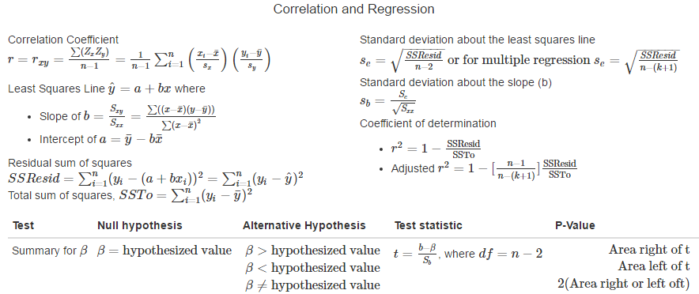

# Chapter 13 Simple Linear Regression

## Terms

A **deterministic relationship** is one in which the value of y (the dependent variable) is completely determined by the value of x (independent variable). A description of the relation between two variables x and y that are not deterministically related can be given by specifying a **probabilistic model**. 
The general form of an additive probabilistic model allows y to be larger or smaller than f(x) by a random amount, e.   

$$Y = \text{deterministic function of x} + \text{random deviation}\\
    = f(x) + e$$
    
**Simple linear regression model**: A probabilistic model in which the deterministic part is a line with vertical or y intercept \alpha and slope \beta.  This line is called the **population** regression line

$$y = \alpha + \beta x + e$$

<div class="notes">
Assumptions

1. $\mu_e = 0$
2. The standard deviation of e is the same for any particular value of x
3. The distribution of e at any particular x value is normal
4. The random deviations $e_1,e_2,\dots,e_n$ associated with different observations are independent of one another.
</div>

## Point estimates for population regression line

The point estimates of $\beta$, the slope, and $\alpha$, the y intercept of the population regression line, are the slope and y intercept, respectively, of the least squares line:

*  Estimated regression line is the Least Squares Line $\hat{y} = a + bx$
*  Estimate of $\beta$ = b = $\frac{S_{xy}}{S_{xx}} = \frac{1}{\sum (x -\bar{x})^2} \sum ((x -\bar{x})(y -\bar{y}))$
*  Estimate of $\alpha$ = a = $\bar{y} - b\bar{x}$   
*  Estimating the standard deviation $\sigma$ = $s_e = \sqrt{\frac{SSResid}{n-2}}$ with degrees of freedom of n-2

## Inference of b
**Properties of the sampling Ditribution of b**   
When the four basic assumptions of the simple linear regression model are satisfied, the following conditions are met:

1.  The mean value of b is $\beta$. Specifically, $\mu_b=\beta$ and hence b is an unbiased statistic for estimating $\beta$
2.  The standard deviation of the statistic b is $\sigma_b = \frac{\sigma}{\sqrt{S_{xx}}}$
3.  The statistic b has a normal distribution (a consequence of the error e being normally distributed)

The **estimated standard deviation** of the statistic b is $\sigma_b = \frac{S_e}{\sqrt{S_{xx}}}$ with a distribution of the statistic $t = \frac{b-\beta}{S_b}$ with the t distribution df = n-2.

<div class="notes">
Assumptions

1. $\mu_e = 0$
2. The standard deviation of e is the same for any particular value of x
3. The distribution of e at any particular x value is normal
4. The random deviations $e_1,e_2,\dots,e_n$ associated with different observations are independent of one another.
</div>

## Confidence interval of b

When then four basic assumptions of the simple linear regression model are satisfied, a confidence interval for $\beta$, the slope of the population regression line, has the form
$$ b \pm (\text{t critical value}*s_b), \text{where }$$
$$ s_b = \frac{S_e}{\sqrt{S_{xx}}}, s_e = \sqrt{\frac{SSResid}{n-2}}$$ 
where the t critical value is based on df = n - 2.

## Hypothesis Test Concerning $\beta$

Null hypothesis: $H_0: \beta = \text{hypothesised value}$   

Test Statistic: $t = \frac{b-\beta}{S_b}$, where the test is based on df = n-2   

Alternative Hypothesis  | P-Value
------------- | -------------
$H_a$: $\beta$ > hypothesized value  | Area to the right of the computed t under the appropriate t curve
$H_a$: $\beta$ < hypothesized value  | Area to the left of the computed t under the appropriate t curve
$H_a$: $\beta$ $\ne$ hypothesized value  |$\begin{align}
\mbox{(1) 2(area to right of t) if t is positive}\\
\mbox{(2) 2(area to left of t) if t is negative}\\
\end{align}$  

**Model utility test for simple regressoin** is the test where the hypothesized value = 0, so the Null hypothesis: $H_0: \beta = 0$

<div class="notes">
Assumptions

1. $\mu_e = 0$
2. The standard deviation of e is the same for any particular value of x
3. The distribution of e at any particular x value is normal
4. The random deviations $e_1,e_2,\dots,e_n$ associated with different observations are independent of one another.
</div>

## Check Model Accuracy

**Residual analysis** Methods based on the residuals or standardized residuals for checking the assumptions of a regression model.

* **Standardized residual** a residual divided by its standard deviation.
* **Standardized residual plot** a  plot of the (x,standardized residual) pairs.  A pattern in this plot suggests that the simple linear regression model may not be appropriate.   

$$\text{standardized residual} = \frac{\text{residual}}{\text{estimated standard deviation of residual}}$$   

The estimated standard deviation of residual is calculated with $S_e \sqrt{1-\frac{1}{n}-\frac{(x_i-\bar{x})^2}{S_xx}}$

## Example Predicting MPG {.smaller}

```{r echo = FALSE, warning=FALSE, message=FALSE, results='hide'}
library(googleVis)
library(ggplot2)
op <- options(gvis.plot.tag='chart')
df<-mtcars
df$Car<-row.names(df)
df<-cbind(df[1:16,c("Car","mpg","wt")],df[17:32,c("Car","mpg","wt")])
```

<div class="columns-2">
```{r echo = FALSE, warning=FALSE, message=FALSE}
p <- ggplot(mtcars, aes(wt, mpg))
p + geom_point()
```


```{r echo = FALSE, warning=FALSE, message=FALSE, results='asis'}
Table <- gvisTable(df)
plot(Table)
```
</div>

## Utilizing the R linear model {.smaller}

```{r}
mpg_prediction<-lm(formula = mpg ~ wt, data = mtcars)
summary(mpg_prediction)
```

# Chapter 14 Multiple Regression

## Multiple Regression

A general additive multiple regression model, which relates a dependent variable y to k predictor variables $X_1,X_2,\dots,X_k$ is given by the model equation

$$y = \alpha + \beta_1 x_1 + \beta_2 x_2 + \dots + \beta_k x_k + e$$

The $\beta_i$'s are called **population regression coefficients**; each $\beta_i$ can be interpreted as the true average change in y when the predictor $x_i$ increases by 1 unit and the values of all the other predictors remain fixed.   

<div class="notes">
The deterministic portion 
$$\alpha + \beta_1 x_1 + \beta_2 x_2 + \dots + \beta_k x_k + e$$
is called the **population regression function**.

Special case of the general multiple regression model 

* Polynomial regression model $y = \alpha + \beta_1 x + \beta_2 x^2 + \dots + \beta_k x^k + e$
* Quadratic regression model $y = \alpha + \beta_1 x + \beta_2 x^2$
</div>

## Qualitative Predictor Variables

**Dummy variables** or **indicator variables** can be created to utilize categorical variables in a regression model.  A common variable of gender is represented in a regression as,   

$x_1 = \begin{cases}
    1 & \text{if male} \\
    0 & \text{if female}\\
  \end{cases}$   

Multiple categorical variables can be converted using a relative score or with multiple dummy variables.  A model for house price used the following variables to describe beachfront, ocean view and no ocean view houses as,   

$x_1 = \begin{cases}
    1 & \text{if the house is ocean-view and beachfront} \\
    0 & \text{otherwise}\\
  \end{cases}$   
$x_2 = \begin{cases}
    1 & \text{if the house is ocean-view but is not beachfront} \\
    0 & \text{otherwise}\\
  \end{cases}$  
  
## Class Practice

[Animal Sleep Data](https://docs.google.com/spreadsheets/d/1uN_Gbko-9LFMpERoA897A6_GWRB-5qzuA6qDIldygRw/edit?usp=sharing) <br>
<br>
What is the best predictor of animal sleep?   
What is the best regression model?

## Adjusted R-Squared

The adjusted R-Squared adjusts for the amount of explanatory variables (k) added to the model relative to data points (n).  The calculation for adjusted R-Squared is common in statistical packages based on the following formula

$$\text{Adjusted } r^2 = 1 - [\frac{n-1}{n-(k+1)}] \frac{\text{SSResid}}{\text{SSTo}}$$

## F test for Multiple Regression

Null hypothesis: $H_0: \beta_1 = \beta_2 = \dots =\beta_k = 0$  (no useful linear relationships between y and any of the predictors)

Alternative Hypothesis: $H_a$: As least one of the predictors $\beta_1,\dots,\beta_k$ is not zero (at least one useful linear relationship between y and the predictors)

Test Statistic: $t = \frac{\text{SSRegr/k}}{\text{SSResid/(n-(k+1))}}$, where SSRegr = SSTo = SSResid   

P-Values: The test is upper-tailed with $df_1 = k$ and $df_2 = n-(k+1)$

<div class="notes">
F disttribution:  The F distribution is a right-skewed distribution used most commonly in Analysis of Variance.  It is type of gamma distribution with two-parameter (shape and scale) similar to the chi-squared distribution.  The F distribution i sspecified by a numerator df and a denominator df.   
Assumptions: For any particular combination of predictor variable values, the distribution of e, the random deviations, is normal with mean 0 and constant variance $\signa^2$.
</div>

## Logistic Regression - Categorical Variables

<iframe src="http://www.r-fiddle.org" width="760" height="800" frameborder="0" marginheight="0" marginwidth="0">Loading...</iframe>

<div class="notes">
library(tree)
df<-iris
ir.tr <- tree(Species ~., iris)
ir.tr
summary(ir.tr)
plot(ir.tr)
text(ir.tr)
</div>

## CLASS DATA COMPETITION

Teams of 2 or 3 students, generate predictive model for final test score (G3).   

[Student Data](https://drive.google.com/open?id=0B7A1XZJhBnCkTF80UjFuNTgtT3M)

* [Meta Data](https://www.kaggle.com/uciml/student-alcohol-consumption) 

## Summary Formulas



## Homework
13.1, 13.4, 13.5, 13.8
13.13, 13.18, 13.19, 13.21   
13.27, 13.28, 13.31
