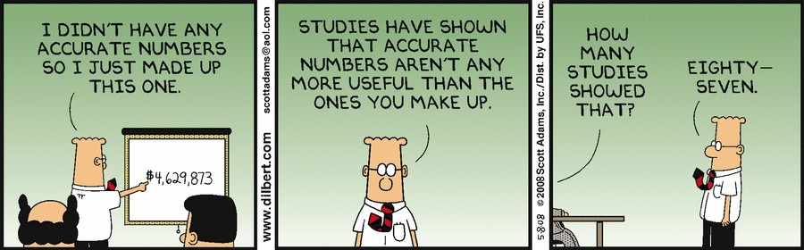
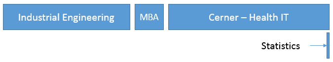
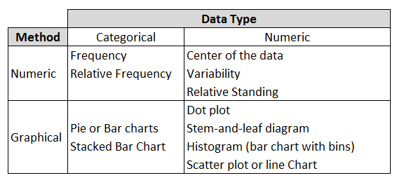

## Class Math 120 

**Statistics** is the science of collecting, analyzing, and drawing conclusions from data



## Why Statistics

My background...    



Why are you taking this class?  

<div class="notes">
Why? Is this class an elective or degree requirement?
</div>

## Content on Moodle
- Syllabus and schedule
- Homework Data and Submission From
- Slides for each week
- Lecture video  
  
## Grades  
- 10% Homework
- 15%	Quizzes and Participation
- 50%	Exams - 3
- 25%	Final

<div class="notes">
* Homework: Completion only.  Submission needs to be a PDF
* Quiz/Participation Tracking: Weekly on moode.  Will include homework questions
* Exam/Final: Similar to homework and quiz questions
</div>

# Chapter 1: Roll of Statistics and Analytic Process

## Roll of Statistics

1.  Being an informed "Information Consumer"
2.  Understanding and Making Decisions
3.  Evaluate Decisions That Affect Your Life

<div class="notes">
1.  Extract information for news, research and marketing
2.  Informed decision are based on data and the knowledge of the risk of an incorrect decision
3.  Statistics can give a good perspective on your own life to review past and influence future decisions
</div>

## Steps of the Data Analysis Process
1. Understand the Nature of the Problem
2. Decide What to Measure and How to Measure It
3. Collect the Data
4. Summarize the Data & Perform a Preliminary Analysis
5. Do the Formal Data Analysis
6. Interpret the Results

<div class="notes">
The problem is **variability**
</div>

## Branches of statistics

1. Descriptive Statistics
    + Organizing, Summarizing Information
    + Graphical techniques
    + Numerical techniques
2. Inferential Statistics
    + Estimation
    + Decision making
    
## Organizing and Sumarizing Information

* Variables and Data
* Population and Samples
* Observational and Experimental Studies

## Variables
Variable: A variable is any characteristic whose value may change from one individual to another.  

* A univariate data set consists of observations on a single variable made on individuals in a sample or population.
* A bivariate data set consists of observations on two variables made on individuals in a sample or population.
* A multivariate data set consists of observations on two or more variables made on individuals in a sample or population.

## Data

1. **Categorical** (or qualitative) if the individual observations are categorical responses.
2. **Numerical** (or quantitative) if the individual observations are numerical responses *where numerical operations generally have meaning*.  
    + Discrete if the possible values are isolated points on the number line. 
    + Continuous if the set of possible values form an entire interval on the number line.
  
**Big Data** - is a term for data sets that are so large they need to be analyzed computationally

## Random Data
```{r}
sample(letters,10)
round(runif(10,5,15),0)
runif(10, 1,15)
```

## Data Manipulaion

Data manipulation is the process of changing data in an effort to make it easier to read or be more organized.

<center></center>   

Data cleaning examples: Distinct, unique, filter, sort, join or merge, group and summarize.

## Frequency

The frequency for a particular category is the number of times the category appears in the data set.  

The relative frequency for a particular category is the fraction or proportion of the time that the category appears in the data set. It is calculated as 

$$\text{Relative Frequency} = \frac{\text{frequency}}{\text{number of observations in the data set}}$$

## Data Manipulation Tools 

* Excel: Spreadsheet software for data manipulation, graphics and calculations
* Google Sheets: Online spreadsheets software
* R: Functional language to statistically explore data sets
* Tableau: Data visualization software
* Napkin Approach: Using a square piece of cloth or paper to make small calculations or graphs
* Phone or Calculator:  Use for quick calculation

## Dot Plot
1. Draw a horizontal line and mark it with an appropriate measurement scale.
2. Locate each value in the data set along the measurement scale, and represent it by a dot. If there are two or more observations with the same value, stack the dots vertically.

Note: Dot plots are useful for **small** numeric data sets.

## Dot Plot
```{r}
round(rnorm(10,mean = 150, sd = 3),0)
```

<div class="columns-2">
  

  - Chart Title
  - Axis and Axis Title
  - Legend
  - Appropriate Scaling
</div>

## Bar Chart
1. Draw a horizontal line, and write the category names or labels below the line at regularly spaced intervals.
2. Draw a vertical line, and label the scale using either frequency (or relative frequency).
3. Place a rectangular bar above each category label. The height is the frequency (or relative frequency) and all bars have the same width.

```{r echo = FALSE, warning=FALSE, message=FALSE}
library(dplyr)
library(ggplot2)
```

## Bar Chart
```{r echo = FALSE, warning=FALSE, message=FALSE}
sample(letters[c(1:4,6)],10, replace = TRUE)
```


## Bar Charts

```{r echo = FALSE, warning=FALSE, message=FALSE}
library(ggplot2)
library(dplyr)
df<-data.frame(Letter = sample(letters[c(1:4,6)],500, replace = TRUE))
df$Letter
g <- ggplot(df, aes(Letter))
```

## Try Excel!

Frequency Table
```{r echo = FALSE, warning=FALSE, message=FALSE}
df2<-df %>% group_by(Letter) %>% summarize(Frequency = length(Letter), Relative_Frequency = Frequency/500)
df2
```

## Today's Homework
* Get your book!
* Start reading chapters 1 and 2
* Start practicing excel: 
    + YouTube Excel tutorials
    + [Lynda.com](http://onestop.jessup.edu/c.php?g=399276&p=2713779) excel tutorials
    + Excel challenge problem: Create a multiplication table using excel formulas

# Chapter 2: Collecting Data

## Population vs Sample
Population: The entire collection of individuals or objects about which information is desired is called the population.  

* Collection of data from every member of the population,
allows a question about the population to be definitively answered
* may be expensive, impractical, or sometimes impossible
  
Sample: A sample is a subset of the population, selected for study in some prescribed manner.  

* Using sample data rather than population data is
more practical  than a census.
* Gives variable results with some possibility of a wrong conclusion being adopted.

<div class="notes">
The study of statistics deals with understanding how to obtain samples and work with the sample data to make statistically justified decisions
</div>

## Sample

A Simple Random Sample of size n is a sample that is selected in a way that ensures that every different possible sample of the desired size has the same chance of being selected.  

- Sampling with replacement means that after each successive item is selected for the sample, the item is replaced back into the population and may therefore be selected again.  
- Sampling without replacement means that after an item is selected for the sample it is removed from the population and therefore cannot be selected again.  

<div class="notes">
Replacement: Dice, spinners,etc
Without Replacement: short straw, hat, cards
</div>

## Sample by dividing Populations  

* Divided into subpopulations called **strata**. Stratified sampling entails selecting a separate simple random sample from each of the strata.  
* Divided into non-overlapping subgroups called **clusters**. Cluster sampling entails selecting clusters at random and all individuals in the selected clusters are included in the sample. 
* **Systematic sampling** is a procedure that can be employed when it is possible to view the population of interest as consisting of a list or some other sequential arrangement. A value k is specified (a number such as 25, 100, 2500, etc). The one of the first k individuals is selected at random, and then every kth individual in the sequence is selected to be included in the sample.
* **Convenience sampling** is using and easily available or convenient group to form a sample.

<div class="notes">
Strata: Example sample few teachers in each department  
Cluster: Example all students in a few selected classes
</div>

## Types of Bias
Bias is introduced by the way in which a sample is selected so that increasing the size of the sample does nothing to reduce the bias

*Selection Bias* is the tendency for samples to differ from the corresponding population as a result of systematic exclusion of some part of the population.  

*Measurement or Response Bias* is the tendency for samples to differ from the corresponding population because the method of observation tends to produce values that differ from the true value.  

*Nonresponse Bias* is the tendency for samples to differ from the corresponding population because data is not obtained from all individuals selected for inclusion in the sample.

## Types of studies
An **observational study** observes individuals and measures variables of interest but does not attempt to influence the responses.  

*	Con - Difficult to measure or gauge the effect of an action or procedure
*	Con - Lurking variables are uncontrolled so the study may be confounded	
*	Pro - Can use available data

A study is an **Experiment** if the values of one or more response variables are recorded when the investigator controls (or manipulates) one or more factors.  

*	Pro -	Allows the measurement of effect of a treatment
*	Pro -	Can help to control lurking variables
*	Pro -	Can give good evidence of causation
*	Con -	May not measure realistic effects.  Not necessarily workable in real life.

<div class="notes">
Observational studies are usually used to draw conclusions about the population or about differences between two or more populations. 
Experiments are usually used when attempting to determine the effect of the manipulation of the factors being controlled.  
</div>

## Study Variables 

An **explanatory variable** are those variables that have values that are controlled by the experimenter.  Also called factors.

A **response variable** is thought to be related to the explanatory variable in the experiment, but not controlled by the experimenter.

An **extraneous variable** is one that is not of interest in the current study but is thought to affect the response variable.

A **confounding variable** is one that is related both the group membership and to the response variable of interest in the research study.
Two variables are **confounded** if their effects on the response variable cannot be distinguished from one another.

<div class="notes">
The purpose is to assess the effect of **temperature** on **test scores**.
</div>

## Reducing confounding variable in experimental conditions (treatments) 

* A **placebo** is a treatment that resembles the other treatments in an experiment, but which has no active ingredients.
* A **control group** is a group that receives no treatment or a placebo treatment. 
* In a **double-blind experiment** neither the subjects nor the individuals measuring know which treatment was received.
* In a **single-blind experiment** the either the subjects or individuals measuring do not know which treatment was received.

## Principles of Experimental Design
The fundamental principles of statistical design of experiments are:  

1. Randomization:  Random assignment (of subjects to treatments or of treatments to trials) to ensure that the experiment does not systematically favor one experimental condition over another
2. Blocking: Using extraneous factors to create groups (blocks) that are similar. All experimental conditions are then tied in each block 
3. Direct Control: Holding extraneous factors constant so that their effects are not confounded with those of the experimental conditions
4. Replication: Ensuring that there is an adequate number of observations in each experimental condition and the study can be duplicated.

## Homework
Chapter 1  

* 1.4, 1.17, 1.19,1.24

Chapter 2  

* 2.4, 2.11, 2.18, 2.20, 2.38, 2.47

Excel Practice: Create a multiplication table using excel formulas
