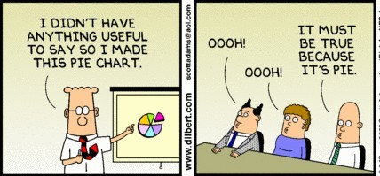
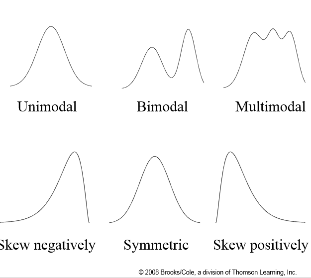

## Statistic Class Week 2

Statistics: Graphical Methods



## Review Steps of the Data Analysis Process
1. Understand the Nature of the Problem
2. Decide What to Measure and How to Measure It
3. Collect the Data
4. **Summarize the Data** & Perform a Preliminary Analysis
5. Do the Formal Data Analysis
6. Interpret the Results

## Today's Homework  

- Start reading chapter 3
- Chapter 1 and 2 assignment due Wednesday

# Chaper 3: Graphical Methods

## Categorical Data

Visualize proportions of the whole  

* Pie Charts
* Segmented or stacked bar charts

Visualize the comparison of groups  

*  Bar chart

Other charts: Tree diagram, Donut  Chart

<div class="notes">
The problem is **variability**
</div>

## Numeric Data

Visualizing distributions of univariate numeric data  

* Stem-and-leaf diagram
* Histogram

Visualizing relationships of bivariate numeric data  

* Scatter plots
* Line chart
* Area chart

## Integrating Visualization

Combination Charts and Infographics

- Charles Joseph Minard's, Napoleon's march on Moscow [graphic](https://en.wikipedia.org/wiki/Infographic#/media/File:Minard.png)
- Others: [Pareto chart](https://en.wikipedia.org/wiki/Pareto_chart), [Sunburst](https://en.wikipedia.org/wiki/Sunburst)

Dashboards  

- [Shiny Applications](http://shiny.rstudio.com/gallery/)
- [Tableau Dashboards](https://public.tableau.com/s/gallery)

Motion and Interactive Charts  

- [The Best Stats You've Ever Seen](https://www.ted.com/talks/hans_rosling_shows_the_best_stats_you_ve_ever_seen?language=en)
- [Google Charts](https://developers.google.com/chart/)
- [Other Examples](https://cran.r-project.org/web/packages/googleVis/vignettes/googleVis_examples.html)

<div class="notes">
Napoleon's march 4 variables: Direction, Location, Army size and Temperature
Grammar of Graphics: 
</div>

## Visualize proportions

Pie Chart  

1. Draw a circle to represent the entire data set.
2. For each category, calculate the "slice" size.
    + Slice size = 360(category relative frequency)
3. Draw a slice of appropriate size for each category.

Segmented (Stacked) Bar Chart  

1. Draw a bar represent the entire data set
2. Divide the bar segment based on the frequency (or relative frequency) of each category

## Pie Chart and Stacked Bar Examples
```{r echo = FALSE, warning=FALSE, message=FALSE}
sample(letters[c(1:4,6)],10, replace = TRUE)
```
 |  |   

## Pie, Stacked Bar or Comparative Bar Chart?
```{r echo = FALSE, warning=FALSE, message=FALSE}
library(ggplot2)
library(dplyr)
#write.csv(midwest,"Data_Sets/state_demographics.csv",row.names = FALSE)
#write.csv(msleep,"Data_Sets/animal_sleep.csv",row.names = FALSE)
```

[State Demographic Data](https://docs.google.com/spreadsheets/d/1Dl4B872ZVHWTDKaRXt1kbQDj10txmt0DHCkieiHMKIk/edit?usp=sharing)  

1. What is Illinois race **proportions**? 
2. How does Illinois race proportions **compare** with other states? Compare with Wisconsin?
3. How do different states **compare** with percent of adults?

<div class="notes">
1. Pie Chart
2. Stacked Bar Chart
3. Comparative Bar Chart
</div>

## Illinois Proportions
```{r echo = FALSE, warning=FALSE, message=FALSE}
library(dplyr)
library(reshape2)
library(gridExtra)
a<-melt(midwest, id.vars = c("state"), measure.vars = c("popwhite","popblack","popamerindian","popasian","popother"))
a$variable<-gsub("pop","",a$variable)
b<-a %>% filter(state == "IL") %>% mutate(Population = sum(value)) 
b<- b %>% group_by(variable) %>% 
  summarize(Race = sum(value), Population = mean(Population), Frequency = Race/Population) %>% 
  arrange(desc(Race))

plot1 <- ggplot(b, aes(x = reorder(variable,-Race), y = Race)) + 
  geom_bar(stat = "identity") + labs(x = "Race", y ="Population")
plot2 <- ggplot(b, aes(x = reorder(variable,-Frequency), y = Frequency)) + 
  geom_bar(stat = "identity") + labs(x = "Race")

library(gridExtra)
grid.arrange(plot1, plot2, ncol=2)
```

## Comparing States
```{r echo = FALSE, warning=FALSE, message=FALSE}
b<-a %>% group_by(state) %>% mutate(Population = sum(value)) 
b<- b %>% group_by(state, variable) %>% 
  summarize(Race = sum(value), Population = mean(Population), Frequency = Race/Population) %>% 
  arrange(desc(Race))

ggplot(b, aes(x = reorder(variable,-Race), y = Race)) + 
  geom_bar(stat = "identity") + labs(x = "Race", y ="Population") + facet_wrap(~state)
```

## Comparing IL and WI
```{r echo = FALSE, warning=FALSE, message=FALSE}
b<-a %>% filter(state %in% c("IL","WI")) %>% group_by(state) %>% mutate(Population = sum(value)) 
b<- b %>% group_by(state, variable) %>% 
  summarize(Race = sum(value), Population = mean(Population), Frequency = Race/Population) %>% 
  arrange(desc(Race))

plot1 <- ggplot(b, aes(x = reorder(variable,-Race), y = Race, fill = state)) + 
  geom_bar(stat = "identity",position="dodge") + labs(x = "Race", y ="Population")
plot2 <- ggplot(b, aes(x = reorder(variable,-Frequency), y = Frequency, fill = state)) + 
  geom_bar(stat = "identity",position="dodge") + labs(x = "Race")
plot2 <- ggplot(b, aes(x = reorder(variable,-Frequency), y = Frequency, fill = state)) + 
  geom_bar(stat = "identity",position="dodge") + labs(x = "Race")
plot3 <- ggplot(b, aes(x = state, y = Frequency, fill = variable)) + 
  geom_bar(stat = "identity") + scale_fill_discrete("Race")
grid.arrange(plot1, plot2, plot2 + coord_flip(), plot3, ncol=2, nrow = 2)
```

## Numeric Univariate Data

**Steam and Leaf**: A quick technique for picturing the distributional pattern associated with numerical data.  

1. We want to break up the data into a reasonable number of groups. 
2. Looking at the range of the data, we choose the stems (one or more of the leading digits) to get the desired number of groups.
3. The next digits (or digit) after the stem become(s) the leaf.
4. Typically, we truncate (leave off) the remaining digits.

## Numeric Univariate Data

**Histogram**: A graph for the information in a frequency distribution for a numeric data set.  

1. Draw a horizontal scale, and mark the possible values.
2. Draw a vertical scale and mark it with either frequencies or relative frequencies (usually start at 0).
3. Above each possible value, draw a rectangle whose height is the frequency (or relative frequency) centered at the data value with a width chosen appropriately.

Note: With class intervals of unequal width, the density for the class should be used for the vertical axis called the **density scale**

$$\text{Density} = \frac {\text{relative frequency of the class interval}}{\text{class interval width}}$$


## Histogram / Stem and Leaf Examples
```{r echo = FALSE, warning=FALSE, message=FALSE, results='hide'}
library(googleVis)
op <- options(gvis.plot.tag='chart')
a<-round(rnorm(20,mean = 150, sd = 10),0)
b<-sample(c("Male","Female"),20, replace = TRUE)
df<-data.frame(Weight = a, Gender = b)
```
```{r echo = FALSE, warning=FALSE, message=FALSE, results='asis'}
Table <- gvisTable(df)
plot(Table)
```

## Histogram Example

 

## Historgram, scatterplot or line chart?

[Animal Sleep Data](https://docs.google.com/spreadsheets/d/1uN_Gbko-9LFMpERoA897A6_GWRB-5qzuA6qDIldygRw/edit?usp=sharing)   

1. What is the distribution of sleep time for different animals?  What is the cumulative distribution?
2. How does the animal weight compare with the amount of sleep?
3. Is the animal type an extraneous variable with the animal weight?

<div class="notes">
1. Histogram / Cumulative Distribution
2. Scatter-plot
3. Scatter-plot with categorical variable
</div>

## Animal Length of Sleep
```{r echo = FALSE, warning=FALSE, message=FALSE}
plot1<-ggplot(msleep,aes(sleep_total))+ geom_histogram(binwidth = .5) + labs(title = "Sleep 1/2 hour bins", x = "Hours")
plot2<-ggplot(msleep,aes(sleep_total))+ geom_histogram(binwidth = 1)  + labs(title = "Sleep 1 hour bins", x = "Hours")
plot3<-ggplot(msleep,aes(sleep_total))+ geom_histogram(binwidth = 2)  + labs(title = "Sleep 2 hour bins", x = "Hours")
plot4<-ggplot(msleep,aes(sleep_total))+ geom_histogram(binwidth = 5)  + labs(title = "Sleep 5 hour bins", x = "Hours")
grid.arrange(plot1, plot2, plot3, plot4, ncol=2, nrow = 2)
```

## Total and Cummulative Sleep
```{r echo = FALSE, warning=FALSE, message=FALSE}
plot1<-ggplot(msleep,aes(sleep_total))+ geom_histogram(binwidth = .5) + 
  labs(title = "Animal Total Sleep", x = "Hours")
plot2<-ggplot(msleep,aes(sleep_total)) + stat_bin(aes(y=cumsum(..count..)),geom="step") + 
  labs(title = "Animal Cumulative Sleep", x = "Hours")
grid.arrange(plot1, plot2, ncol=2)
```

## Animal Body Weight vs Sleep
```{r echo = FALSE, warning=FALSE, message=FALSE}
plot3<-ggplot(msleep,aes(bodywt, sleep_total))+ geom_point() + 
  labs(title = "Body Weight vs Sleep", y = "Hours", x = "Pounds")
a<-msleep %>% filter(bodywt<150 & bodywt > 5)
a<-msleep %>% filter(vore %in% c("carni", "omni","herbi")) %>% filter(bodywt<300 & bodywt>2)
plot1<-ggplot(a,aes(bodywt, sleep_total, colour = vore))+ geom_point() + labs(title = "Weight vs Sleep by Type", y = "Hours", x = "Pounds")
plot2<-ggplot(a,aes(bodywt, sleep_total))+ geom_point() + labs(title = "Weight vs Sleep by Type", y = "Hours", x = "Pounds") + facet_wrap(~vore)
grid.arrange(plot1, plot2, nrow=2)
```

## Describing Historgam Distributions


## Time Series

**Time series plot** is a simple graph of data collected over time that can be used to identify trends or patters of interest. Examples include demographic or economic trends, [stock prices](https://www.google.com/finance), business metrics, web site traffic, etc.

```{r echo = FALSE, warning=FALSE, message=FALSE}
a<-movies
a$rating<-round(a$rating,0)
b<-a %>% group_by(year,rating) %>% summarize(number = sum(length))

p <- ggplot(b, aes(x=year, y=number))
p + geom_line(aes(colour = factor(rating))) + labs(title = "IMDB Movie Ratings")
```

## Homework Chapter 3

* 3.3, 3.8, 3.9 
* 3.16, 3.20, 3.23
* 3.41, 3.47