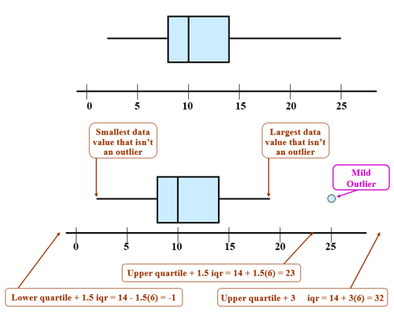

## Statistic Class Week 3

There are three types of statisticians. Those that can count and those that can't.

### Numeric Methods
* Describe the center of data
* Describe variance from the center
* Describe relative standing

### Today's Homework  
* Start reading chapter 4
* Prepare for the first exam next Monday

# Chapter 4 - Numeric Methods

## Center of the data - mean

The **sample mean** of a numeric sample $x_1,x_2,\ldots,x_n$, usually denoted by $\bar{x}$, is the sum of the observations divided by the number observations in the sample

$$\bar{x} = \frac{x_1+x_2+\cdots +x_n}{n} = \frac{\sum (x)}{n}$$

The **population mean** is denoted by $\mu$, is the average of all x values in the entire population.  

## Center of the data - adjusted mean 

Problems with the mean  

1.  The mean is not necessarily like any of the observations
2.  The mean is sensitive to outliers

The **centroid** is the observation, in the sample, that is closest to the mean value.

A **trimmed mean** is computed by deleting a selected number (or percentage) of values from each end of an ordered list, and finally computing the mean of the remaining values.

The **trimming percentage** is the percentage of values deleted from each end of the ordered list.

## Center of the data - median

The **sample median** is obtained by first ordering the n observations from smallest to largest (with any repeated values included, so that every sample observation appears in the ordered list). Then finding the middle value if n is odd or the mean of the middle two values if n is even.  

Odd data set with n = 7 

* {1, 3, 3, 6, 7, 8, 9}, the median is 6  

Even data set with n = 8  

* {1, 3, 3, 5, 6, 7, 8, 9}, the median is 5.5  

## Mean vs Median

Symmetric distribution  
$$\text{Mean} = \text{median}$$

Positively skewed distribution
$$\text{Mean} > \text{median}$$

Negatively skewed distribution
$$\text{Mean} < \text{median}$$

## Categorical - Sample Porportion of Success

The **sample proportion of success**, denoted by p, is
$$\hat{p} = \frac {\text{number of S's in the sample}}{n}$$

Where S is the label used for the response designated as success.  The population proportion of successes is denoted by p.

## Variability of Data

How much do the data vary from the center?  

* Range
* Deviations from the mean
* Variance, s2
* Standard deviation, s
* Quartiles

The simplest numerical measure of the variability of a numerical data set is the range, which is defined to be the difference between the largest and smallest data values.  

$$\text{Range} = \text{maximum} - \text{minimum}$$

## Variability of Data - Deviation from mean

Deviation from the mean

```{r}
x <- round(runif(5,0,15),0)
x
mean(x)
y <- x-mean(x)
y
```


## Variability of Data - Variance 
The sample variance, denoted s2 is the sum of the squared deviations from the mean divided by n-1.  

$$S^2 = \frac{\sum (x - \overline{x})^2}{n-1}= \frac{S_{xx}}{n-1}$$

```{r}
(x-mean(x))^2
sum((x-mean(x))^2)/(length(x)-1)
var(x)
```

<div class="notes">
Squares have to be centered around 0, so there really are merely (n-1) independent values. For example, if you told me (n-1) values, I would know the nth value. We say there are (n-1) degrees of freedom.
</div>

## Variability of Data - Standard deviation

The sample standard deviation, denoted s is the positive square root of the sample variance.  
$$s = \sqrt{\frac{1}{N-1} \sum_{i=1}^N (x_i - \overline{x})^2}$$

```{r}
sqrt(sum((x-mean(x))^2)/(length(x)-1))
sd(x)
```

The population standard deviation is denoted by $\sigma$.


## Variability of Data - Quartiles

* Lower quartile (Q1) = median of the lower half of the data set
* Upper Quartile (Q3) = median of the upper half of the data set 
* Interquartile range (iqr) = upper quartile - lower quartile

```{r}
x <- sort(round(runif(10,0,15),0))
x
quantile(x, probs = seq(0, 1, 0.25), type = 2)
```

Note: If n is odd, the median is excluded from both the lower and upper halves of the data.

## Variability of Data

How much do the data vary from the center?  

* Range: Quick, does not represent all the data
* Deviations from the mean: List of numbers not useful 
* Variance, s2: Not at the level of the data, but at the square of the data
* Standard deviation, s: Typical numeric representation of the deviation from the mean
* Quartiles: A measure of variability less sensitive to outliers than s

## Relative Standing - Outliers

* An observations is an outlier if it is more than 1.5 iqr away from the nearest quartile
* An outlier is **extreme** if it is more than 3 iqr from the nearest quartile and it is a **mild** outlier otherwise

2, 4, 7, 8, 9, 10, 10, 10, 11, 12, 12, 14, 15, 19, 25

```{r echo=FALSE}
x <- sort(c(2, 4, 7, 8, 9, 10, 10, 10, 11, 12, 12, 14, 15, 19, 25))
quantile(x, probs = seq(0, 1, 0.25), type = 2)
```

A mild outlier would need to be greater than 1.5 * 7 + 14 = 24.5  

An extreme outlier would need to be greater than 3 * 7 + 14 = 35

## Relative Standing - Box Plot

Constructing a Skeletal Boxplot  

1. Draw a horizontal (or vertical) scale.
2. Construct a rectangular box whose left (or lower) edge is at the lower quartile and whose right (or upper) edge is at the upper quartile (the box width = iqr). Draw a vertical (or horizontal) line segment inside the box at the location of the median.
3. Extend horizontal (or vertical) line segments from each end of the box to the smallest and largest observations in the data set. (These lines are called whiskers.)

A **modified boxplot** represents mild outliers by shaded circles and extreme outliers by open circles. Whiskers extend on each end to the most extreme observations that are not outliers

## Relative Standing - Box Plot



## Relative Standing - Percentile

For any particular number r between 0 and 100, the **rth percentile** is a value such that r percent of the observation in the data set fall at or below that value.

```{r echo = FALSE, warning=FALSE, message=FALSE, fig.width = 5, fig.height = 3}
library(ggplot2)
x<-rnorm(50000,mean = 0, sd = 1)
df<-data.frame(Value = x)
y<-quantile(x,probs = .9, names = FALSE)
ggplot(df, aes(x)) + geom_density(adjust=5) + geom_vline(xintercept = y)
```

Example of normal sample with r of 90% at `r round(qnorm(.9),2)`.  


## Relative Standing - Chebyshev's Rule

Consider the number k, where k $\le$ 1. Then the percentage of observations that are within k standard deviations of the mean is at least $100 (1 - \frac{1}{k^2}) %$

Number of Standard Deviations, k| $1 - \frac{1}{k^2} %$| Percentage Within k Standard Deviations of the Mean
------------- | -------------
2  | .75 | at least 75%
3  | .89 | at least 89%
4  | .94 | at least 94%
5  | .96 | at least 96%
10  | .99 | at least 99%


## Relative Standing - Empirical Rule

If the histogram of values in a data set is reasonably symmetric and unimodal (specifically, is reasonably approximated by a normal curve), then  

* Approximately 68% of the observations are within 1 standard deviation of the mean.
* Approximately 95% of the observations are within 2 standard deviation of the mean.
* Approximately 99.7% of the observations are within 3 standard deviation of the mean.


## Relative Standing - Z Score

The **z score** , or standardized score, is how many standard deviations the observation is from the mean.  

A positive z score indicates the observation is above the mean and a negative z score indicates the observation is below the mean.

$$\text{z score} = \frac{\text{Observation}- \text{mean}}{\text{standard deviation}}$$


$$\text{Z} = \frac{x- \bar{x}}{S}$$

## Relative Standing

* Box Plot - show an observation compared to quartiles, median and outliers
* Percentile - Show percent of the observation in the data set fall at or below that value
* Chebyshev's Rule - Show percentage of observations within k, standard deviations for any distribution
* Empirical Rule - Show percentage of observations within 1,2 and 3 standard deviations for a normal distribution
* Z Score - Standardized score of number of standard deviations from the mean and used to calculate percentile for a normal distribution.

## Homework Chapter 4

4.1, 4.6, 4.14, 4.15  
4.29, 4.31, 4.32, 4.33  
4.39, 4.43, 4.50, 4.58