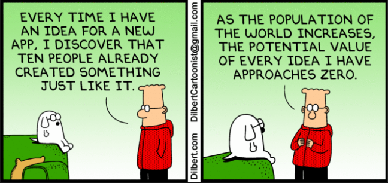
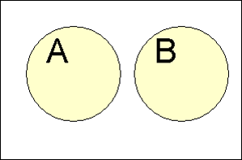

## Statistic Class Week 5



## Probability Terms {.smaller}

Review  

* Sampling is **with replacement** if, once selected, an individual or object is put back into the population before the next selection. 
* Sampling is **without replacement** if, once selected, an individual or object is not returned to the population prior to subsequent selections.

New  

*  A **chance experiment** is any activity or situation in which there is uncertainty about which of two or more possible outcomes will result.
The collection of all possible outcomes of a chance experiment is the **sample space** for the experiment.
*  An **event** is any collection of outcomes from the sample space of a chance experiment.  
*  A **simple event** is an event consisting of exactly one outcome.

## Probility of Events

If a chance experiment has k outcomes, all equally likely, then each individual outcome has the probability 1/k and the probability of an event E is

$$P(E) = \frac{\text{number of outcomes favorable to E}}{\text{number of outcomes in the sample space}}$$

## Probability with Dice . . . . . .   

Experiment of rolling two fair dice and observing the sum of the up faces.  A sample space description is given by.

$${(1, 1), (1, 2),..., (6, 6)}$$

where the pair (1, 2) means 1 is the 1st die and 2 is the 2nd die. This sample space  consists of 36 equally likely outcomes.  Let E stand for the event that the sum is 6.

$$P(E) = \frac{5}{36} = `r round(5/36,3)`$$

```{r echo = FALSE, warning=FALSE, message=FALSE}
df<-data.frame(A = sample(1:6,50,replace = TRUE), B = sample(1:6,50,replace = TRUE))
small<-length(df$A[df$A+df$B == 6])/length(df$A)
df<-data.frame(A = sample(1:6,5000,replace = TRUE), B = sample(1:6,500,replace = TRUE))
large<-length(df$A[df$A+df$B == 6])/length(df$A)
```

Or based on observing 50 rolls we can and calculate the relative frequency of `r round(small,3)`.

## Methods for Determining Probability

1. **The classical approach**: Appropriate for experiments that can be described with equally likely outcomes.
2. **The subjective approach**: Probabilities represent an individual's judgment based on facts combined with personal evaluation of other information.
3. **The relative frequency approach**: An estimate is based on an accumulation of experimental results. This estimate, usually derived empirically, presumes a repeatable chance experiment.

## Yahtzee!

1.  The classical approach
2.  The subjective approach
3.  The relative frequency approach

<div class="notes">
Classical - 6 possible Yahtzee out of $6^5$ or `r 6^5` = `r round(6/6^5,4)`... now need to calculate the probability of rolling in 2 then 3 rolls and sum.
Subjective - Who plays Yahtzee?  normally how many games until a Yahtzee?
Relative Frequency or Simulation?
</div>

## Law of Large Numbers

**Law of Large Numbers**: As the number of repetitions of a chance experiment increases, the chance that the relative frequency of occurrence for an event will differ from the true probability of the event by more than any very small number approaches zero.

The probability of an event E, denoted by P(E), is defined to be the value approached by the **relative frequency** of occurrence of E in a very long series of trials of a chance experiment. Thus, if the number of trials is quite large,

$$P(E) \approx \frac{\text{number of time E occurs}}{\text{number of trials}}$$

Previous example sample of 50 rolls is `r round(small,3)` whereas a sample of 500 is `r round(large,3)` compared to actual of `r round(5/36,3)`. 

## Yahtzee First Roll

```{r echo = FALSE, warning=FALSE, message=FALSE}
library(dplyr)
library(reshape2)
set.seed(31)

rolls<-50000
df<-data.frame(D1 = sample(1:6,rolls,replace = TRUE), D2 = sample(1:6,rolls,replace = TRUE),D3= sample(1:6,rolls,replace = TRUE),
               D4 = sample(1:6,rolls,replace = TRUE), D5 = sample(1:6,rolls,replace = TRUE))
df$Roll<-1:rolls

dfb<-melt(df,id.vars = "Roll")
dfb<-dfb %>% group_by(Roll, value) %>% summarize(Die_Count = length(value))
dfb<-dfb %>% group_by(Roll) %>% mutate(Max_Count = max(Die_Count)) %>% filter(Die_Count == Max_Count) %>% mutate(SEQ = 1:length(value)) %>% filter(SEQ == 1)
dfb<-dfb[,c("Roll","value","Die_Count")]
colnames(dfb)<-c("Roll","Keep","Die_Count")
df<-merge(df,dfb,by = "Roll")

one<-length(df$Roll[df$Die_Count==5])/rolls

df2<-df
df2$D1<-sample(1:6,rolls,replace = TRUE)
df2$D1[df2$Die_Count>=2]<-df2$Keep[df2$Die_Count>=2]
df2$D2<-sample(1:6,rolls,replace = TRUE)
df2$D2[df2$Die_Count>=2]<-df2$Keep[df2$Die_Count>=2]
df2$D3<-sample(1:6,rolls,replace = TRUE)
df2$D3[df2$Die_Count>=3]<-df2$Keep[df2$Die_Count>=3]
df2$D4<-sample(1:6,rolls,replace = TRUE)
df2$D4[df2$Die_Count>=4]<-df2$Keep[df2$Die_Count>=4]
df2$D5<-sample(1:6,rolls,replace = TRUE)
df2$D5[df2$Die_Count>=5]<-df2$Keep[df2$Die_Count>=5]
df2<-df2[,c("Roll","D1","D2","D3","D4","D5")]

dfb<-melt(df2,id.vars = "Roll")
dfb<-dfb %>% group_by(Roll, value) %>% summarize(Die_Count = length(value))
dfb<-dfb %>% group_by(Roll) %>% mutate(Max_Count = max(Die_Count)) %>% filter(Die_Count == Max_Count) %>% mutate(SEQ = 1:length(value)) %>% filter(SEQ == 1)
dfb<-dfb[,c("Roll","value","Die_Count")]
colnames(dfb)<-c("Roll","Keep","Die_Count")

df2<-merge(df2,dfb,by = "Roll")

two<-length(df2$Roll[df2$Die_Count==5])/rolls

df3<-df2
df3$D1<-sample(1:6,rolls,replace = TRUE)
df3$D1[df3$Die_Count>=2]<-df3$Keep[df3$Die_Count>=2]
df3$D2<-sample(1:6,rolls,replace = TRUE)
df3$D2[df3$Die_Count>=2]<-df3$Keep[df3$Die_Count>=2]
df3$D3<-sample(1:6,rolls,replace = TRUE)
df3$D3[df3$Die_Count>=3]<-df3$Keep[df3$Die_Count>=3]
df3$D4<-sample(1:6,rolls,replace = TRUE)
df3$D4[df3$Die_Count>=4]<-df3$Keep[df3$Die_Count>=4]
df3$D5<-sample(1:6,rolls,replace = TRUE)
df3$D5[df3$Die_Count>=5]<-df3$Keep[df3$Die_Count>=5]
df3<-df3[,c("Roll","D1","D2","D3","D4","D5")]

dfb<-melt(df3,id.vars = "Roll")
dfb<-dfb %>% group_by(Roll, value) %>% summarize(Die_Count = length(value))
dfb<-dfb %>% group_by(Roll) %>% mutate(Max_Count = max(Die_Count)) %>% filter(Die_Count == Max_Count) %>% mutate(SEQ = 1:length(value)) %>% filter(SEQ == 1)
dfb<-dfb[,c("Roll","value","Die_Count")]
colnames(dfb)<-c("Roll","Keep","Die_Count")

df3<-merge(df3,dfb,by = "Roll")

three<-length(df3$Roll[df3$Die_Count==5])/rolls
```

```{r echo = FALSE, warning=FALSE, message=FALSE, results='hide'}
library(googleVis)
op <- options(gvis.plot.tag='chart')
```

Percent of Yahtzee rolled on the first roll is `r round(one,3)`

```{r echo = FALSE, warning=FALSE, message=FALSE, results='asis'}
Table <- gvisTable(df[1:22,])
plot(Table)
```

## Yahtzee Second Roll

Percent of Yahtzee rolled on the second roll is `r round(two,3)`

```{r echo = FALSE, warning=FALSE, message=FALSE, results='asis'}
Table <- gvisTable(df2[1:22,])
plot(Table)
```

## Yahtzee Third Roll

Percent of Yahtzee rolled on the third roll is `r round(three,3)`

```{r echo = FALSE, warning=FALSE, message=FALSE, results='asis'}
Table <- gvisTable(df3[1:22,])
plot(Table)
```

## Venn Diagram

A **Venn Diagram** is an informal picture that is used to identify relationships and visualize relationships of chance events.  The collection of all possible outcomes of a chance experiment are represented as the interior of a rectangle.

   
  

## Venn Diagram Practice {.smaller}
Given you manage the health plan of a large employer and 40% of employees have a healthy diet, 30%  of employees have a good exercise habits and 10% of employees have both a healthy diet and good exercise habits.  We can define the following events:  

A = event that a selected employee is on a healthy diet  
B = event that a select employee has good exercise habits  

What is the probability of A union B $P(A\cup B)$ and A intersection B $P(A\cap B)$? 

  

## Conditional Probability {.smaller}

Let E and F be two events with P(F) > 0. The conditional probability of the event E given that the event F has occurred, denoted by P(E|F), is

$$P(E \mid F) = \frac{P(E \cap F)}{P(F)}$$

Level	| Satisfied	| Unsatisfied	| Total
------------- | ------------ | ------------ | ------------
College	| 0.095	| 0.055	| 0.150
High School	| 0.288	| 0.220	| 0.508
Elementary	| 0.162	| 0.180	| 0.342
Total	| 0.545	| 0.455	| 1.000  

  
1. What is proportion of satisfied (S) college (C) teachers?  $P(S\cap C)$?  
2. What is the proportion of teachers who are college teachers given they are satisfied is?  $P(C|S)$?

## Probility of Events

Event|Probability
------------- | ------------
A|$P(A)\in[0,1]$
Not A|$P(A^c)=1-P(A)$, $P(A^c) + P(A) = 1$
A or B|$\begin{align}
P(A\cup B) & = P(A)+P(B)-P(A\cap B) \\
P(A\cup B) & = P(A)+P(B) \qquad\mbox{if A and B are mutually exclusive} \\
\end{align}$
A and B|$\begin{align}
P(A\cap B) & = P(A|B)P(B) = P(B|A)P(A)\\
P(A\cap B) &  = P(A)P(B) \qquad\mbox{if A and B are independent}\\
\end{align}$
A given B|$P(A \mid B) = \frac{P(A \cap B)}{P(B)} = \frac{P(B|A)P(A)}{P(B)}$

## Independence {.smaller}

Two events E and F are said to be **independent** if P(E|F)=P(E).  
If P(E|F) = P(E), it is also true that P(F|E) = P(F) and vice versa.

If E and F are not independent, they are said to be **dependent events**.


Previous example $P(C|S) \neq P(C)$, so C and S are **dependent**.  
Whereas the probability of each dice roll (coin flip) is **independent**.

Multiplication Rule for Independent Events (rolling multiple dice)

* The events E and F are independent if and only if
$$P(E\cap F) = P(E)P(F)$$


## Relative Frequency Excel Practice {.smaller}

```{r echo = FALSE, warning=FALSE, message=FALSE}
# Random Patient Generator
vte_patients<-500 + rnorm(1, mean = 50, sd = 10)
non_vte_patient<-vte_patients*10 + rnorm(1, mean = 100, sd = 20)
genders<-c("M","F")

df_vte<-data.frame(
  Gender = sample(genders,vte_patients,replace = TRUE),
  Age = round(runif(vte_patients,0,15)+rnorm(vte_patients, mean = 50, sd = 10),0),
  D_Dimer = rbinom(vte_patients, 1, .8),
  VTE = 1)

#low risk: young women
df_vte$D_Dimer[df_vte$Age<50 & df_vte$Gender == "F"]<-rbinom(length(df_vte$D_Dimer[df_vte$Age<50 & df_vte$Gender == "F"]), 1, .6)

#high risk: old men
df_vte$D_Dimer[df_vte$Age>50 & df_vte$Gender == "M"]<-rbinom(length(df_vte$D_Dimer[df_vte$Age>50 & df_vte$Gender == "M"]), 1, .8)

df_novte<-data.frame(
  Gender = sample(genders,non_vte_patient,replace = TRUE),
  Age = round(runif(non_vte_patient,0,15)+rnorm(non_vte_patient, mean = 50, sd = 10),0),
  D_Dimer = rbinom(non_vte_patient, 1, .2),
  VTE = 0)

#low risk: young women
df_novte$D_Dimer[df_novte$Age<50 & df_novte$Gender == "F"]<-rbinom(length(df_novte$D_Dimer[df_novte$Age<50 & df_novte$Gender == "F"]), 1, .25)

#high risk: old men
df_novte$D_Dimer[df_novte$Age>50 & df_novte$Gender == "M"]<-rbinom(length(df_novte$D_Dimer[df_novte$Age>50 & df_novte$Gender == "M"]), 1, .3)

df<-rbind(df_vte,df_novte)

#write.csv(df, "Data_Sets/Random_Patients_VTE.csv",row.names = FALSE)
df$NEG_D_Dimer<-0
df$NEG_D_Dimer[df$D_Dimer==0]<-1

P_VTE = round(mean(df$VTE),2)
P_VTE_c= 1-P_VTE
P_VTE_POS_D_Dimer = round(mean(df$VTE[df$D_Dimer==1]),2)
P_VTE_NEG_D_Dimer = round(mean(df$VTE[df$D_Dimer==0]),2)

P_TP = round(mean(df$D_Dimer[df$VTE==1]),2)
P_TN = round(mean(df$NEG_D_Dimer[df$VTE==1]),2)
P_FP = round(mean(df$D_Dimer[df$VTE==0]),2)
P_FN = round(mean(df$NEG_D_Dimer[df$VTE==0]),2)

#write.csv(df, "Data_Sets/Random_Patients_VTE.csv",row.names = FALSE)
```

A venous thromboembolism (VTE), is a blood clot that breaks loose and travels in the blood.  This may cause serious life-threatening condition such as a heart attack or stroke.  A d-dimer test is a blood test that measures a substance that is released when there is a blood clot and can be used to assess the likelihood of a VTE. 

[VTE PATIENT DATA](https://docs.google.com/spreadsheets/d/1T6-CB3eaOhAjtUS6fdkWrHWCPYUBlOr6_moZbr-9Mgk/edit?usp=sharing)

VTE Patients Part A - Using data set to find probabities (pivot table practice)

1. What is the probability of a VTE with a positive d-dimer?
2. What is the probability of a VTE with a negative d-dimer?
3. What is the total probability of a VTE?
4. If you are an older (above 50) male with a positive d-dimer test, what is your likelihood of a VTE?
5. If you are an young (below 50) female with a positive d-dimer test, what is your likelihood of a VTE?

## General Probability Rules: {.smaller}

If $B_1,B_2,...B_k$ are mutually exclusive events with $P(B_1)+P(B_2) = 1$ then for any event E

The law of Total Probability
$$P(E)= P(E \cap B_1) + P(E \cap B_2) = P(E|B_1)P(B_1) + P(E|B_2)P(B_2)$$

Bays Rule  
$$P(B_1|E) = \frac{P(E|B_1)P(B_1)}{P(E|B_1)P(B_1) + P(E|B_2)P(B_2)}$$

## Law of total probability Example {.smaller}

VTE Patients Part B - Calculating probabilities without the data set  

$VTE$ = Event that the patient has a VTE  
$VTE^c$ = Event that the patient does not of a VTE  
$+DDIMER$ = Event that the patient has a positive d-dimer  
$-DDIMER$ = Event that the patient has a negative d-dimer  

If we only know:   
P(VTE) = `r P_VTE`   
P($VTE^c$)= `r P_VTE_c`   
P(VTE|+DDimer) = `r P_VTE_POS_D_Dimer`  
P(VTE|-DDimer) = `r P_VTE_NEG_D_Dimer`  

<br>
What is the probability of a positive d_dimer test, P(+DDIMER)?  

## Bays Rule Example {.smaller}

If we only know:  
P(VTE) = `r P_VTE` and P($VTE^c$)= `r P_VTE_c`   

Test Results  | Positive | Negative
------------- | ------------- | -------------
TRUE | $P(+DDIMER|VTE)$ = `r P_TP` |  $P(-DDIMER|VTE)$ = `r P_TN`
FALSE | $P(+DDIMER|VTE^c)$ = `r P_FP` | $P(-DDIMER|VTE^c)$ = `r P_FN`

<br>
What is the probability of VTE given a positive d_dimer test, P(VTE|+DDimer)?

## Homework

Chapter 6

* 6.3,6.11,6.24, 6.29
* 6.31, 6.35, 6.43, 6.50
* 6.54, 6.59, 6.67, 6.81

Excel Challenge: Create all 7776 possible rolls in a Yahtzee game.  In one roll, what is the probability of getting 1, 2, 3, 4, or all 5 ones?

<center></center>