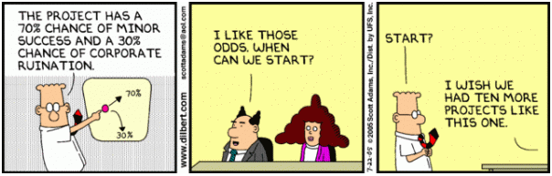

## Announcements  

* Start reading chapter 7
* Complete chapter 6 homework

<center></center>

# Chapter 7: Probability Distribution

## Random Variable

A numerical variable whose value depends on the outcome of a chance experiment is called a **random variable**. A random variable associates a numerical value with each outcome of a chance experiment.

* **Discrete** if the possible values are isolated points on the number line. 
* **Continuous** if the set of possible values form an entire interval on the number line.

## Probability distributions

The probability distribution of a **discrete random variable x** gives the probability associated with each possible x value.

1. For every possible x value, $0 \le p(x) \le 1$.
2. $\sum p(x) = 1$  

A probability distribution for a **continuous random variable x** is specified by a mathematical function denoted by f(x) which is called the **density function**.  The graph of a density function is a smooth curve (the **density curve**). 

The following requirements must be met:  

1. f(x) > 0 
2. The total area under the density curve is equal to 1.

## Types of Probability distributions

Discrete Probability distribution  

* Binomial
* Geometric

Continuous Probability distribution  

* Normal
* Uniform
* Poisson

<div class="notes">
**Binomial** - number of successes observed when experiment is performed.  Ex flip a coin.  
**Geometric** - number of trials until the first success is observed (including the success trial).  Ex flip coin until heads.  
**Normal** - How far an apple falls from the tree.  
**Uniform** - Rain or sun shinning or leaves falling. Or many overlapping normal distributions.  
**Poisson** - Number of people arriving into an emergency department on a given hour.  
</div>

## Discrete Random Probability Mean and Variance

The mean value of a random variable x, denoted by $\mu_x$, describes where the probability distribution of x is centered.  

$$\mu_x = \sum xp(x)$$

The standard deviation of a random variable x, denoted by $\sigma_x$, describes variability in the probability distribution.    

$$\sigma_x^2 = \sum (x- \mu_x)^2p(x)$$

<div class="notes">
$\mu_x$ is computed by first multiplying each possible x value by the probability of observing that value and then adding the resulting quantities  

$\sigma_x$ is the square root of the variance which is computed by first subtracting the mean from each possible x value to obtain the deviations, then squaring each deviation and multiplying the result by the probability of the corresponding x value, and then finally adding these quantities.  

1. When $\sigma_x$ is small, observed values of x will tend to be close to the mean value
2. when $\sigma_x$ is large, there will be more variability in observed values
</div>

## Mean & Variance of a Linear Function

If x is a random variable with mean, $\mu_x$, and variance, $\sigma_x^2$ and a and b are numeric constants, the random variable y defined by $y = a + bx$ is called a **linear function of the random variable x**

The mean of y = a+ bx is $$\mu_y = \mu_{a + bx} = a + b\mu_x$$

The variance of y is $$\sigma_y^2 = \sigma_{a + bx}^2 = b^2*\sigma_x^2$$

## Coffee Break

Suppose x is the number of sales staff needed on a given day.  If the cost opening the coffee shop on a day involves fixed costs of $255 and the cost per barista per day is $110. Answer the following questions where the distribution of x is given below   
```{r echo = FALSE, warning=FALSE, message=FALSE, results='hide'}
library(googleVis)
op <- options(gvis.plot.tag='chart')
df<-data.frame(x = c(1:5), probab_x = c(.25,.35,.2, .15, .05))
```

<center>
```{r echo = FALSE, warning=FALSE, message=FALSE, results='asis'}
Table <- gvisTable(df)
plot(Table)
```
</center>
<br>  

1.  What is the average, $\mu_x$, number of baristas that are needed?
2.  What is the mean cost, $\mu_y$,of doing business on a given day? 
3.  What is the probability the cost is within 1 standard deviation of the mean cost?

## Coffee Break Results

```{r echo = FALSE, warning=FALSE, message=FALSE, results='hide'}
df$Product<-df$x*df$probab_x
prob_mean<-sum(df$Product)
df$Deviation<-df$x-prob_mean
df$Dev_sqrt<-df$Deviation^2
df$Product_Dev<-df$Dev_sqrt*df$probab_x
prob_var<-sum(df$Product_Dev)
prob_sd<-round(sqrt(prob_var),2)
df$Cost<-255+ 110*df$x
cost_mean<-round(255+ 110*prob_mean,2)
cost_sd<-round(sqrt(110^2*prob_var),2)
```

<center>
```{r echo = FALSE, warning=FALSE, message=FALSE, results='asis'}
Table <- gvisTable(df)
plot(Table)
```
</center>

<div class="notes">
$\mu_x$ = `r prob_mean`  
$\sigma_x$ = `r prob_sd`  
$\mu_y$ = `r cost_mean`  
$\sigma_y$ = `r cost_sd`  
Cost is between `r cost_mean-cost_sd` and `r cost_mean+cost_sd`
</div>

## Binomial Distribution

The binomial random variable x is defined as the number of successes observed when experiment is performed.  Let   
n = number of independent trials in a binomial experiment  
p = constant probability that any particular trial results in a success.

Then  P(x) = P(x success among n trials)

$$P(x) = \binom n x  p^x(1-p)^{n-x} \text{ where } \binom n x =\frac{n!}{x!(n-x)!}$$

Note this can be read n choose x and 0! = 1 and $x^0=1$.  The $\mu_x$ and $\sigma_x$ can be solved with  
$$\mu_x = np  \text{ and }  \sigma_x = \sqrt{np(1-p)}$$

<div class="notes">
n choose x give the number of outcomes of that type.  
Challenge what is n choose 1 $\binom n 1$

a.	1
b.	The value of n must be known.
c.	n
d.	0

</div>

## Back to Yahzee

You are on you very last roll need to get 1s.  What is your probability of getting 0, 1, 2,3, 4 or 5 number of 1s on your last roll?

Is rolling dice a **binomial experiment** of success or failure?  
Is each die an **independent trial**?  
What is the **constant probability** of any particular die being one?   

## Another binomial distribution problem

Given that 7 in 10 auto accidents involve a single vehicle, suppose 15 accidents are randomly selected.

1.  What is the probability that exactly six involve multiple vehicles?
2.  What is the probability that six or less involve multiple vehicles?

<div class="notes">
1.  .147
2.  .864

</div>

## Geometric Distribution

A **geometric** random variable is defined as
x = number of trials until the first success is observed (including the success trial)

If x is a geometric random variable with probability of success = p for each trial, then 

$$P(x) = p(1-p)^{(x-1)}$$

Example would be number of widgets from an assembly line until the widget meets specifications.

## Chapter 7: Discrete Homework

* 7.9, 7.17, 7.29
* 7.30, 7.34, 7.43
* 7.53, 7.54, 7.61

Challenge: Create a excel tool for a binomial distribution problem