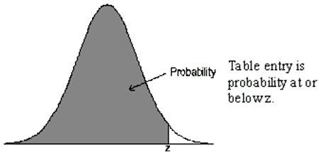

## Statistics Class Week 6

Probability Distributions


## Announcements  

* Start reading chapter 7
* Complete chapter 6 homework
* Discussion Board:  Useful and/or Informative Analytics
    + What is the problem addressed or decision supported?
    + What are the main variables and data sources?
    + How is are the variables displayed?
    + Does it capture and hold your attention?  Is it interactive or engaging?
    + What could be improved to help communicate?

# Chapter 7: Probability Distribution

## Random Variable

A numerical variable whose value depends on the outcome of a chance experiment is called a **random variable**. A random variable associates a numerical value with each outcome of a chance experiment.

* **Discrete** if the possible values are isolated points on the number line. 
* **Continuous** if the set of possible values form an entire interval on the number line.

## Probability distributions

The probability distribution of a **discrete random variable x** gives the probability associated with each possible x value.

1. For every possible x value, $0 \le p(x) \le 1$.
2. $\sum p(x) = 1$  

A probability distribution for a **continuous random variable x** is specified by a mathematical function denoted by f(x) which is called the **density function**.  The graph of a density function is a smooth curve (the **density curve**). 

The following requirements must be met:  

1. f(x) > 0 
2. The total area under the density curve is equal to 1.

## Types of Probability distributions

Discrete Probability distribution  

* Binomial
* Geometric

Continuous Probability distribution  

* Normal
* Uniform
* Poisson

<div class="notes">
**Binomial** - number of successes observed when experiment is performed.  Ex flip a coin.  
**Geometric** - number of trials until the first success is observed (including the success trial).  Ex flip coin until heads.  
**Normal** - How far an apple falls from the tree.  
**Uniform** - Rain or sun shinning or leaves falling. Or many overlapping normal distributions.  
**Poisson** - Number of people arriving into an emergency department on a given hour.  
</div>

## Discrete Random Probability Mean and Variance

The mean value of a random variable x, denoted by $\mu_x$, describes where the probability distribution of x is centered.  

$$\mu_x = \sum xp(x)$$

The standard deviation of a random variable x, denoted by $\sigma_x$, describes variability in the probability distribution.    

$$\sigma_x^2 = \sum (x- \mu_x)^2p(x)$$

<div class="notes">
$\mu_x$ is computed by first multiplying each possible x value by the probability of observing that value and then adding the resulting quantities  

$\sigma_x$ is the square root of the variance which is computed by first subtracting the mean from each possible x value to obtain the deviations, then squaring each deviation and multiplying the result by the probability of the corresponding x value, and then finally adding these quantities.  

1. When $\sigma_x$ is small, observed values of x will tend to be close to the mean value
2. when $\sigma_x$ is large, there will be more variability in observed values
</div>

## Coffee Break

Suppose x is the number of sales staff needed on a given day.  If the cost opening the coffee shop on a day involves fixed costs of $255 and the cost per barista per day is $110. Answer the following questions where the distribution of x is given below   

1.  What is the average, $\mu_x$, number of baristas that are needed?  Expected?
2.  What is the mean cost, $\mu_y$,of doing business on a given day? What is the probability the cost is within 1 standard deviation of the mean cost?

```{r echo = FALSE, warning=FALSE, message=FALSE, results='hide'}
library(googleVis)
op <- options(gvis.plot.tag='chart')
df<-data.frame(x = c(1:5), probab_x = c(.25,.35,.2, .15, .05))
```

```{r echo = FALSE, warning=FALSE, message=FALSE, results='asis'}
Table <- gvisTable(df)
plot(Table)
```

## Mean & Variance of a Linear Function

If x is a random variable with mean, $\mu_x$, and variance, $\sigma_x^2$ and a and b are numeric constants, the random variable y defined by $y = a + bx$ is called a **linear function of the random variable x**

The mean of y = a+ bx is $$\mu_y = \mu_{a + bx} = a + b\mu_x$$

The variance of y is $$\sigma_y^2 = \sigma_{a + bx}^2 = b^2 + \sigma_x^2$$

## Coffee Break Results

```{r echo = FALSE, warning=FALSE, message=FALSE, results='hide'}
df$Product<-df$x*df$probab_x
prob_mean<-sum(df$Product)
df$Deviation<-df$x-prob_mean
df$Dev_sqrt<-df$Deviation^2
df$Product_Dev<-df$Dev_sqrt*df$probab_x
prob_var<-sum(df$Product_Dev)
prob_sd<-round(sqrt(prob_var),2)
df$Cost<-255+ 110*df$x
cost_mean<-round(255+ 110*prob_mean,2)
cost_sd<-round(sqrt(110^2*prob_var),2)
```

```{r echo = FALSE, warning=FALSE, message=FALSE, results='asis'}
Table <- gvisTable(df)
plot(Table)
```

<div class="notes">
$\mu_x$ = `r prob_mean`  
$\sigma_x$ = `r prob_sd`  
$\mu_y$ = `r cost_mean`  
$\sigma_y$ = `r cost_sd`  
Cost is between `r cost_mean-cost_sd` and `r cost_mean+cost_sd`
</div>

## Binomial Distribution

The binomial random variable x is defined as the number of successes observed when experiment is performed.  Let   
n = number of independent trials in a binomial experiment  
p = constant probability that any particular trial results in a success.

Then  P(x) = P(x success among n trials)

$$P(x) = \binom n x  p^x(1-p)^{n-x} \text{ where } \binom n x =\frac{n!}{x!(n-x)!}$$

Note this can be read n choose x and 0! = 1 and $x^0=1$.  The $\mu_x$ and $\sigma_x$ can be solved with  
$$\mu_x = np  \text{ and }  \sigma_x = \sqrt{np(1-p)}$$

<div class="notes">
n choose x give the number of outcomes of that type.
</div>

## Back to Yahzee

You are on you very last roll need to get 1s.  What is your probability of getting 0, 1, 2,3, 4 or 5 number of 1s on your last roll?

Is rolling dice a **binomial experiment** of success or failure?  
Is each die an **independent trial**?  
What is the **constant probability** of any particular die being one?   

## Geometric Distribution

A **geometric** random variable is defined as
x = number of trials until the first success is observed (including the success trial)

If x is a geometric random variable with probability of success = p for each trial, then 

$$P(x) = p(1-p)^(x-1)$$

Example would be number of widgets from an assembly line until the widget meets specifications.

# Continuous Distributions

## Normal Distribution  

A normal distribution with  $\mu_x = 0$ and $\sigma_x = 1$, is called the standard (or standardized) normal distribution.

```{r echo = FALSE, warning=FALSE, message=FALSE, fig.width = 9, fig.height = 4}
library(ggplot2)
library(gridExtra)
x<-rnorm(50000,mean = 0, sd = 1)
df<-data.frame(Value = x, Label = "Mean = 0")
x<-rnorm(50000,mean = 2, sd = 1)
dfb<-data.frame(Value = x, Label = "Mean = 2")
df<-rbind(df,dfb)
x<-rnorm(50000,mean = -2, sd = 1)
dfb<-data.frame(Value = x, Label = "Mean = -2")
df<-rbind(df,dfb)

plot1<-ggplot(df, aes(Value, color = Label)) + geom_density(adjust = 3) + labs(title = 'Mean Change')

x<-rnorm(50000,mean = 0, sd = 1)
df<-data.frame(Value = x, Label = "SD = 1")
x<-rnorm(50000,mean = 0, sd = .5)
dfb<-data.frame(Value = x, Label = "SD = .5")
df<-rbind(df,dfb)
x<-rnorm(50000,mean = 0, sd = 2)
dfb<-data.frame(Value = x, Label = "SD = = 2")
df<-rbind(df,dfb)

plot2<-ggplot(df, aes(Value, color = Label)) + geom_density(adjust = 3) + labs(title = 'Standard Deviation Change')

grid.arrange(plot1, plot2, ncol=2)
```

## Using the Standard Normal Table

[Link to table on Wiki](https://en.wikipedia.org/wiki/Standard_normal_table) or use back of statistics book.

 

## Example Z Calculation


## 2 year old boys

[CDC Baby Boy Growth Chart](http://www.cdc.gov/growthcharts/data/set1/chart05.pdf)

What is the mean and standard deviation of height for a 2 year old boys?

Reminder $\text{Z} = \frac{x- \bar{x}}{S}$  

97 Percentile = 34.5
50 Percentile = 34.5

<div class="notes">

</div>

## 2 year Old height Sample

Normal Distribution.  Say we take randomly sample 30 2 year old boys with $\mu$  = 34 inches and $\sigma$ = 1.2.

```{r echo = FALSE, warning=FALSE, message=FALSE, results='hide'}
library(googleVis)
op <- options(gvis.plot.tag='chart')
set.seed(10)
n<-10
A<-round(rnorm(n,mean = 34, sd = 1.2),2)
B<-round(rnorm(n,mean = 34, sd = 1.2),2)
C<-round(rnorm(n,mean = 34, sd = 1.2),2)
#x<-runif(n,31,36)
df<-data.frame(A = A,B=B,C=C)
```

```{r echo = FALSE, warning=FALSE, message=FALSE, results='asis'}
Table <- gvisTable(df)
plot(Table)
```

## Excel Practice

1. Plot the density
2. Plot the cumulative distribution
3. What is the occurrence of height greater or equal to 3 ft? Probability based on the sample? Probability based on the population?
4. What is the probability of height being between 34 and 36 inches? Probability based on the sample? Probability based on the population?

## 2 year old Plots
```{r echo = FALSE, warning=FALSE, message=FALSE, fig.width = 9, fig.height = 5}
library(ggplot2)
library(gridExtra)
df<-data.frame(x = c(A,B,C))
df$cum_x<-cumsum(df$x)
df$z<-(df$x-mean(df$x))/sd(df$x)
df$Probability<-pnorm(df$z)

plot1<-ggplot(df,aes(x)) + geom_histogram(aes(y = ..density..),binwidth = .5) + geom_density(color = "red", size = 1) + labs(title = "2 Yrs Old PDF", x = "Height Inches")
plot2<-ggplot(df,aes(x)) + stat_ecdf(binwidth = .5, size = 1, color = 'blue') + labs(title = "2 Yrs Old CDF", x = "Height Inches", y = "Cummulative Density")
plot3<-ggplot(df,aes(y = Probability,x = x)) + geom_point() + labs(title = "Normal Probability Plot", x = "Height Inches")
grid.arrange(plot1, plot2, plot3, ncol=3)
```

## 2 year old Sample Data

```{r echo = FALSE, warning=FALSE, message=FALSE, results='asis'}
Table <- gvisTable(df)
plot(Table)
```

## Chapter 7 Homework

* 7.9, 7.17, 7.20, 7.23, 7.24
* 7.29, 7.30, 7.34, 7.43, 7.53
* 7.54, 7.61, 7.64, 7.75


