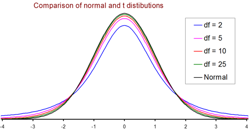

## Statistics Class Week 7 and 8

"There are three kinds of lies: lies, damned lies, and statistics."  - Benjamin Disraeli, British Prime Minister (late 18th century)  


### Announcements

* Chapter 7 Homework Due Wednesday
* Start reading chapter 8 and 9
* Complete discussion Board and replies by Friday
* Exam 2 is covering chapters 4 through 7 next week

# Chapter 8 Sampling Distributions

##  Terminology

Any quantity computed from values in a sample is called a **statistic**.

The observed value of a statistic depends on the particular sample selected from the population; typically, it varies from sample to sample. This variability is called **sampling variability**.

The distribution of a statistic is called its **sampling distribution**.

### Question

What is the center and variability of samples?

## Sampling Distribution of a Sample Mean

Let $\bar{x}$ denote the mean of the observations in a random sample of size n from a population having mean $\mu$ and standard deviation $\sigma$. Denote the mean value of the distribution by $\mu_\bar{x}$ and standard deviation of the distribution by $\sigma_\bar{x}$ (called the standard error of the mean)

##  Properties

When random samples are selected form a population, the following are properties of the sampling distribution of $\bar{x}$.

1. $\mu = \mu_\bar{x}$ 
2. $\sigma = \frac{\sigma_\bar{x}}{\sqrt{n}}$  
This rule is approximately correct as long as no more than 5% of the population is included in the sample.
3. When the population distribution is normal, the sampling distribution of $\bar{x}$ is also normal for any sample size n.
4. When n is sufficiently large, the sampling distribution of $\bar{x}$ is approximately normally distributed, even when the population distribution is not itself normal. Central Limit Theorem.

## Central Limit Theorem

The Central Limit Theorem can safely be applied when n exceeds 30.

If n is large or the population distribution is normal, the standardized variable 

$$\text{Z} = \frac{\bar{x}- \mu_\bar{x}}{\sigma_\bar{x}} = \frac{\bar{x}- \mu_\bar{x}}{\sigma} * \frac{1}{\sqrt{n}}$$

has (approximately) a standard normal (z) distribution regardless of the underlying distribution.

<div class="notes">
The average of averages is going to be normal.  Especially when n is large.
</div>

## Why does Central Limit Theorem (CLT) matter?

Results enable inferencial statistics about a population mean even when the shape of the populaiton distribution is unknown.


<div class="notes">
Example about skewed graphs.  
And show histram of rolling 1 die vs 2 dice.
</div>

## Example with Different Population Distributions

Random data for 3 distributions with values of 0 to 100

```{r echo = FALSE, warning=FALSE, message=FALSE, results='hide'}
library(ggplot2)
set.seed(10)
dfa<-data.frame(Type = "Normal", x = round(rnorm(1000,mean = 50, sd = 10),0))
dfb<-data.frame(Type = "Uniform", x = round(runif(1000, 0,100),0))
dfc<-data.frame(Type = "Skewed", x = round(rnorm(1000,mean = 40, sd = 20)+runif(100, 20,30),0))
dfc$x[dfc$x>100]<-100
df<-rbind(dfa,dfb,dfc)
ggplot(df, aes(x, color = Type)) + geom_density(adjust = 3, size = 1) + labs(title = 'Distributions')

```

## Sample Distribution based on n

```{r echo = FALSE, warning=FALSE, message=FALSE, results='hide', fig.width = 9, fig.height = 6}
dfa<-data.frame(Sample = 1:100, Type = "Normal")
dfb<-data.frame(Sample = 1:100, Type = "Uniform")
dfc<-data.frame(Sample = 1:100, Type = "Skewed")
df_sample<-rbind(dfa,dfb,dfc)

clt<-function(sample_type, n)
  {
  mean(sample(df$x[df$Type == sample_type], size = n))
  }

df_sample$Sample_Mean<-mapply(df_sample$Type,2, FUN = clt)
plot1<-ggplot(df_sample, aes(Sample_Mean, color = Type)) + geom_density(adjust = 3, size = 1) + labs(title = 'n = 2')
df_sample$Sample_Mean<-mapply(df_sample$Type,5, FUN = clt)
plot2<-ggplot(df_sample, aes(Sample_Mean, color = Type)) + geom_density(adjust = 3, size = 1) + labs(title = 'n = 5')
df_sample$Sample_Mean<-mapply(df_sample$Type,10, FUN = clt)
plot3<-ggplot(df_sample, aes(Sample_Mean, color = Type)) + geom_density(adjust = 3, size = 1) + labs(title = 'n =10')
df_sample$Sample_Mean<-mapply(df_sample$Type,20, FUN = clt)
plot4<-ggplot(df_sample, aes(Sample_Mean, color = Type)) + geom_density(adjust = 3, size = 1) + labs(title = 'n = 20')

library(gridExtra)
grid.arrange(plot1, plot2, plot3,plot4, ncol=2,nrow = 2)
```

## Example

Let x denote the time (in minutes) that is takes a fifth-grade student to read a certain passage.  Suppose that the mean value and standard deviation of z are $\mu = 2$ minutes and $\sigma = 0.8$ minutes, respectively.

1.  If $\bar{x}$ is the sample mean time for a random sample of n = 9 students, where is the $\bar{x}$ distribution center, and how much does it spread out (as described by its standard deviation)?
2.  What is the center and spread for n = 25 and n = 100?
3.  Which of the sample sizes would be most likely to result in an $\bar{x}$ value close to $\mu$, and why?

<div class="notes">
Problem 8.15  

1. $\mu_\bar{x} = 2$, $\sigma_\bar{x} = 0.267$
2. $\mu_\bar{x} = 2$ will alway be 2.  For n = 25, $\sigma_\bar{x} = 0.16$.  When n = 100, $\sigma_\bar{x} = 0.008$
3. Since n = 100, has the smallest standard deviation it is most likily to have $\bar{x}$ be closer to $\mu$
</div>

## Sampling Distribution of a Sample Proportion $\hat{p}$
Let $\hat{p}$ be the proportion of successes in a random sample of size n from a population whose proportion of S's (successes) is p. Denote the mean of p by $\mu_\hat{p}$ and the standard deviation by $\sigma_\hat{p}$.

## Sample Proportion Properties

When random samples are selected from a population, the following are properties of the sampling distribution $\hat{p}$

1.  $\mu_\hat{p} = p$
2.  $\sigma_\hat{p} = \sqrt{\frac{p(1-p)}{n}}$
3. When n is large and p is not too near 0 or 1, the sampling distribution of p is approximately normal.

# Chapter 9 Point Estimation

## Terms

A **point estimate** of a population characteristic is a single number that is based on sample data and represents a plausible value of the characteristic

A statistic with mean value equal to the value of the population characteristic being estimated is said to be an **unbiased** statistic. A statistic that is not unbiased is said to be **biased**.

## Confidence

A  **confidence interval** an interval of plausible values for a population characteristic. It is constructed so that, with a chosen degree of confidence, the value of the characteristic will be captured inside the interval.

The **confidence level** is the success rate of the method used to construct a confidence interval.

Question - What is my age?

## 95% Confidence

When n is large, a **95% confidence interval for p** is 

$$\hat{p} \pm 1.96 \sqrt{\frac{p(1-p)}{n}}$$

For other confidence intervals replace the 1.96 with the appropriate z crical value such as 1.645 for 90% or 2.58 for 99% confidence.  The **bound on error estimation**, B, represents the confidence interval quantity $1.96 \sqrt{\frac{p(1-p)}{n}}$

## Choosing the sample size

The sample size required to estimate a population proportion p to within an amount B with 95% confidence is

$$n = p(1-p)\frac{1.96}{B}^2$$

Where B is the bound on error of estimation associated with a 95% confidence interval.  

$$B = 1.96 \sqrt{\frac{p(1-p)}{n}}$$

## Confidence Interval Example

In an AP-AOL sports poll (Associated Press, December 2015), 394 of 1000 randomly selected U.S. adults indicated that they considered themselves to be baseball fans, 272 stated that they thought the designated hitter rule should either be explanded to both leagues or eliminated.

1.  What is the 95% confidence interval for the proportion of U.S. adults who consider themselves to be baseball fans.
2.  What is the 95% confidence interval for the proportion of those who consider themselves to be  baseball fans who think the designated hitter rule should be expanded to both leagues or eliminated.
3.  Why are these confidence intervals different?

<div class="notes">
Problem 9.24

1. (0.3637, 0.4243)
2. (0.6443, 0.7357)
3. Sample size and sample proportions are different
</div>

## Confidence Interval for a Population Mean

One-Sample z Confidence Interval for $\mu$

1. $\bar{x}$ is the sample mean from a **simple random sample**,
2. the **sample size n is large** (generally n $\ge 30$), and 
3. $\sigma$, the **population standard deviation**, is known  
is  

$$\bar{x} \pm (\text{z critical value})*(\frac{\sigma}{\sqrt{n}})$$

## Confidence Interval for $\mu$ When $\sigma$ is unknown

Student's **t distributions**.  If $\bar{x}$ and s are the mean and standard deviation of a random sample from a normal population, then the probability of the standardized variable is 

$$t = \frac{\bar{x}-\mu}{\frac{s}{\sqrt{n}}}$$

with degrees of freedom df = n - 1 and a confidence interval

$$\bar{x} \pm (\text{t critical value})*(\frac{s}{\sqrt{n}})$$

<div class="notes">
**Degrees of freedom** is the number of values in the final calculation of a statistic that are free to vary.  Remember n-1 for sample standard deviation or n-2 for standard deviation about the least squares line.
</div>


## T distibution



Notes  

*  As df increases, t distributions approach the standard normal distribution
*  Each t distribution is more spread out than the standard normal curve (z)
*  As df increases, the spread of the corresponding t distribution decreases.

## T critical Values

Since each t distribution would require a table similar to the standard normal table, we usually only create a table of critical values for the t distributions.


## Example T 

Five studends visiting the student health center for were asked how many months had passed since their last visit to a dentist.  Their responses were as follows:   

6, 17, 11, 22, 29

What is the 95% confidence interval for the mean number of months elapsed?

<div class="notes">
Problem 9.50

(5.77,28.23) with $\bar{x} = 17$, s = 9.028, n = 5 and df = 4
</div>

## Chapter 8 and 9 Homework

* 8.10,8.11,8.19,8.22, 8.23
* 9.7, 9.11, 9.19, 9.35, 9.39
