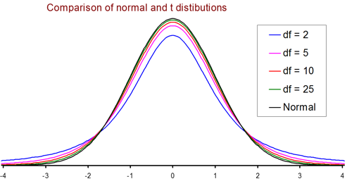

## Statistics Class

<div class="columns-2">


### Announcements

* Chapter 8 Homework due Friday
* Chapter 7-8 Quiz due Friday
<div>

# Chapter 9 Point Estimation

## Review Sample Distribution Properties

<div class="columns-2">
Distribution of mean $\bar{x}$  

1. $\mu_\bar{x} = \mu$ 
2. $\sigma_\bar{x} = \frac{\sigma}{\sqrt{n}}$  

<br>

Distribution of proportion $\hat{p}$  

1.  $\mu_\hat{p} = p$
2.  $\sigma_\hat{p} = \sqrt{\frac{p(1-p)}{n}}$
<div>

## New Terms

A **point estimate** of a population characteristic is a single number that is based on sample data and represents a plausible value of the characteristic

A statistic with mean value equal to the value of the population characteristic being estimated is said to be an **unbiased** statistic. A statistic that is not unbiased is said to be **biased**.

## Confidence Overview

A  **confidence interval** is an interval of plausible values for a population characteristic. It is constructed so that, with a chosen degree of confidence, the value of the characteristic will be captured inside the interval.  The **bound on error estimation**, B, represents the confidence interval quantity.

The **confidence level** is the success rate of the method used to construct a confidence interval.

## Estimation and Confidence Intervals Formulas {.smaller}

Estimate | Bound on Error (B) | Confidence Interval | n with 95% confidence | Notes
------------- | ------------ | ------------ | ------------ | ------------
$\text{z} = \frac{x- \bar{x}}{\sigma}$ | $(\text{z critical value})*(\frac{\sigma}{\sqrt{n}})$ | $\bar{x} \pm B$ | $n = (\frac{1.96\sigma}{B})^2$ | $\begin{align}\text{Critical Value of 90%}=1.645\\
\text{Critical Value of 95%}=1.96\\
\text{Critical Value of 99%}=2.58\end{align}$ 
$\text{z} = \frac{\hat{p}- p}{\sqrt{\frac{p(1-p)}{n}}}$ | $(\text{z critical value})*\sqrt{\frac{p(1-p)}{n}}$ | $\hat{p} \pm B$ | $n = p(1-p)(\frac{1.96}{B})^2$ | Use p=.5 for conservative estimates of n and always round up.
$t = \frac{\bar{x}-\mu}{\frac{s}{\sqrt{n}}}$ | $(\text{t critical value})*(\frac{s}{\sqrt{n}})$ | $\bar{x} \pm B$ | | df = n-1 and see table for t critical values

## Confidence Interval Practice {.smaller}

A random sample of n = 50 four-year old girls was selected, and the height (in inches) of each girl was measured.  The resulting observations are as follows

```{r echo = FALSE, warning=FALSE, message=FALSE}
library(googleVis)
op <- options(gvis.plot.tag='chart')
df<-data.frame(Height1 = round(rnorm(10, mean = 45, sd = 3),1),
               Height2 = round(rnorm(10, mean = 45, sd = 3),1),
               Height3 = round(rnorm(10, mean = 45, sd = 3),1),
               Height4 = round(rnorm(10, mean = 45, sd = 3),1),
               Height5 = round(rnorm(10, mean = 45, sd = 3),1))
```

<div class="columns-2">
```{r echo = FALSE, warning=FALSE, message=FALSE, results='asis'}
Table <- gvisTable(df)
plot(Table)
```

1.  Compute a point estimate for $\sigma$ and $\mu$?
2.  Use this information to construct a confidence interval for $\mu$ with a confidence level of 90%
3.  Use this information to construct a 95% confidence interval for the standardize score, Z, of a 42 inch four-year old.
    + What is the confidence interval represented as a percentile?
<div>

## Categorical Confidence Interval

When n is large, a **95% confidence interval for p** is 

$$\hat{p} \pm 1.96 \sqrt{\frac{p(1-p)}{n}}$$

For other confidence intervals replace the 1.96 with the appropriate z critical value such as 1.645 for 90% or 2.58 for 99% confidence.  The **bound on error estimation**, B, represents the confidence interval quantity $1.96 \sqrt{\frac{p(1-p)}{n}}$.

## Confidence Interval Categorical Example

In an AP-AOL sports poll (Associated Press, December 2015), 394 of 1000 randomly selected U.S. adults indicated that they considered themselves to be baseball fans, 272 stated that they thought the designated hitter rule should either be expanded to both leagues or eliminated.

1.  What is the 95% confidence interval for the proportion of U.S. adults who consider themselves to be baseball fans.
2.  What is the 95% confidence interval for the proportion of those who consider themselves to be  baseball fans who think the designated hitter rule should be expanded to both leagues or eliminated.
3.  Why are these confidence intervals different?

<div class="notes">
Problem 9.24

1. (0.3637, 0.4243)
2. (0.6443, 0.7357)
3. Sample size and sample proportions are different
</div>

## Using CI for choosing the sample size {.smaller}

The sample size required to estimate within an amount B with 95% confidence is

$n = (\frac{1.96\sigma}{B})^2$ or for categorical $n = p(1-p)\frac{1.96}{B}^2$

Where B is the bound on error of estimation or margin of error associated with a 95% confidence interval.  

**Example Question**: Suppose a survey is to be conducted to determine the proportion of cars purchased that are red. What size sample should be taken to ensure the estimate is within 0.10 of the population proportion with 95% confidence?  

Note for deciding the sample size start with p = 1/2 as a conservative estimate when the actual proportion is not known.

## Confidence Interval for $\mu$ When $\sigma$ is **known**

One-Sample z Confidence Interval for $\mu$

1. $\bar{x}$ is the sample mean from a **simple random sample**,
2. the **sample size n is large** (generally n $\ge 30$), and 
3. $\sigma$, the **population standard deviation**, is known  
is  

$$\bar{x} \pm (\text{z critical value})*(\frac{\sigma}{\sqrt{n}})$$

## Confidence Interval for $\mu$ When $\sigma$ is **unknown**

Student's **t distributions**.  If $\bar{x}$ and s are the mean and standard deviation of a random sample from a normal population, then the probability of the standardized variable is 

$$t = \frac{\bar{x}-\mu}{\frac{s}{\sqrt{n}}}$$

with degrees of freedom df = n - 1 and a confidence interval

$$\bar{x} \pm (\text{t critical value})*(\frac{s}{\sqrt{n}})$$

<div class="notes">
**Degrees of freedom** is the number of values in the final calculation of a statistic that are free to vary.  Remember n-1 for sample standard deviation or n-2 for standard deviation about the least squares line.
</div>

## T distibution



Notes  

*  As df increases, t distributions approach the standard normal distribution
*  Each t distribution is more spread out than the standard normal curve (z)
*  As df increases, the spread of the corresponding t distribution decreases.

## T Distibution Practice {.smaller}

Solve for the following probabilities:

x  | t with n=2 | t with n=5 | t with n=15 | t with n=30 | z distribution |
-------------  | ------------- | ------------- | ------------- | ------------- | ------------- |
-1 |  |  |  |  |  |
0  |  |  |  |  |  |
1  |  |  |  |  |  |
2  |  |  |  |  |  |  

<br>

1.  What is the impact of the sample size, n, increasing?
2.  Why are all the P(x=0) the same?
3.  Are the confidence interval critical values impacted?

## T critical Values

Since each t distribution would require a table similar to the standard normal table, we usually only create a table of critical values for the t distributions.  See last page of the statistics books or statistical tables on moodle.


## Example T 

Five students visiting the student health center for were asked how many months had passed since their last visit to a dentist.  Their responses were as follows:   

6, 17, 11, 22, 29

What is the 95% confidence interval for the mean number of months elapsed?

<div class="notes">
Problem 9.50

(5.77,28.23) with $\bar{x} = 17$, s = 9.028, n = 5 and df = 4
</div>

## Estimation and Confidence Intervals Formulas {.smaller}

Estimate | Bound on Error (B) | Confidence Interval | n with 95% confidence | Notes
------------- | ------------ | ------------ | ------------ | ------------
$\text{z} = \frac{x- \bar{x}}{\sigma}$ | $(\text{z critical value})*(\frac{\sigma}{\sqrt{n}})$ | $\bar{x} \pm B$ | $n = (\frac{1.96\sigma}{B})^2$ | $\begin{align}\text{Critical Value of 90%}=1.645\\
\text{Critical Value of 95%}=1.96\\
\text{Critical Value of 99%}=2.58\end{align}$ 
$\text{z} = \frac{\hat{p}- p}{\sqrt{\frac{p(1-p)}{n}}}$ | $(\text{z critical value})*\sqrt{\frac{p(1-p)}{n}}$ | $\hat{p} \pm B$ | $n = p(1-p)(\frac{1.96}{B})^2$ | Use p=.5 for conservative estimates of n and always round up.
$t = \frac{\bar{x}-\mu}{\frac{s}{\sqrt{n}}}$ | $(\text{t critical value})*(\frac{s}{\sqrt{n}})$ | $\bar{x} \pm B$ | | df = n-1 and see table for t critical values

## Chapter 9 Homework

* 9.8, 9.11, 9.19, 
* 9.35, 9.39, 9.48

Excel: T and Z Table of Probabilities (see Slide 15)

## Excel: Review Histogram (distribution) Plots

```{r echo = FALSE, warning=FALSE, message=FALSE}
set.seed(20)
library(googleVis)
op <- options(gvis.plot.tag='chart')
df<-data.frame(Games1 = round(rnorm(15, mean = 75, sd = 5),0),
               Games2 = round(rnorm(15, mean = 75, sd = 5),0),
               Games3 = round(rnorm(15, mean = 75, sd = 5),0),
               Games4 = round(rnorm(15, mean = 75, sd = 5),0),
               Games5 = round(rnorm(15, mean = 75, sd = 5),0))
```

<div class="columns-2">
1. Histogram chart with a cumulative line
2. Descriptive sentence based on formulas
3. Sample distribution plots
4. Standard Z CDF and PDF Graphs

```{r echo = FALSE, warning=FALSE, message=FALSE, results='asis'}
Table <- gvisTable(df)
plot(Table)
```
</div>

## Excel: Review Calculations

1. Calculations to fit a regression line
2. Calculations for a binomial distribution problem
3. Standard Z Probability Table
4. T and Z Table of Probabilities  