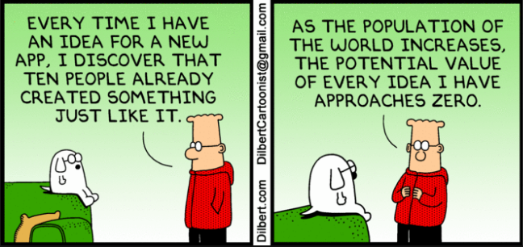
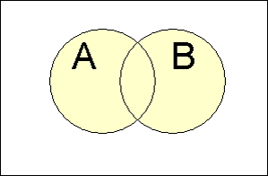
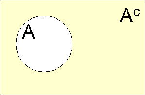
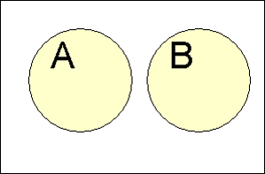
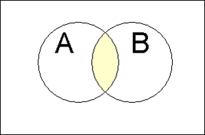

## Statistic Class Week 5



## Probability Terms

Review  

* Sampling is **with replacement** if, once selected, an individual or object is put back into the population before the next selection. 
* Sampling is **without replacement** if, once selected, an individual or object is not returned to the population prior to subsequent selections.

New  

*  A **chance experiment** is any activity or situation in which there is uncertainty about which of two or more possible outcomes will result.
The collection of all possible outcomes of a chance experiment is the **sample space** for the experiment.
*  An **event** is any collection of outcomes from the sample space of a chance experiment.  
*  A **simple event** is an event consisting of exactly one outcome.

## Probility of Events

If a chance experiment has k outcomes, all equally likely, then each individual outcome has the probability 1/k and the probability of an event E is

$$P(E) = \frac{\text{number of outcomes favorable to E}}{\text{number of outcomes in the sample space}}$$

## Probability with Dice . . . . . .   

Experiment of rolling two fair dice and observing the sum of the up faces.  A sample space description is given by.

$${(1, 1), (1, 2),..., (6, 6)}$$

where the pair (1, 2) means 1 is the 1st die and 2 is the 2nd die. This sample space  consists of 36 equally likely outcomes.  Let E stand for the event that the sum is 6.

$$P(E) = \frac{5}{36} = `r round(5/36,3)`$$

```{r echo = FALSE, warning=FALSE, message=FALSE}
df<-data.frame(A = sample(1:6,50,replace = TRUE), B = sample(1:6,50,replace = TRUE))
small<-length(df$A[df$A+df$B == 6])/length(df$A)
df<-data.frame(A = sample(1:6,5000,replace = TRUE), B = sample(1:6,500,replace = TRUE))
large<-length(df$A[df$A+df$B == 6])/length(df$A)
```

Or based on observating 50 rolls we can and calculate the relative frequency of `r round(small,3)`.

## Law of Large Numbers

**Law of Large Numbers**: As the number of repetitions of a chance experiment increases, the chance that the relative frequency of occurrence for an event will differ from the true probability of the event by more than any very small number approaches zero.

The probability of an event E, denoted by P(E), is defined to be the value approached by the **relative frequency** of occurrence of E in a very long series of trials of a chance experiment. Thus, if the number of trials is quite large,

$$P(E) \approx \frac{\text{number of time E occurs}}{\text{number of trials}}$$

Pevious example sample of 50 rolls is `r round(small,3)` whereas a sample of 500 is `r round(large,3)` compared to actual of `r round(5/36,3)`. 

## Methods for Determining Probability

1. **The classical approach**: Appropriate for experiments that can be described with equally likely outcomes.
2. **The subjective approach**: Probabilities represent an individual's judgment based on facts combined with personal evaluation of other information.
3. **The relative frequency approach**: An estimate is based on an accumulation of experimental results. This estimate, usually derived empirically, presumes a replicable chance experiment.

## Yahtzee!

1.  The classical approach
2.  The subjective approach
3.  The relative frequency approach

<div class="notes">
Classical - 6 possible Yahtzee out of $6^5$ or `r 6^5` = `r round(6/6^5,4)`... now need to calculate the probability of rolling in 2 then 3 rolls and sum.
Subjective - Who plays Yahtzee?  normally how many games until a Yahtzee?
Relative Frequency or Simulation?
</div>

## Yahtzee First Roll

```{r echo = FALSE, warning=FALSE, message=FALSE}
library(dplyr)
library(reshape2)
set.seed(31)

rolls<-50000
df<-data.frame(D1 = sample(1:6,rolls,replace = TRUE), D2 = sample(1:6,rolls,replace = TRUE),D3= sample(1:6,rolls,replace = TRUE),
               D4 = sample(1:6,rolls,replace = TRUE), D5 = sample(1:6,rolls,replace = TRUE))
df$Roll<-1:rolls

dfb<-melt(df,id.vars = "Roll")
dfb<-dfb %>% group_by(Roll, value) %>% summarize(Die_Count = length(value))
dfb<-dfb %>% group_by(Roll) %>% mutate(Max_Count = max(Die_Count)) %>% filter(Die_Count == Max_Count) %>% mutate(SEQ = 1:length(value)) %>% filter(SEQ == 1)
dfb<-dfb[,c("Roll","value","Die_Count")]
colnames(dfb)<-c("Roll","Keep","Die_Count")
df<-merge(df,dfb,by = "Roll")

one<-length(df$Roll[df$Die_Count==5])/rolls

df2<-df
df2$D1<-sample(1:6,rolls,replace = TRUE)
df2$D1[df2$Die_Count>=2]<-df2$Keep[df2$Die_Count>=2]
df2$D2<-sample(1:6,rolls,replace = TRUE)
df2$D2[df2$Die_Count>=2]<-df2$Keep[df2$Die_Count>=2]
df2$D3<-sample(1:6,rolls,replace = TRUE)
df2$D3[df2$Die_Count>=3]<-df2$Keep[df2$Die_Count>=3]
df2$D4<-sample(1:6,rolls,replace = TRUE)
df2$D4[df2$Die_Count>=4]<-df2$Keep[df2$Die_Count>=4]
df2$D5<-sample(1:6,rolls,replace = TRUE)
df2$D5[df2$Die_Count>=5]<-df2$Keep[df2$Die_Count>=5]
df2<-df2[,c("Roll","D1","D2","D3","D4","D5")]

dfb<-melt(df2,id.vars = "Roll")
dfb<-dfb %>% group_by(Roll, value) %>% summarize(Die_Count = length(value))
dfb<-dfb %>% group_by(Roll) %>% mutate(Max_Count = max(Die_Count)) %>% filter(Die_Count == Max_Count) %>% mutate(SEQ = 1:length(value)) %>% filter(SEQ == 1)
dfb<-dfb[,c("Roll","value","Die_Count")]
colnames(dfb)<-c("Roll","Keep","Die_Count")

df2<-merge(df2,dfb,by = "Roll")

two<-length(df2$Roll[df2$Die_Count==5])/rolls

df3<-df2
df3$D1<-sample(1:6,rolls,replace = TRUE)
df3$D1[df3$Die_Count>=2]<-df3$Keep[df3$Die_Count>=2]
df3$D2<-sample(1:6,rolls,replace = TRUE)
df3$D2[df3$Die_Count>=2]<-df3$Keep[df3$Die_Count>=2]
df3$D3<-sample(1:6,rolls,replace = TRUE)
df3$D3[df3$Die_Count>=3]<-df3$Keep[df3$Die_Count>=3]
df3$D4<-sample(1:6,rolls,replace = TRUE)
df3$D4[df3$Die_Count>=4]<-df3$Keep[df3$Die_Count>=4]
df3$D5<-sample(1:6,rolls,replace = TRUE)
df3$D5[df3$Die_Count>=5]<-df3$Keep[df3$Die_Count>=5]
df3<-df3[,c("Roll","D1","D2","D3","D4","D5")]

dfb<-melt(df3,id.vars = "Roll")
dfb<-dfb %>% group_by(Roll, value) %>% summarize(Die_Count = length(value))
dfb<-dfb %>% group_by(Roll) %>% mutate(Max_Count = max(Die_Count)) %>% filter(Die_Count == Max_Count) %>% mutate(SEQ = 1:length(value)) %>% filter(SEQ == 1)
dfb<-dfb[,c("Roll","value","Die_Count")]
colnames(dfb)<-c("Roll","Keep","Die_Count")

df3<-merge(df3,dfb,by = "Roll")

three<-length(df3$Roll[df3$Die_Count==5])/rolls
```

```{r echo = FALSE, warning=FALSE, message=FALSE, results='hide'}
library(googleVis)
op <- options(gvis.plot.tag='chart')
```

Percent of Yahtzee rolled on the first roll is `r round(one,3)`

```{r echo = FALSE, warning=FALSE, message=FALSE, results='asis'}
Table <- gvisTable(df[1:22,])
plot(Table)
```

## Yahtzee Second Roll

Percent of Yahtzee rolled on the second roll is `r round(two,3)`

```{r echo = FALSE, warning=FALSE, message=FALSE, results='asis'}
Table <- gvisTable(df2[1:22,])
plot(Table)
```

## Yahtzee Third Roll

Percent of Yahtzee rolled on the third roll is `r round(three,3)`

```{r echo = FALSE, warning=FALSE, message=FALSE, results='asis'}
Table <- gvisTable(df3[1:22,])
plot(Table)
```

## Probility of Events

Event|Probability
------------- | ------------
A|$P(A)\in[0,1]$
Not A|$P(A^c)=1-P(A)$, $P(A^c) + P(A) = 1$
A or B|$\begin{align}
P(A\cup B) & = P(A)+P(B)-P(A\cap B) \\
P(A\cup B) & = P(A)+P(B) \qquad\mbox{if A and B are mutually exclusive} \\
\end{align}$
A and B|$\begin{align}
P(A\cap B) & = P(A|B)P(B) = P(B|A)P(A)\\
P(A\cap B) &  = P(A)P(B) \qquad\mbox{if A and B are independent}\\
\end{align}$
A given B|$P(A \mid B) = \frac{P(A \cap B)}{P(B)} = \frac{P(B|A)P(A)}{P(B)}$

## Venn Diagram

A **Venn Diagram** is an informal picture that is used to identify relationships.  
The collection of all possible outcomes of a chance experiment are represented as the interior of a rectangle.

   
  

## Conditional Probability

Let E and F be two events with P(F) > 0. The conditional probability of the event E given that the event F has occurred, denoted by P(E|F), is

$$P(E \mid F) = \frac{P(E \cap F)}{P(F)}$$

Level	| Satisfied	| Unsatisfied	| Total
------------- | ------------ | ------------ | ------------
College	| 0.095	| 0.055	| 0.150
High School	| 0.288	| 0.220	| 0.508
Elementary	| 0.162	| 0.180	| 0.342
Total	| 0.545	| 0.455	| 1.000  

<div class="notes">
1. What is proportion of satisfied (S) college (C) teachers?  $P(S\cap C)$?  
2. What is the proportion of teachers who are college teachers given they are satisfied is?  $P(C|S)$?
</div>

## Independence

Two events E and F are said to be **independent** if P(E|F)=P(E).  

If E and F are not independent, they are said to be **dependent events**.
If P(E|F) = P(E), it is also true that P(F|E) = P(F) and vice versa.

Previous example $P(C|S) \neq P(C)$, so C and S are dependent.

Multiplication Rule for Independent Events

* The events E and F are independent if and only if
$$P(E\cap F) = P(E)P(F)$$
* The events $E_1,E_2,...,E_k$ are independent and implies
$$P(E_1 \cap E_2 \cap ... \cap E_k) = P(E_1)P(E_2)...P(E_k)$$

## General Probability Rules

Event|Probability
------------- | ------------
A|$P(A)\in[0,1]$
Not A|$P(A^c)=1-P(A)$, $P(A^c) + P(A) = 1$
A or B|$\begin{align}
P(A\cup B) & = P(A)+P(B)-P(A\cap B) \\
P(A\cup B) & = P(A)+P(B) \qquad\mbox{if A and B are mutually exclusive} \\
\end{align}$
A and B|$\begin{align}
P(A\cap B) & = P(A|B)P(B) = P(B|A)P(A)\\
P(A\cap B) &  = P(A)P(B) \qquad\mbox{if A and B are independent}\\
\end{align}$
A given B|$P(A \mid B) = \frac{P(A \cap B)}{P(B)} = \frac{P(B|A)P(A)}{P(B)}$

## General Probability Rules
If $B_1,B_2,...B_k$ are mutually exclusive events with $P(B_1)+P(B_1)+...+P(B_k) = 1$ then for any event E

The law of Total Probability
$$P(E)= P(E \cap B_1) + P(E \cap B_2) + ... + P(E \cap B_k)$$

Bays Rule
$$P(B_i|E) = \frac{P(E|B_i)P(B_i)}{P(E|B_1)P(B_1) + P(E|B_2)P(B_2) + ... + P(E|B_k)P(B_k)}$$

## Homework

Discussion Post - Infographic/App

Chapter 6

* 6.3,6.11,6.24, 6.29
* 6.31, 6.35, 6.43, 6.50
* 6.54, 6.59, 6.67, 6.81
