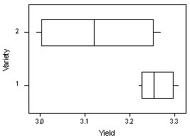

#### Concepts Review

##### With regards to the shape of a histogram, when are the mean and median equal?
	
a.	When the histogram is bimodal.
b.	When the histogram is unimodal with a longer lower tail.
c.	When the histogram is unimodal with a longer upper tail.
d.	When the histogram is symmetric. <ANSWER>

##### Which of the following is not true with regards to finding the median of a data set?

a.	The first step is to order the data set from smallest to largest.
b.	If n is odd, the sample median is the single middle value of the ordered list.
c.	If n is even the sample median is the average of the middle two values in the ordered list.
d.	Any repeated values should be removed from the data set prior to determining the median. <ANSWER>

##### What is the interquartile range of the age of seven kids randomly sampled at a local mall? The ages are 15, 18, 5, 10, 9, 12 and 13.

a.	13
b.	4.5
c.	6 <ANSWER>
d.	17.9

##### What is the value of $\sum(x-\hat(x))$ for any given set of data?
	
a.	Cannot tell from the information given.
b.	0 <ANSWER>
c.	x
d.	1

##### Fill in the blank. The __________ corresponding to a particular value tells us how many standard deviations the value is from the mean.

a.	z-score <answer>
b.	percentage
c.	proportion
d.	mean

##### According to the Empirical Rule, what percentage of the observations in a data set that can be reasonably approximated by a normal curve lie within two standard deviations of the mean?

a.	50%
b.	95%
c.	99.7%
d.	68%

##### Which of the following is a correct interpretation of the yield for variety 1 and 2 from the boxplot below?

a.	It is not reasonable to conclude that the populations (variety 1 and variety 2) have equal variances.
b.	The yield is generally greater for variety 2.
c.	The yields appear to be approximately the same for variety 1 and 2.
d.	The data are more variable for variety 1 than variety 2.

#### Homework Review

#####  Problem 4.14

Suppose 10 patients with meningitis received treatment with large doses of penicillin.  Three days later, temperatures were recorded, and the treatment was considered successful if there had been a reduction in a patient's temperature.  Denoting success by S and failture by F, the 10 observations are  

S S F S S S F F S S

Suppose that it is decided to include 15 more patients in the study.  How many of these would be to be S's to give $\hat{p} = 0.80$ for the entire sample of 25 patients?

a.	12
b.	13 <answer>
c.	15
d.  20

#####  Problem 4.29

The ministry of Health and Long-Term Care in Ontario Canada, published information on the time that patients must wait for various medical procedures on its web site (www.health.gov.on.ca). For two cardiac procedures completed in fall of 2005, the following information was provided:  

Procedure |	# Completed	Median Wait (days) | Mean Wait (days)	| 90% Completed Within (days)
------------- | ------------- | ------------- | -------------
Angioplasty	| 847	| 14	| 18	| 39
Bypass Surgery	| 539	| 13	| 19	| 42

Which of the following must be true

I.  The lower quartile for Angioplasty wait time is less than 14 days
II. The upper quartile for Bypass surgery wait time is between 13 and 19 days
III.  Only 5% of the bypass surgeries are at least longer than 42 days

a. I and II
b. I and III <answer>
c. II and III
d. All are true

#####  Problem 4.39

In a study investigating the effect of car speed on accident severity, 5000 reports of fatal automobile accidents were examined, and the vehicle speed at impact was recorded for each site.  For these 5000 accidents, the average speed was 42 mph and the standard deviation was 15 mph.  A histogram revealed that the vehicle speed at impact distribution was approzimately normal.  

Roughly what proportion of vehicle speeds exceeded 57 mph?

a.	10%
b.	16%
c.	32%
d.  68%
e.  95%

