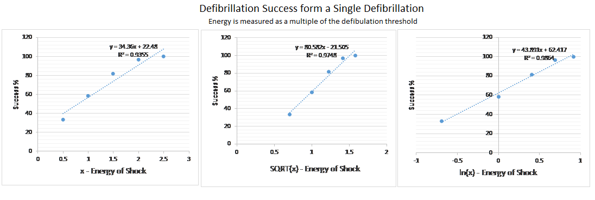

#### Concepts Review

##### Which of the following is not a property of the correlation coefficient, r?
	
a.	The value of r does not depend on the unit of measurement for either variable.
b.	The value of r is between –1 and +1.
c.	The value of r does not depend on which of the two variables is considered x.
d.	The value of r is a measure of the extent to which x and y are related. <answer>

##### Which of the following is the general equation of a straight line?

a.  $y = \frac{1}{n-1} \sum ^n _{i=1} \left( \frac{x_i - \bar{x}}{s_x} \right) \left( \frac{y_i - \bar{y}}{s_y} \right)$
b.  $y = a + bx$ <answer>
c.  $y = b^x$
d.  $y = \sqrt{\frac{1}{N-1} \sum_{i=1}^N (x_i - \overline{x})^2}$
e.  All equations could be the general equation of a straight line

#####  Fill in the blank. The __________ of a line is the amount by which y increases when x increases by 1 unit.

a.	slope <answer>
b.	mean
c.	correlation coefficient
d.	intercept

#####  Which of the following pairs of variables cannot be studied using regression?

a.	A child's age and height
b.	Inches of snowfall in a month and average temperature
c.	Worker's age and number of sick days taken per year
d.	A person's major in college and age at graduation <answer>

##### Suppose the following regression equation, y = 67.5 + 2.73x, is representative of the relationship between the weight of a bear (y) and its age (x). If a bear is 10 years old, how much would you expect it to weigh?

a.	There is not enough information given to answer the question.
b.	77.5 pounds
c.	94.8 pounds <answer>
d.	27.3 pounds

##### In a linear correlation, if y decreases as x increases, what type of correlation would be demonstrated in the graph?

a.	perfect correlation
b.	no correlation
c.	positive correlation
d.	negative correlation <answer>

##### Which of the following is the criterion used to obtain the least-squares regression line?

a. maximize a and b in y = a + bx
b. minimize a and b in y = a + bx
c. maximize $\sum ^n _{i=1} (y_i - \hat{y})^2$ where $\hat{y}= a + bx$
d. minimize $\sum ^n _{i=1} (y_i - \hat{y})^2$ where $\hat{y}= a + bx$ <answer>

##### Fill in the blank. A __________ is the difference between an observed y value and the corresponding predicted y value.

a.	residual <answer>
b.	fitted value
c.	actual value
d.	regression

##### Suppose a regression analysis gave a total sum of squares, SSTo = 1.38. Which of the following could possibly be the residual sum of squares for this regression analysis?

a.	1.38
b.	1.40
c.	Both 1.358 and 1.38 could possibly be the sum of squares residual. <answer>
d.	1.358

#####  In a study to determine whether a person's age could be used to predict the amount of retirement money they have saved, the researcher found the squared correlation to be $r^2 = 0.25$. What can you conclude from the information given?

a.	75% of the variation in people's retirement income is explained by their age.
b.	25% of the variation in people's retirement income is explained by their age. <answer>
c.	It can be concluded that there is a negative association between the two variables.
d.	0.25% of the variation in people's retirement income is explained by their age.

##### If a data point has a negative deviation where does it lie with respect to the least-squares regression line for the corresponding data set?

a.	It lies above the least-squares regression line.  
b.	A graph of the residuals is needed to determine the answer.
c.	It lies on the least-squares regression line.
d.	It lies below the least-squares regression line. <answer>

#### Homework Review

#####  Problem 5.2

Which of the following pairs of variables would you expect a negative correlation?

a.  Maximum daily temperature and cooling costs
b.	Interest rates and home loan applicants
c.	Incomes of husbands and wives when both have full-time jobs
d.  Height and shoe size

#####  Problem 5.16

In investigation on whether water temperature was related to how far a salamander would swim and whether it would swim upstream or downstream, collected data and generated a equation of y = 0.01614 x - 0.14282 where y = net directional and x = mean water temperature in degrees Celsius.

Based on the equation, what mean temperature would result in a prediction of the same number of salamander larvae moving upstream and downstream?

a. 0 degrees Celsius
b. 8.85 degrees Celsius
c. Negative 0.14 degrees Celsius
d. 0.016 degrees Celsius
e. Not enough information to calculate

#####  Problem 5.47

A study, described in the paper "Prediction of Defibrillation Success from a Single Defibrillation Threshold Measurement" (Ciculation [1988]: 1144-1149) investigated the relationship between defibrillation success and the energy of the defibrillation (expressed as a multiple of the defibrillation threshold).  Based on the data, 3 least squares regression was created using y unchanged.  

  

Which transformation would you recommend?  

a.  The Reciprocal of x, $\frac{1}{x}$
b.  The natural log of x, ln(x)
c.  The square root of x, $\sqrt{x}$ 
d.  No transformation recommended
