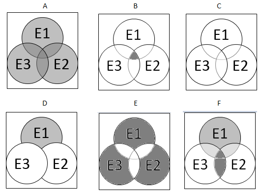

#### Concepts Review

##### Suppose R and T are two events, what is the event called in which R and T consists of all experimental outcomes that are in both the event R and the event T?

a.	It is called the conditional probability of R and T.
b.	It is called the complement of R and T. 
c.	It is called the intersection of R and T. <answer>
d.	It is called the union of R and T.

##### Which of the following statements correctly states the Law of Large Numbers?

a.	As the number of repetitions of a chance experiment decreases, the chance that the relative frequency of occurrence for an event will differ from the true probability of the event by more than any small number approaches 1.
b.	The Law of Large Numbers is any collection of possible outcomes from a chance experiment.
c.	As the number of repetitions increases for any experiment there is uncertainty concerning the result of the outcome.
d.	As the number of repetitions of a chance experiment increases, the chance that the relative frequency of occurrence for an event will differ from the true probability of the event approaches 0. <answer>

##### Suppose two coins are drawn simultaneously from a bag of quarters{Q} and nickels{N}. The type of coins drawn is recorded. What is the sample space for this experiment?

a. S = {(Q,Q),(N,N)}
b. S = {(Q,N)}
c. S = {(Q,Q),(Q,N),(N,N)} <answer>
d. S = {(Q,N),(Q,Q)}

##### How is a simple event defined?

a.	Any collection of possible outcome from a chance experiment.
b.	Any experiment for which there is uncertainty concerning the resulting outcome.
c.	The collection of all possible outcomes from a chance experiment.
d.	Any event that consists of a single outcome. <answer>

##### If two events do not contain any of the same outcomes (or simple events), the events are said to be which of the following?

a.	disjoint
b.	independent
c.	mutually exclusive
d.	both mutually exclusive and disjoint <answer>

##### Fill in the blank. One event (A) is __________ of another event (B) if the probability of event A has occurred given event B is the same as the probability that A will occur with no knowledge of B.

a.	mutually exclusive
b.	dependent
c.	disjoint
d.	independent

##### Which of the following is the definition of the union of two events T and W?

a.	The union is the event consisting of all outcomes that are in both T and W.
b.	The union is the event consisting of all outcomes that are not in T or in W.
c.	The union is the event consisting of all outcomes in either T or in W or in both T and W. <answer>
d.	The union is the event consisting of all outcomes that are not in both T and W.

Suppose the probability of event C is P(C) = 0.10 and the probability of event D is P(D) = 0.65.  If C and D are mutually exclusive then what is $P(C \cap D)$?

a. $P(C \cap D)=.35$ 
b. $P(C \cap D)=.25$ 
c. $P(C \cap D)=.75$
d. $P(C \cap D)=0$ <answer>
e. $P(C \cap D)=1$

#### Homework Review

#####  Problem 6.11

An engineering construction firm is currently working on power plants at three different sites.  Define events $E_1$,$E_2$, and $E_3$ as follows:  

$E_1$ = the plant at Site 1 is completed by the contract date  
$E_2$ = the plant at Site 2 is completed by the contract date  
$E_2$ = the plant at Site 3 is completed by the contract date  

The following Venn diagrams pictures the relationships and different outcomes of these events.  

   

Which of the following is **NOT** true?

a.  Diagram A represents at least one plant is completed by the contract date.
b.  Diagram B represents all the plants are completed by the contract date.
c.  Diagram C represents none of the plants are completed by the contract date.
d.  Diagram D represents only the plant at site one is completed by the contract date.
e.  Diagram E represents exactly one of the three plants is completed by the contract date.
f.  Diagram F represents that any 2 of the three sites are completed by the contract date. <answer>

#####  Problem 6.24

The following information for degrees awarded by U.S. colleges to Hispanic students in 2008 - 2009 academic year:

* A total 247,515 degrees were awarded to Hispanic students  
* 97,921 of these degrees were associate degrees
* 129,526 of these degrees were bachelor's degrees
* The remaining degrees were either graduate or professional degrees.

What is the probability that a randomly selected Hispanic student who received a degree in 2008-2009 academic year did not receive a bachelor's degree?

a.  .528 <answer>
b.  .472
c.  .357
d.  .643
e.  .171

#####  Problem 6.50

Approximately 30% of the calls to an airline reservation phone line result in a reservation being made.  Suppose that an operator handles 10 calls.  What is the probability that at least one call results in a reservation being made?

a.  0.028
b.  0.972 <answer>
c.  0.70
d.  0.30
e.  0.99

#####  Problem 6.54

Three friends (A,B, and C) will participate in a round-robin tournament in which each one plays both of the others.  Suppose that

P(A beats B) = .7
P(A beats C) = .8
P(B beats C) = .6

What is the probability that each person wins one match?

a. 0.336
b. 0.084
c. 0.096
d. 0.56
e. 0.18 <answer>

#### Challenge Problems

##### What is the probability that the sum of two dice will be 5 when two fair die are rolled and the sum of the dice noted?

a. P(5) = 5/6
b. P(5) = 1/6
c. P(5) = 1/36
d. P(5) = 1/9 <answer>
e. P(5) = 1/18

##### What is the probability of drawing three kings from a fair deck of cards if the three cards are drawn without replacement? Note: A fair deck of cards contains 4 kings and a total of 52 cards.

a. P(three kings) = $\frac{3}{52}$
b. P(three kings) = $\frac{4}{52} \frac{3}{51} \frac{2}{50}$ <answer>
c. P(three kings) = $\frac{4}{52} \frac{4}{52} \frac{4}{52}$
d. P(three kings) = $\frac{1}{52} \frac{1}{51} \frac{1}{50}$
e. P(three kings) = $\frac{1}{52}^3$

##### Suppose 3 graduates at a party throws their hats in the air.  The hats are mixed up and then each graduate randomly selects a hat.  What is the probability that none of the three graduates selects their original hat?

a. 1/6
b. 1/3
c. 1/2 
d. 2/3 <answer>
e. 5/6

##### A family has two children.  What is the conditional probability that both are boys given that at least one of them is a boy? Assume the sample space S = {(b,b),(b,g),(g,b),(g,g)}, and all outcomes are equally likely.

a. 1/6
b. 1/3 <answer>
c. 1/2 
d. 2/3 
e. 5/6

##### Four fair coins are flipped.  If the outcomes are assumed independent, what is the probability that two heads and two tails are obtained?

a. 1/8
b. 1/4
c. 1/2 
d. 3/8 <answer> 
e. 3/4

