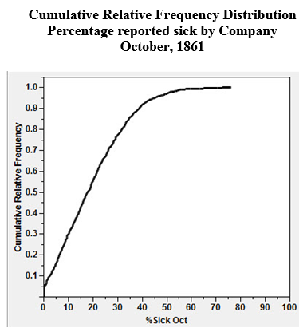
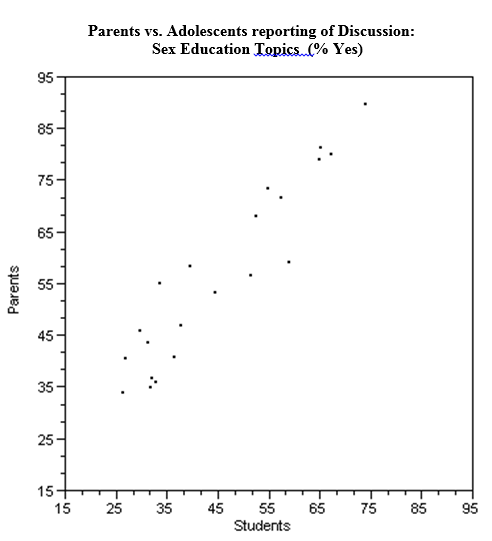
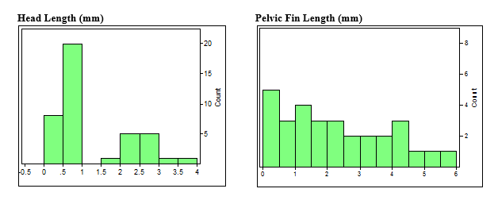

#### Multiple Choice (1 point each)

##### 1. A college admissions officer wishes to compare the SAT scores for the incoming freshmen class to the current sophomore class. Which of the following is the most appropriate technique for gathering the data needed to make this comparison?   

a. observational study
b. experiment
c. census <ANSWER>
d. sample survey
e. a doubleblind experiment

##### 2. A study of TV show genre preferences in three general geographic locations in the United States resulted in the following segmented bar chart:   

   
Which of the following has the smallest percentage?

a. The percentage of those from the West Coast who prefer Blockbuster movies. <ANSWER>
b. The percentage of those from the Midwest who prefer Reality TV.
c. The percentage of those from the East Coast who prefer either Blockbuster movies or SitComs.
d. The percentage of those from the Midwest who prefer neither SitComs nor Reality TV.
e. It is not possible to determine this without actually knowing the number of respondents in each category.

##### 3. Thirty-six students completed an algebra exam consisting of 40 questions. The score distribution is described by the following stem-and-leaf plot:

Leaf | Stem
------------- | -------------
0 |0 1 1 6
1 |2 2 3 5 7 8 8 8
2 |1 8 8 8 8 9 9 9
3 |1 2 2 2 4 6 6 6 6 6 8 8
4 |0 0 0 0

The median of the score distribution is equal to which of the following?

a. 19 
b. 18
c. 36
d. 17.5
e. 29 <ANSWER>

##### 4. Consider the following three scatterplots:

   

**Which of the following statements is (are) true?** 

I. The intercept for the line of best fit for the data in scatterplot A will be positive.   
II. The slope for the line of best fit for the data in scatterplot B will be negative.   
III. There is no discernible relationship between the variables x and y in scatterplot C.   

a. I only
b. II only
c. III only
d. II and III only
e. I and II only  <ANSWER>

##### 5. A four-year liberal arts college is deciding whether or not to begin a new graduate degree program. They wish to assess the opinion of alumni of the college. The Alumni Affairs Department decides to mail a questionnaire to a random sample of 3500 alumni from the past 30 years. Of the 3500 mailed, 679 were returned, and of these, 218 supported the launching of a new graduate degree program.   
Which of the following statements is true?

a. The population of this study consists of the 218 respondents who favor the graduate degree program.
b. The 3500 alumni who were randomly mailed a questionnaire is a representative sample of all alumni of the college for the past 30 years.  <ANSWER>
c. The population of this study consists of the 679 alumni who mailed back a response.
d. The 3500 alumni receiving the questionnaire constitute the population of the study.
e. Current students are part of the population of this study.

##### 6. The authors of the paper "Digital Inequality: Differences in Young Adults' Use of the Internet" (Communicated Research [2008]:602-621) were interested in determining if people with highter levels of education use the Internet in different ways than those who do not have as much formal education. To answer this question, they used data from a national telephone survey.  Approximately 1300 households were selected for the survey, and 270 of them completed the interview.  What type of bias should the researchers be concerned about?

a.  Selection bias
b.  Measurement bias
c.  Response bias
d.  Nonresponse bias <ANSWER>
e.  Sampling bias

##### 7. In which of the following sampling methods, are random subgroups selected from of a population and all individuals or objects included in the sample?

a. All of these choices.
b. Stratified sampling 
c. 1 in k systematic sampling
d. Cluster sampling <ANSWER>

##### 8. Suppose the number of students in a class of 35 who turn in a term paper before the due date is recorded. What type of data set is being collected

Select one:  

a. Continuous numerical
b. Categorical
c. Bivariate
d. Discrete numerical <ANSWER>

<!-- pagebreak -->

#### Multiple Choice (2 points each)

##### 1. During the first six months of the American Civil War armies were amassed as never before in history.  Large groups of men, transported far from home, lived in conditions that bred sickness.   In a recent study involving Confederate muster rolls, a researcher constructed a cumulative relative frequency distribution of the percentages of Confederate soldiers reported sick for each company.  A "Company" is a unit of soldiers, usually between about 70 and 120 in size.  The cumulative relative frequency distribution for October, 1861, is shown below.  

   

(Part a) Approximately what proportion of the Confederate companies had less than 10% sick?

a. No companies had less than 10% sick
b. 5%
c. 30%  <ANSWER>
d. 50%
e. All companies had less than 10% sick

(Part b) Approximately 50% of the companies had less than what percentage of soldiers sick?

a. 5%
b. 20% <ANSWER>
c. 50%
d. 95%
e. 100% 

##### 2.  Investigators were interested in the communication about sex and related topics between parents and 12-14 year olds.  The investigators asked students and parents whether or not they had communicated with their child/parent about topics such as pregnancy, how to say "no," and methods of contraception.  A scatter plot of their data is presented below.  Each point represents one topic listed by the investigators.  For example, 72.4% of parents and 57.6% of adolescents said the parents had discussed childbirth.  This would be recorded as the point (57.6, 72.4).

  

(Part a)  On the graph above, sketch the line , representing a line of "perfect agreement" between the parents and adolescents.

(Part b)  What is a possible explanation of the placement of the points in the scatter plot relative to the line you sketched in part (a)? 

a. The line is drawn evenly between the points to represent the line of best fit, so points are distributed evenly above and below the line to represent the variance of the sample. 
b. The line is drawn above the points to indicate the highest variance in communicatoin between children and parents.
c. A line drawn below the points represents inapproprate scaling of the axis, which create bias for the viewer of the visualization.
d. The line has no relavance to the points since the slope and intercept were not calculated to be the line of best fit.
e. All the points are above the line, indicating that for all topics, parents are generally saying that they have talked about the topics more so than indicated by the adolescents' response. 

##### 3. Marine biologists have reported the discovery of a new species of fish in the Western North Atlantic.  Data on the head length (n=41) and pelvic fin length (n=30) are shown below.

(Part a) Which all of the following distributions descriptions is NOT true?

a.	The distribution of head length is bimodal
b.	The distribution of pelvic fin length has a positive skew
c.	The distribution of pelvic fin length is multimodal
d.	The distribution of head length has a positive skew

(Part b)  The distribution of head lengths appears to be rather strange.  What do you think might account for the shape of this distribution?  

 

##### 4.After reading the description below, determine whether the study is an observational or experimental study.  Justify your answer by indicating the presence (or absense) of one of the four prinicipals of experimental design

"Before expanding the regional airport, nearby children were determined to be in one of two aircraft-noise groups (i) aircraft noise at present or (ii) aircraft noise would come with the expansion.  Three hundred twenty-six children (mean age = 10.4 years) took part in three data-collection waves, one before and two after the expansion of the airports.  After the expansion, long-term memory and reading were found to be impaired in the group newly exposed to aircraft noise." 

(Part a) Circle one:  Obervational Study or Experiment

(Part b) Indicate the presence (or absense) of one experimental prinicipal with a brief description justifying your selection in part a.

  

##### 5.After reading the description below, determine whether the study is an observational or experimental study.  Justify your answer by indicating the presence (or absense) of one of the four prinicipals of experimental design

"A business professor divided the class into two groups.  He showed students a mug and then asked students in one of the groups how much they would pay for the mug.  Students in the other group were asked how much they would sell the mug for if it belonged to them.  Surprisingly, the average value assigned to the mug was quite different for the two groups."

(Part a) Circle one:  Obervational Study or Experiment

(Part b) Indicate the presence (or absense) of one experimental prinicipal with a brief description justifying your selection in part a.

  

