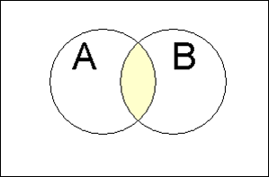

 

## Statistics

### Roll of Statistics

1.  Being an informed "Information Consumer"
2.  Understanding and Making Decisions
3.  Evaluate Decisions That Affect Your Life

### Branches of statistics

**Descriptive Statistics**   

* Organizing, Summarizing Information
    + Data and Variables
    + Population and Samples
    + Observational and Experimental Studies
* Graphical methods
    + Categorical Data
    + Numeric Data
* Numerical methods
    + Center of the data
    + Variability
    + Relative Standing
    + Association and Correlation
    + Regression   

**Inferential Statistics**   

* Probability
    + Probability of Events
    + Probability distributions
* Estimation
* Decision making

 

## Descriptive Statistics

### Organizing, Summarizing Information

#### Data and Variables

**Categorical** (or qualitative) if the individual observations are categorical responses.   
**Numerical** (or quantitative) if the individual observations are numerical responses *where numerical operations generally have meaning*.  

* Discrete if the possible values are isolated points on the number line. 
* Continuous if the set of possible values form an entire interval on the number line.   
    
Variable: A variable is any characteristic whose value may change from one individual to another.  

* A **univariate** data set consists of observations on a single variable made on individuals in a sample or population.
* A **bivariate** data set consists of observations on two variables made on individuals in a sample or population.
* A **multivariate** data set consists of observations on two or more variables made on individuals in a sample or population.

 

#### Population and Samples
**Population**: The entire collection of individuals or objects about which information is desired is called the population.  
  
**Sample**: A sample is a subset of the population, selected for study in some prescribed manner.  

* Using sample data rather than population data is more practical than a **census**.
* A Simple Random Sample of size n is a sample that is selected in a way that ensures that every different possible sample of the desired size has the same chance of being selected.  
* Sampling **with replacement** means that after each successive item is selected for the sample, the item is replaced back into the population and may therefore be selected again.  
* Sampling **without replacement** means that after an item is selected for the sample it is removed from the population and therefore cannot be selected again.  
* Divided into subpopulations called **strata**. Stratified sampling entails selecting a separate simple random sample from each of the strata.  
* Divided into non-overlapping subgroups called **clusters**. Cluster sampling entails selecting clusters at random and all individuals in the selected clusters are included in the sample. 
* **Systematic sampling** is a procedure that can be employed when it is possible to view the population of interest as consisting of a list or some other sequential arrangement. A value k is specified (a number such as 25, 100, 2500, etc). The one of the first k individuals is selected at random, and then every kth individual in the sequence is selected to be included in the sample.
* **Convenience sampling** is using and easily available or convenient group to form a sample.
* **Bias** is introduced by the way in which a sample is selected so that increasing the size of the sample does nothing to reduce the bias
    + **Selection Bias** is the tendency for samples to differ from the corresponding population as a result of systematic exclusion of some part of the population.  
    + Measurement or **Response Bias** is the tendency for samples to differ from the corresponding population because the method of observation tends to produce values that differ from the true value.  
    + **Nonresponse Bias** is the tendency for samples to differ from the corresponding population because data is not obtained from all individuals selected for inclusion in the sample.

 

#### Observational and Experimental Studies
An **observational study** observes individuals and measures variables of interest but does not attempt to influence the responses.  

A study is an **Experiment** if the values of one or more response variables are recorded when the investigator controls (or manipulates) one or more factors.  

*  An **explanatory variable** are those variables that have values that are controlled by the experimenter.  Also called factors.
*  A **response variable** is thought to be related to the explanatory variable in the experiment, but not controlled by the experimenter.
*  An **extraneous variable** is one that is not of interest in the current study but is thought to affect the response variable.
*  A **confounding variable** is one that is related both the group membership and to the response variable of interest in the research study.
Two variables are **confounded** if their effects on the response variable cannot be distinguished from one another.

The fundamental principles of statistical design of experiments are:  

1. **Randomization**:  Random assignment (of subjects to treatments or of treatments to trials) to ensure that the experiment does not systematically favor one experimental condition over another
2. **Blocking**: Using extraneous factors to create groups (blocks) that are similar. All experimental conditions are then tied in each block 
3. **Direct Control**: Holding extraneous factors constant so that their effects are not confounded with those of the experimental conditions
4. **Replication**: Ensuring that there is an adequate number of observations in each experimental condition and the study can be duplicated.

 

### Graphical methods
#### Categorical Data

Visualize proportions of the whole  

* Pie Charts
* Segmented or stacked bar charts

Visualize the comparison of groups  

*  Bar chart

#### Numeric Data

Visualizing distributions of univariate numeric data  

* Stem-and-leaf diagram
* Histogram

Visualizing relationships of bivariate numeric data  

* Scatter plots
* Line chart
* Area chart

 

### Numeric methods
#### Center of the data

The **sample mean** of a numeric sample $x_1,x_2,\ldots,x_n$, usually denoted by $\bar{x}$, is the sum of the observations divided by the number observations in the sample

The **population mean** is denoted by $\mu$, is the average of all x values in the entire population.  

The **sample median** is obtained by first ordering the n observations from smallest to largest (with any repeated values included, so that every sample observation appears in the ordered list). Then finding the middle value if n is odd or the mean of the middle two values if n is even.  

Odd data set with n = 7 

* {1, 3, 3, 6, 7, 8, 9}, the median is 6  

Even data set with n = 8  

* {1, 3, 3, 5, 6, 7, 8, 9}, the median is 5.5  

Symmetric distribution $\text{Mean} = \text{median}$   

Positively skewed distribution $\text{Mean} > \text{median}$   

Negatively skewed distribution $\text{Mean} < \text{median}$      

The **sample proportion of success**, denoted by p, is $\hat{p} = \frac {\text{number of S's in the sample}}{n}$   
Where S is the label used for the response designated as success.  The population proportion of successes is denoted by p.

 

#### Variability of Data

How much do the data vary from the center?  

* Range: Quick, does not represent all the data $\text{Range} = \text{maximum} - \text{minimum}$
* Deviations from the mean: List of numbers not useful 
* Variance, $s^2$: Not at the level of the data, but at the square of the data
* Standard deviation, s: Typical numeric representation of the deviation from the mean
* Quartiles: A measure of variability less sensitive to outliers than s
    + Lower quartile (Q1) = median of the lower half of the data set
    + Upper Quartile (Q3) = median of the upper half of the data set 
    + Interquartile range (iqr) = upper quartile - lower quartile
    + An observations is an outlier if it is more than 1.5 iqr away from the nearest quartile
    + An outlier is **extreme** if it is more than 3 iqr from the nearest quartile and it is a **mild** outlier otherwise

<big>Descriptive Statistics</big>
  

Population Mean $\mu$   
Sample Mean $\bar{x} = \frac{x_1+x_2+\cdots +x_n}{n} = \frac{\sum (x)}{n}$

* Estimating $\mu = \mu_\bar{x}$ 

Population standard deviation $\sigma$   
Sample Standard deviation $s = \sqrt{\frac{1}{N-1} \sum_{i=1}^N (x_i - \overline{x})^2}$ 

* Estimating $\sigma = \frac{\sigma_\bar{x}}{\sqrt{n}}$  

Sample proportion of success $\hat{p} = \frac {\text{number of S's in the sample}}{n}$

* Estimating $\mu_\hat{p} = p$
* Estimating $\sigma_\hat{p} = \sqrt{\frac{p(1-p)}{n}}$

 

#### Relative Standing

* Frequency for a particular category is the number of times the category appears in the data set.
    + Relative frequency for a particular category is the fraction or proportion of the time that the category appears in the data set
    + Class intervals of unequal width, the density for the class should be used for the vertical axis called the **density scale**.  $\text{Density} = \frac {\text{relative frequency of the class interval}}{\text{class interval width}}$
* Box Plot - show an observation compared to quartiles, median and outliers
* Percentile - Show percent of the observation in the data set fall at or below that value
* Chebyshev's Rule - Show percentage of observations within k, standard deviations for any distribution
    +  the number k, where k $\le$ 1. Then the percentage of observations that are within k standard deviations of the mean is at least $100 (1 - \frac{1}{k^2}) %$
* Empirical Rule - Show percentage of observations within 1,2 and 3 standard deviations for a normal distribution
    + Approximately 68% of the observations are within 1 standard deviation of the mean.
    + Approximately 95% of the observations are within 2 standard deviation of the mean.
    + Approximately 99.7% of the observations are within 3 standard deviation of the mean.
* Z Score - Standardized score of number of standard deviations from the mean and used to calculate percentile for a normal distribution.   
$$\text{Z} = \frac{x- \bar{x}}{S}$$

 

#### Association and Correlation

**Positive Association** - Two variables are positively associated when above-average values of one tend to accompany above-average values of the other and below-average values tend similarly to occur together. (i.e., Generally speaking, the y values tend to increase as the x values increase.)

**Negative Association** - Two variables are negatively associated when above-average values of one accompany below-average values of the other, and vice versa. (i.e., Generally speaking, the y values tend to decrease as the x values increase.)

Pearson **Correlation Coefficient**, r, is a measure of the strength of the linear relationship between the two variables is called the Pierson correlation coefficient.  

 

#### Regression

Object of a regression analysis is to use information about one variable, x, predict the value of a second variable, y.  Multiple regression uses multiple variables to predict y.

The most widely used criterion for measuring the goodness of fit of a line **y = a + bx** to bivariate data $(x_1, y_1), (x_2, y_2),(x_n,y_n)$ is the sum of the of the squared deviations about the line.

$$SSD = \sum ^n _{i=1} (y_i - (a - bx_i))^2$$   

The line that gives the best fit to the data is the one that minimizes this sum; it is called the **least squares** line or **simple regression** line. The equation is represented by **$\hat{y} = a + bx$**.   

The **predicted** or **fitted** values result form substituting each sample x value into the equation for the least squares line.  This gives

$$\hat{y}_1 = a + bx_1 = \text{1st predicted value}$$
$$\hat{y}_2 = a + bx_2 = \text{2nd predicted value}$$
$$\hat{y}_n = a + bx_n = \text{nth predicted value}$$

The **residuals** for the least squares line are the values: $y_1-\hat{y}_1, y_2-\hat{y}_2,...,y_2-\hat{y}_2$   

The **coefficient of determination**, denoted by $r^2$, gives the proportion of variation in y that can be attributed to an approximate linear relationship between x and y.  Note that the coefficient of determination is the square of the Pearson correlation coefficient.   

The **standard deviation about the least squares line** is denoted $s_e$ is interpreted as the "typical" amount by which an observation deviates from the least squares line.   

A general additive **multiple regression** model $y = \alpha + \beta_1 x_1 + \beta_2 x_2 + \dots + \beta_k x_k + e$   

* Polynomial regression model $y = \alpha + \beta_1 x + \beta_2 x^2 + \dots + \beta_k x^k + e$   
* Quadratic regression model $y = \alpha + \beta_1 x + \beta_2 x^2$   

**Dummy variables** or **indicator variables** can be created to utilize categorical variables in a regression model.   

The **adjusted R-Squared** adjusts for the amount of explanatory variables (k) added to the model relative to data points (n).  

 

Regression steps for Bivariate Numeric Dataset   

1. Summarize with scatterplot
2. Determine linear relationship
3. Find equation of least-squares regression line
4. Construct residual plot to look for patterns
5. Compare $s_e$ and $r^2$
6. Decide if least-squares line is useful for predictions
7. Use regression line for prediction   

<big>Correlation and Regression</big>
  

Correlation Coefficient $r = r_{xy} = \frac{\sum (Z_x Z_y)}{n-1} = \frac{1}{n-1} \sum ^n _{i=1} \left( \frac{x_i - \bar{x}}{s_x} \right) \left( \frac{y_i - \bar{y}}{s_y} \right)$   

Least Squares Line **$\hat{y} = a + bx$** where  

* Slope of $b = \frac{S_{xy}}{S_{xx}} = \frac{\sum ((x -\bar{x})(y -\bar{y}))}{\sum (x -\bar{x})^2}$
* Intercept of $a = \bar{y} - b\bar{x}$   

Residual sum of squares   
$SSResid = \sum ^n _{i=1} (y_i - (a + bx_i))^2 = \sum ^n _{i=1} (y_i - \hat{y})^2$   
Total sum of squares, $SSTo = \sum ^n _{i=1} (y_i - \bar{y})^2$     

Standard deviation about the least squares line   
$s_e = \sqrt{\frac{SSResid}{n-2}} \text{ or for multiple regression } s_e = \sqrt{\frac{SSResid}{n-(k+1)}}$   
Standard deviation about the slope (b), confidence interval df = n - 2   
$s_b = \frac{S_e}{\sqrt{S_{xx}}}, b \pm (\text{t critical value}) s_b$   
Coefficient of determination 

*  $r^2 = 1 - \frac{\text{SSResid}}{\text{SSTo}}$   
*  Adjusted $r^2 = 1 - [\frac{n-1}{n-(k+1)}] \frac{\text{SSResid}}{\text{SSTo}}$

 

### Descriptive Review Questions
**Consider the following output obtained when analyzing the percent nitrogen composition of soil collected in neighborhoods near a water treatment facility in 2015.**   

NumCases = 55   
Mean = 23.01   
Median = 24.26   
StdDev = 4.131   
Min = 12.05   
Max = 31.49   
75 %ile = 30.12   

**Which of the following statements is correct?**   <NO ANSWER NEEDS REVIEW>

a. The 25th percentile must be about 18.4.
b. Some outliers appear to be present. 
c. The IQR is 19.44
d. About 10% of the values are in the range 30.12 to 31.49.
e. Soil levels at 11% exist in the sample, but are not prevalent.

**The CEO of a software company is interested in the effects of playing two different versions of a new video game on the pulse rate of players. Forty beta-testers were identified online to participate in the study.**   

**All 40 participants measured their at-rest pulse rates. Each participant will play each version of the game for twenty minutes. The experimenter flips a coin to determine which version each participant will play first. All participants get sufficient rest between gameplay to allow their pulse rates to return to their normal at-rest states.**   
**The experiment then compares elevation in pulse rate resulting from playing version 1 to elevation in pulse rate resulting from playing version 2 for each participant.**   

**Which of the following statements is true?**   

a. The design of the experiment is flawed because subjects were not randomly assigned to a control or an experimental group.
b. This is an example of a completely randomized comparative experiment without blocking.
c. This is an observational study and not an experiment, so no conclusion can be reached regarding the connection between version of the game and pulse rate that is characteristic of the overall population of video game players.
d. All observations in this study are independent.
e. Blocking is used in this study to reduce the difference in elevated pulse rates of the two observations for each individual participant.  <ANSWER>
  
**What type of bias occurs when the sample selected systematically excludes some part of the population being studied?**
  
a.	Response bias
b.	Nonresponse bias
c.	Measurement bias
d.	Selection bias <answer>
  
**What is used to ensure there is an adequate number of observations in each experimental condition?**
  
a.	Replication <answer>
b.	Confounding
c.	Direct control
d.	Blocking

**What term is used when a study collects information from the entire population?**

a.	Replication
b.	Sampling
c.	Census <answer>
d.	Bias

**Which of the following is the definition of a sample chosen by cluster sampling?**

a.	Random selection of one of the first k elements in list, and then the systematic selection of every kth element thereafter in the population.
b.	A simple random sample from each of a given number of subpopulations.
c.	A sample that is obtained by using an easily available or convenient group.
d.	A simple random sample of clusters from the available clusters in the population. <answer>
  
**Which of the following cannot be conveyed using a stem-and-leaf display?**
  
a.	The extent of symmetry in the distribution of values.
b.	The order in which the observations were obtained. <answer>
c.	The presence of any gaps in the data.
d.	The presence of any outliers.

**Fill in the blank. The effect of a confounding variable on the response variable __________ the effect of the explanatory variable.**

a.	cannot be distinguished from <answer>
b.	is larger than
c.	can be distinguished from
d.	equals

 

## Inferential Statistics
### Probability

Methods for Determining Probability

1. **The classical approach**: Appropriate for experiments that can be described with equally likely outcomes.
2. **The subjective approach**: Probabilities represent an individual's judgment based on facts combined with personal evaluation of other information.
3. **The relative frequency approach**: An estimate is based on an accumulation of experimental results. This estimate, usually derived empirically, presumes a replicable chance experiment.

**Law of Large Numbers**: As the number of repetitions of a chance experiment increases, the chance that the relative frequency of occurrence for an event will differ from the true probability of the event by more than any very small number approaches zero.   

A **chance experiment** is any activity or situation in which there is uncertainty about which of two or more possible outcomes will result.  The collection of all possible outcomes of a chance experiment is the **sample space** for the experiment.   

*  An **event** is any collection of outcomes from the sample space of a chance experiment.  
*  A **simple event** is an event consisting of exactly one outcome.
*  A **Venn Diagram** is an informal picture that is used to identify relationships.  
The collection of all possible outcomes of a chance experiment are represented as the interior of a rectangle.

Union  | Intersection
------------- | -------------
 | 

Complement | Mutually Exclusive
------------- | -------------
 | 

 

#### Probility of Events
If a chance experiment has k outcomes, all equally likely, then each individual outcome has the probability 1/k and the probability of an event E is

$$P(E) = \frac{\text{number of outcomes favorable to E}}{\text{number of outcomes in the sample space}}$$

Two events E and F are said to be **independent** if P(E|F)=P(E).  If E and F are not independent, they are said to be **dependent events**.   

Two events are **mutually exclusive** if they have no out-comes in common. The term **disjoint** is also sometimes used to describe events that have no outcomes in common.   

 

#### Probability distributions

The probability distribution of a **discrete random variable x** gives the probability associated with each possible x value.

1. For every possible x value, $0 \le p(x) \le 1$.
2. $\sum p(x) = 1$  

A probability distribution for a **continuous random variable x** is specified by a mathematical function denoted by f(x) which is called the **density function**.  The graph of a density function is a smooth curve (the **density curve**). 

The following requirements must be met:  

1. f(x) > 0 
2. The total area under the density curve is equal to 1.

Discrete Probability distribution Types   

* Binomial - Flip a coin
* Geometric - Number of coin flips until heads 

Continuous Probability distribution Types   

* Normal - Apple falls from the tree
* Uniform - Rain, sun shinning or leaves falling
* Poisson - Number of people arriving into an emergency department on a given hour

<big>Probability Events</big>
   

Event|Probability
------------- | ------------
A|$P(A)\in[0,1]$
Not A|$P(A^c)=1-P(A)$, $P(A^c) + P(A) = 1$
A or B|$\begin{align}
P(A\cup B) & = P(A)+P(B)-P(A\cap B) \\
P(A\cup B) & = P(A)+P(B) \qquad\mbox{if A and B are mutually exclusive} \\
\end{align}$
A and B|$\begin{align}
P(A\cap B) & = P(A|B)P(B) = P(B|A)P(A)\\
P(A\cap B) &  = P(A)P(B) \qquad\mbox{if A and B are independent}\\
\end{align}$
A given B|$P(A \mid B) = \frac{P(A \cap B)}{P(B)} = \frac{P(B|A)P(A)}{P(B)}$

Law of Total Probability $P(E)= P(E \cap B_1) + P(E \cap B_2) + ... + P(E \cap B_k)$  
Bays Rule $P(B_i|E) = \frac{P(E|B_i)P(B_i)}{P(E|B_1)P(B_1) + P(E|B_2)P(B_2) + ... + P(E|B_k)P(B_k)}$  

<big>Discrete Probability Random Variable</big>
   

Mean $\mu_x = \sum xp(x)$,  Variance $\sigma_x^2 = \sum (x- \mu_x)^2p(x)$   

Binomial Distribution  

* $P(x) = \binom n x  p^x(1-p)^{n-x} \text{ where } \binom n x =\frac{n!}{x!(n-x)!}$
* $\mu_x = np  \text{ and } \sigma_x = \sqrt{np(1-p)}$

Geometric Distribution  

* $P(x) = p(1-p)^(x-1)$

 

### Estimation

#### Sampling Distrubtion
Any quantity computed from values in a sample is called a **statistic**.

The observed value of a statistic depends on the particular sample selected from the population; typically, it varies from sample to sample. This variability is called **sampling variability**.

The distribution of a statistic is called its **sampling distribution**.

When random samples are selected form a population, the following are properties of the sampling distribution of $\bar{x}$.

1. $\mu = \mu_\bar{x}$ 
2. $\sigma = \frac{\sigma_\bar{x}}{\sqrt{n}}$  
This rule is approximately correct as long as no more than 5% of the population is included in the sample.
3. When the population distribution is normal, the sampling distribution of $\bar{x}$ is also normal for any sample size n.
4. When n is sufficiently large, the sampling distribution of $\bar{x}$ is approximately normally distributed, even when the population distribution is not itself normal.
    + Central Limit Theorem: If n is large (n exceeds 30) or the population distribution is normal, the standardized variable Z has (approximately) a standard normal (z) distribution regardless of the underlying distribution.

Let $\hat{p}$ be the proportion of successes in a random sample of size n from a population whose proportion of S's (successes) is p. Denote the mean of p by $\mu_\hat{p}$ and the standard deviation by $\sigma_\hat{p}$.  When random samples are selected from a population, the following are properties of the sampling distribution $\hat{p}$

1.  $\mu_\hat{p} = p$
2.  $\sigma_\hat{p} = \sqrt{\frac{p(1-p)}{n}}$
3. When n is large and p is not too near 0 or 1, the sampling distribution of p is approximately normal.

 

#### Point Esimation
A **point estimate** of a population characteristic is a single number that is based on sample data and represents a plausible value of the characteristic

A statistic with mean value equal to the value of the population characteristic being estimated is said to be an **unbiased** statistic. A statistic that is not unbiased is said to be **biased**.

A  **confidence interval** an interval of plausible values for a population characteristic. It is constructed so that, with a chosen degree of confidence, the value of the characteristic will be captured inside the interval.
* The **bound on error estimation**, B, represents the confidence interval quantity.  Also called the **margin of error**.
* The sample size, n, can be calulcated with the desired confidence interval and bound of error.

The **confidence level** is the success rate of the method used to construct a confidence interval.

When $\sigma$ is unknown $\mu$ can be estimated with the Student's **t distribution** depending on the **degrees of freedom** which is the number of values in the final calculation of a statistic that are free to vary.

Estimate | Bound of Error (B) | Confidence Interval | n with 95% confidence | Notes
------------- | ------------ | ------------ | ------------ | ------------
$\text{z} = \frac{x- \bar{x}}{\sigma}$ | $(\text{z critical value})*(\frac{\sigma}{\sqrt{n}})$ | $\bar{x} \pm B$ | $n = (\frac{1.96\sigma}{B})^2$ | $\begin{align}\text{Critical Value of 90%}=1.645\\
\text{Critical Value of 95%}=1.96\\
\text{Critical Value of 99%}=2.58\end{align}$ 
$t = \frac{\bar{x}-\mu}{\frac{s}{\sqrt{n}}}$ | $(\text{t critical value})*(\frac{s}{\sqrt{n}})$ | $\bar{x} \pm B$ | | df = n-1 and see table for t critical values
$\text{z} = \frac{\hat{p}- p}{\sqrt{\frac{p(1-p)}{n}}}$ | $(\text{z critical value})*\sqrt{\frac{p(1-p)}{n}}$ | $\hat{p} \pm B$ | $n = p(1-p)(\frac{1.96}{B})^2$ | Use p=.5 for conservative estimates of n and always round up.
For $\mu_1 - \mu_2$ | $\text{t critical value})\sqrt{\frac{s_1^2}{n_1} + \frac{s_2^2}{n_2}}$ | $(\bar{x}_1 - \bar{x}_2) \pm B$ | | $df = \frac{(V_1 + V_2)^2}{\frac{V_1^2}{n_1-1}+\frac{V_2^2}{n_2-1}}$ where $V_1 = \frac{s_1^2}{n_1}$ and $V_2 = \frac{s_2^2}{n_2}$
For $p_1 - p_2$ | $\text{z critical value})\sqrt{\frac{\hat{p_1}(1-\hat{p_1})}{n_1}+\frac{\hat{p_2}(1-\hat{p_2})}{n_2}}$ |$\hat{p_1} - \hat{p_2} \pm B$

 

### Decision making

#### Hypothesis Testing

Hypothesis Structure:   
The **null hypothesis**, denoted $H_0$ is a statement or claim about a population characteristic that is initially assumed to be true.   

The **alternate hypothesis**, denoted by $H_a$ is the competing claim.   
The alternate hypothesis is a statement about the same population characteristic that is used in the null hypothesis   

Typically one assumes the null hypothesis to be true and then one of the following conclusions are drawn.  

1.  Reject $H_0$
    + Equivalent to saying that $H_a$ is correct or true
2.  Fail to reject $H_0$
    + Equivalent to saying that we have failed to show a statistically significant deviation from the claim

Hypothesis form:     

$H_0$: population characteristic = hypothesized value   
where the hypothesized value is a specific number determined by the problem context.  

The alternative (or alternate) hypothesis will have one of the following three forms:   

* $H_a$: population characteristic > hypothesized value
* $H_a$: population characteristic < hypothesized value
* $H_a$: population characteristic $\ne$ hypothesized value

Errors in Hypothesis Testing:   

**Type I error (False Positive)** : The error of rejecting $H_0$ when $H_0$ is true.  Probability of a Type I error is denoted $\alpha$ and is called the **level of significance** of the test.  

**Type II error (False Negative)**: The error of failing to rejected $H_0$ when $H_0$ is false.  Probability of a Type II error is denoted by $\beta$.  

Null hypothesis $H_0$ | Valid/True | Invalid/False 
----------------|------------|----------------
Reject $H_0$ |$\begin{align}
\mbox{Type I error, } \alpha \\
\mbox{(False Positive)}  \\
\end{align}$| $\begin{align}
\mbox{Correct inference} \\
\mbox{(True Positive)}  \\
\end{align}$
Fail to reject $H_0$ |$\begin{align}
\mbox{Correct inference} \\
\mbox{(True Negative)}  \\
\end{align}$| $\begin{align}
\mbox{Type II error, } \beta \\
\mbox{(False Negative)}  \\
\end{align}$

 

A **test statistic** is the function of sample data on which a conclusion to reject or fail to reject $H_0$ is based.   

The  **P-value** (also called the **observed significance level**) is a measure of inconsistency between the hypothesized value for a population characteristic and the observed sample. A decision as to whether $H_0$ should be rejected results from comparing the P-value to the chosen $\alpha$:

* Reject $H_0$  if P-value $\le \alpha$.
* Fail to reject $H_0$ if P-value > $\alpha$.   

The **power of a test** is the probability of rejecting the null hypothesis

When $H_0$ is false, the power is the probability that the null hypothesis is rejected. Specifically,  power = 1 - $\beta$.

Steps in a Hypothesis-Testing Analysis: 

1.  Describe (determine) the population characteristic about which hypotheses are to be tested.
2.  State the null hypothesis $H_0$.
3.  State the alternate hypothesis $H_a$.
4.  Select the significance level $\alpha$ for the test.
5.  Display the test statistic to be used, with substitution of the hypothesized value identified in step 2 but without any computation at this point.
6.  Check to make sure that any assumptions required for the test are reasonable.
7.  Compute all quantities appearing in the test statistic and then the value of the test statistic itself.
8.  Determine the P-value associated with the observed value of the test statistic
9.  State the conclusion in the context of the problem, including the level of significance.

**Independent samples** Two samples where the individuals or objects in the first sample are selected independently from those in the second sample.

**Paired samples** Two samples for which each observation in one sample is paired in a meaningful way with a particular observation in a second sample.

Categorical Data and **Goodness-of-Fit**   

*  Univariate categorical data is best summarized in a **one-way frequency table**, which gives the number of times (frequencies) each of the possible categories in the data set occurs. 
*  Bivariate categorical data can be summarized in a **two-way frequency table** or **contingency table**.  Additionally **margin totals** are obtained by adding the observed cell counts in each row and column of the table.

 

Test | Null hypothesis | Alternative Hypothesis | Test statistic | P-Value | 
------------- | ------------ | ------------ | ------------ | ------------
Large-Sample for p | p = hypothesized value | $\begin{align}
p > \text{hypothesized value}\\
p < \text{hypothesized value}\\
p \ne \text{hypothesized value}\\
\end{align}$ | $\text{z} = \frac{\hat{p}- \text{hypothesized value}}{\sqrt{\frac{\text{hypothesized value}(1-\text{hypothesized value})}{n}}}$ | $\begin{align}
\text{Area right of z}\\
\text{Area left of z}\\
2\text{(Area right or left of z)}\\
\end{align}$
One-Sample for $\mu$ | $\mu$ = hypothesized value | $\begin{align}
\mu > \text{hypothesized value}\\
\mu < \text{hypothesized value}\\
\mu \ne \text{hypothesized value}\\
\end{align}$| $t = \frac{\bar{x}-\text{hypothesized value}}{\frac{s}{\sqrt{n}}}$ | $\begin{align}
\text{Area right of t}\\
\text{Area left of t}\\
\text{2(Area right or left of t)}\\
\end{align}$
Two-Sample for $\mu_1 - \mu_2$ | $\mu_1 - \mu_2$ = hypothesized value | $\begin{align}
\mu_1 - \mu_2 > \text{hypothesized value}\\
\mu_1 - \mu_2 < \text{hypothesized value}\\
\mu_1 - \mu_2 \ne \text{hypothesized value}\\
\end{align}$| $t = \frac{\bar{x}_1-\bar{x}_2-\text{hypothesized value}}{\sqrt{\frac{s_1^2}{n_1}+\frac{s_2^2}{n_2}}}$,$df = \frac{(V_1 + V_2)^2}{\frac{V_1^2}{n_1-1}+\frac{V_2^2}{n_2-1}}$ where $V_1 = \frac{s_1^2}{n_1}$ and $V_2 = \frac{s_2^2}{n_2}$ | $\begin{align}
\text{Area right of t}\\
\text{Area left  of t}\\
\text{2(Area right or left of t)}\\
\end{align}$
Paired for $\mu_d$ | $\mu_d$ = hypothesized value | $\begin{align}
\mu_d > \text{hypothesized value}\\
\mu_d < \text{hypothesized value}\\
\mu_d \ne \text{hypothesized value}\\
\end{align}$| $t = \frac{\bar{x}_d-\text{hypothesized value}}{\frac{s_d}{\sqrt{n}}}$ | $\begin{align}
\text{Area right of t}\\
\text{Area left of t}\\
\text{2(Area right or left of t)}\\
\end{align}$
Large-Sample for $p_1 - p_2$ | $p_1 - p_2$ = hypothesized value | $\begin{align}
p_1 - p_2 > \text{hypothesized value}\\
p_1 - p_2 < \text{hypothesized value}\\
p_1 - p_2 \ne \text{hypothesized value}\\
\end{align}$| $z = \frac{\hat{p_1} - \hat{p_2}}{\sqrt{\frac{\hat{p_c}(1-\hat{p_c})}{n_1}+\frac{\hat{p_c}(1-\hat{p_c})}{n_2}}}$, $\hat{p_c} = \frac{n_1\hat{p_1} + n_2\hat{p_2}}{n_1 + n_2}$ | $\begin{align}
\text{Area right of z}\\
\text{Area left of z}\\
\text{2(Area right or left of z)}\\
\end{align}$   

 
Test | Hypothesis |  Test statistic | P-Value | 
------------- | ------------ | ------------ | ------------
Goodness-of-fit | $\begin{align}H_0: p_1  = \text{hypothesized proportion for Category 1}\\
p_2  = \text{hypothesized proportion for Category 2}\\
\vdots\\
p_k  = \text{hypothesized proportion for Category k}\end{align}$ $\begin{align}H_a: H_0 \text{ is not true}\end{align}$ | $\chi^2 = \sum{\frac{(\text{oberved cell count - expected cell count})^2}{\text{expected cell count}}}$ | Area to the right of $\chi^2$ under the df = k-1 chi-squared curve.   

 

### Inferential Review Questions
**Does playing the television during an 8-hour workday reduce a pet Siberian Husky dog's activity level during the day? An experiment was conducted where a group of Siberian Huskies was divided into two groups. The television was played in the household for one group, and it was not played for the control group. Activity level was assessed as being the number of hours the dog was engaged in activities other than lying down or eating. The average decrease in activity level for the groups measured is 3.6 hours.**   

**A 95% confidence interval for the difference (treatment - control) in the mean activity levels was computed to be (2.5, 4.7). Which of the following is an accurate interpretation of this interval?**

a. We do not know the true decrease in activity level in Siberian Huskies due to television exposure, but we are 95% confident that the increase in the mean decrease lies in this interval. <ANSWER>
b. Because the confidence interval does not include zero, we are 95% confident that the true decrease in activity level in Siberian Huskies is 3.6 hours.
c. We are 95% confident that the average decrease in activity level in the sample is 3.6 hours.
d. Because the confidence interval does not contain zero, we are 95% confident that there was no effect of playing the television on decreasing activity level in Siberian Huskies.
e. The activity level of 95% of the Siberian Huskies decreased by between 2.5 and 4.7 hours.

**A die has eight faces, all of which are equally likely to occur. Two of the faces have the number 8 printed on them, four of the faces have the number 24 printed on them, one face has the number 80 printed on it, and one face has the number 0 printed on it. What is the expected value of the sum if one were to roll three such dice?**   

a. 72 <ANSWER>
b. 112
c. 37.3
d. 24
e. 14

**Suppose R and T are two events, what is the event called in which R and T consists of all experimental outcomes that are in both the event R and the event T?**

a.	It is called the conditional probability of R and T.
b.	It is called the complement of R and T. 
c.	It is called the intersection of R and T. <answer>
d.	It is called the union of R and T.

**What is the probability of drawing three kings from a fair deck of cards if the three cards are drawn without replacement? Note: A fair deck of cards contains 4 kings and a total of 52 cards.**

a. P(three kings) = $\frac{3}{52}$
a. P(three kings) = $\frac{4}{52} \frac{3}{51} \frac{2}{50}$ <answer>
a. P(three kings) = $\frac{4}{52} \frac{4}{52} \frac{4}{52}$
a. P(three kings) = $\frac{1}{52} \frac{1}{51} \frac{1}{50}$

**During the pre-deployment check of a city snowplow, the driver discovers a warning light that indicates that the coolant level may be low. If he decides to check the coolant level, it will delay the deployment by 30 minutes. If he decides to ignore the warning light, the snowplow might overheat before completing its route. If a hypothesis were to be performed, which of the following would be the appropriate null hypothesis and Type I error?**

a. Null hypothesis: assume the coolant level should be checked   
Type I error: decide to ignore the warning light when, in fact, the coolant level was low  <ANSWER>
b. Null hypothesis: assume the coolant level should be checked   
Type I error: decide to check the coolant level when, in fact, the level is sufficiently high
c. Null hypothesis: assume that the snowplow already has a delayed deployment   
Type I error: decide to ground the snowplow until repairs can be made even if it is not broken
d. Null hypothesis: assume the warning light can be ignored   
Type I error: decide to ignore the warning light when, in fact, the coolant level was low
e. Null hypothesis: assume the warning light cannot be ignored   
Type I error: decide to check the coolant level when, in fact, the level is low
