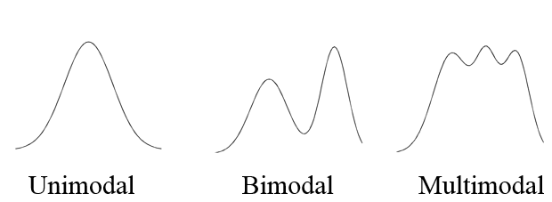
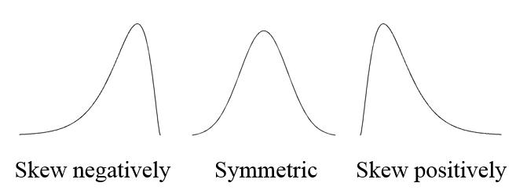
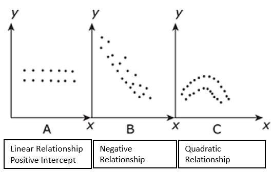

 

## Statistics

### Roll of Statistics

1.  Being an informed "Information Consumer"
2.  Understanding and Making Decisions
3.  Evaluate Decisions That Affect Your Life

### Branches of statistics

**Descriptive Statistics**   

* Organizing, Summarizing Information
    + Data and Variables
    + Population and Samples
    + Observational and Experimental Studies
* Graphical methods
    + Categorical Data
    + Numeric Data
* Numerical methods
    + Center of the data
    + Variability
    + Relative Standing
    + Association and Correlation
    + Regression   

**Inferential Statistics**   

* Probability
    + Probability of Events
    + Probability distributions
* Estimation
* Decision making

 

## Descriptive Statistics

### Organizing, Summarizing Information

#### Data and Variables

**Categorical** (or qualitative) if the individual observations are categorical responses.   
**Numerical** (or quantitative) if the individual observations are numerical responses *where numerical operations generally have meaning*.  

* Discrete if the possible values are isolated points on the number line. 
* Continuous if the set of possible values form an entire interval on the number line.   
    
Variable: A variable is any characteristic whose value may change from one individual to another.  

* A **univariate** data set consists of observations on a single variable made on individuals in a sample or population.
* A **bivariate** data set consists of observations on two variables made on individuals in a sample or population.
* A **multivariate** data set consists of observations on two or more variables made on individuals in a sample or population.

 

#### Population and Samples
**Population**: The entire collection of individuals or objects about which information is desired is called the population.  
  
**Sample**: A sample is a subset of the population, selected for study in some prescribed manner.  

* Using sample data rather than population data is more practical than a **census**.
* A Simple Random Sample of size n is a sample that is selected in a way that ensures that every different possible sample of the desired size has the same chance of being selected.  
* Sampling **with replacement** means that after each successive item is selected for the sample, the item is replaced back into the population and may therefore be selected again.  
* Sampling **without replacement** means that after an item is selected for the sample it is removed from the population and therefore cannot be selected again.  
* Divided into subpopulations called **strata**. Stratified sampling entails selecting a separate simple random sample from each of the strata.  
* Divided into non-overlapping subgroups called **clusters**. Cluster sampling entails selecting clusters at random and all individuals in the selected clusters are included in the sample. 
* **Systematic sampling** is a procedure that can be employed when it is possible to view the population of interest as consisting of a list or some other sequential arrangement. A value k is specified (a number such as 25, 100, 2500, etc). The one of the first k individuals is selected at random, and then every kth individual in the sequence is selected to be included in the sample.
* **Convenience sampling** is using and easily available or convenient group to form a sample.
* **Bias** is introduced by the way in which a sample is selected so that increasing the size of the sample does nothing to reduce the bias
    + **Selection Bias** is the tendency for samples to differ from the corresponding population as a result of systematic exclusion of some part of the population.  
    + Measurement or **Response Bias** is the tendency for samples to differ from the corresponding population because the method of observation tends to produce values that differ from the true value.  
    + **Nonresponse Bias** is the tendency for samples to differ from the corresponding population because data is not obtained from all individuals selected for inclusion in the sample.

 

#### Observational and Experimental Studies
An **observational study** observes individuals and measures variables of interest but does not attempt to influence the responses.  

A study is an **Experiment** if the values of one or more response variables are recorded when the investigator controls (or manipulates) one or more factors.  

*  An **explanatory variable** are those variables that have values that are controlled by the experimenter.  Also called factors.
*  A **response variable** is thought to be related to the explanatory variable in the experiment, but not controlled by the experimenter.
*  An **extraneous variable** is one that is not of interest in the current study but is thought to affect the response variable.
*  A **confounding variable** is one that is related both the group membership and to the response variable of interest in the research study.
Two variables are **confounded** if their effects on the response variable cannot be distinguished from one another.

The fundamental principles of statistical design of experiments are:  

1. **Randomization**:  Random assignment (of subjects to treatments or of treatments to trials) to ensure that the experiment does not systematically favor one experimental condition over another
2. **Blocking**: Using extraneous factors to create groups (blocks) that are similar. All experimental conditions are then tied in each block 
3. **Direct Control**: Holding extraneous factors constant so that their effects are not confounded with those of the experimental conditions
4. **Replication**: Ensuring that there is an adequate number of observations in each experimental condition and the study can be duplicated.

 

### Graphical methods
#### Categorical Data

Visualize proportions of the whole  

* Pie Charts
* Segmented or stacked bar charts

Visualize the comparison of groups  

*  Bar chart

#### Univariate Numeric Data

Visualizing distributions of univariate numeric data  

* Dot plot (quick on paper with small data set)
* Stem-and-leaf diagram (quick on paper with small data set)
* Histogram

##### Frequency Distribution

Bin  | Frequency | Relative Frequency | Cummulative Frequency | Cummulative Percentage | Density
------------- | ------------- | ------------- | ------------- | ------------- | -------------
First class interval or bin range | Count of observations in range | Percent of observations | Count of obervations at or below range | Percent of obervations at or below range | $\frac {\text{relative frequency of the class interval}}{\text{class interval width}}$
Second class interval or bin range | Count of observations in range | Percent of observations | Count of obervations at or below range | Percent of obervations at or below range | $\frac {\text{relative frequency of the class interval}}{\text{class interval width}}$
Third class interval or bin range | Count of observations in range | Percent of observations | Count of obervations at or below range | Percent of obervations at or below range | $\frac {\text{relative frequency of the class interval}}{\text{class interval width}}$
Etc. | Etc.| Etc.| Etc.| Etc.| Etc.|

##### Center of the data

The **sample mean** of a numeric sample $x_1,x_2,\ldots,x_n$, usually denoted by $\bar{x}$, is the sum of the observations divided by the number observations in the sample

The **sample median** is obtained by first ordering the n observations from smallest to largest (with any repeated values included, so that every sample observation appears in the ordered list). Then finding the middle value if n is odd or the mean of the middle two values if n is even.  

Symmetric distribution:  $\text{Mean} = \text{median}$  

Positively skewed distribution:  $\text{Mean} > \text{median}$  

Negatively skewed distribution:  $\text{Mean} < \text{median}$   

#### Bivariate Numeric Data

Visualizing relationships of bivariate numeric data  

* Scatter plots

* Line chart
* Area chart