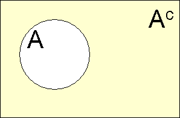
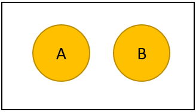

 

## Statistics

### Roll of Statistics

1.  Being an informed "Information Consumer"
2.  Understanding and Making Decisions
3.  Evaluate Decisions That Affect Your Life

### Branches of statistics

**Descriptive Statistics**   

* Organizing, Summarizing Information
    + Data and Variables
    + Population and Samples
    + Observational and Experimental Studies
* Graphical methods
    + Categorical Data
    + Numeric Data
* Numerical methods
    + Center of the data
    + Variability
    + Relative Standing
    + Association and Correlation
    + Regression   

**Inferential Statistics**   

* Probability
    + Probability of Events
    + Probability distributions
* Estimation
* Decision making

 

## Descriptive Statistics
### Organizing, Summarizing Information
#### Data and Variables

**Categorical** (or qualitative) if the individual observations are categorical responses.   
**Numerical** (or quantitative) if the individual observations are numerical responses *where numerical operations generally have meaning*.  

* Discrete if the possible values are isolated points on the number line. 
* Continuous if the set of possible values form an entire interval on the number line.   
    
Variable: A variable is any characteristic whose value may change from one individual to another.  

* A **univariate** data set consists of observations on a single variable made on individuals in a sample or population.
* A **bivariate** data set consists of observations on two variables made on individuals in a sample or population.
* A **multivariate** data set consists of observations on two or more variables made on individuals in a sample or population.

 

#### Population and Samples
**Population**: The entire collection of individuals or objects about which information is desired is called the population.  
  
**Sample**: A sample is a subset of the population, selected for study in some prescribed manner.  

* Using sample data rather than population data is more practical than a **census**.
* A Simple Random Sample of size n is a sample that is selected in a way that ensures that every different possible sample of the desired size has the same chance of being selected.  
* Sampling **with replacement** means that after each successive item is selected for the sample, the item is replaced back into the population and may therefore be selected again.  
* Sampling **without replacement** means that after an item is selected for the sample it is removed from the population and therefore cannot be selected again.  
* Divided into subpopulations called **strata**. Stratified sampling entails selecting a separate simple random sample from each of the strata.  
* Divided into non-overlapping subgroups called **clusters**. Cluster sampling entails selecting clusters at random and all individuals in the selected clusters are included in the sample. 
* **Systematic sampling** is a procedure that can be employed when it is possible to view the population of interest as consisting of a list or some other sequential arrangement. A value k is specified (a number such as 25, 100, 2500, etc). The one of the first k individuals is selected at random, and then every kth individual in the sequence is selected to be included in the sample.
* **Convenience sampling** is using and easily available or convenient group to form a sample.
* **Bias** is introduced by the way in which a sample is selected so that increasing the size of the sample does nothing to reduce the bias
    + **Selection Bias** is the tendency for samples to differ from the corresponding population as a result of systematic exclusion of some part of the population.  
    + Measurement or **Response Bias** is the tendency for samples to differ from the corresponding population because the method of observation tends to produce values that differ from the true value.  
    + **Nonresponse Bias** is the tendency for samples to differ from the corresponding population because data is not obtained from all individuals selected for inclusion in the sample.

 

#### Observational and Experimental Studies
An **observational study** observes individuals and measures variables of interest but does not attempt to influence the responses.  

A study is an **Experiment** if the values of one or more response variables are recorded when the investigator controls (or manipulates) one or more factors.  

*  An **explanatory variable** are those variables that have values that are controlled by the experimenter.  Also called factors.
*  A **response variable** is thought to be related to the explanatory variable in the experiment, but not controlled by the experimenter.
*  An **extraneous variable** is one that is not of interest in the current study but is thought to affect the response variable.
*  A **confounding variable** is one that is related both the group membership and to the response variable of interest in the research study.
Two variables are **confounded** if their effects on the response variable cannot be distinguished from one another.

The fundamental principles of statistical design of experiments are:  

1. **Randomization**:  Random assignment (of subjects to treatments or of treatments to trials) to ensure that the experiment does not systematically favor one experimental condition over another
2. **Blocking**: Using extraneous factors to create groups (blocks) that are similar. All experimental conditions are then tied in each block 
3. **Direct Control**: Holding extraneous factors constant so that their effects are not confounded with those of the experimental conditions
4. **Replication**: Ensuring that there is an adequate number of observations in each experimental condition and the study can be duplicated.

 

### Graphical methods
#### Categorical Data

Visualize proportions of the whole  

* Pie Charts
* Segmented or stacked bar charts

Visualize the comparison of groups  

*  Bar chart  

#### Univariate Numeric Data

Visualizing distributions of univariate numeric data  

* Dot plot (quick on paper with small data set)
* Stem-and-leaf diagram (quick on paper with small data set)
* Histogram

##### Frequency Distribution

Bin  | Frequency | Relative Frequency | Cummulative Frequency | Cummulative Percentage | Density
------------- | ------------- | ------------- | ------------- | ------------- | -------------
First class interval or bin range | Count of observations in range | Percent of observations | Count of obervations at or below range | Percent of obervations at or below range | $\frac {\text{relative frequency of the class interval}}{\text{class interval width}}$
Second class interval or bin range | Count of observations in range | Percent of observations | Count of obervations at or below range | Percent of obervations at or below range | $\frac {\text{relative frequency of the class interval}}{\text{class interval width}}$
Third class interval or bin range | Count of observations in range | Percent of observations | Count of obervations at or below range | Percent of obervations at or below range | $\frac {\text{relative frequency of the class interval}}{\text{class interval width}}$
Etc. | Etc.| Etc.| Etc.| Etc.| Etc.|

##### Center of the data

The **sample mean** of a numeric sample $x_1,x_2,\ldots,x_n$, usually denoted by $\bar{x}$, is the sum of the observations divided by the number observations in the sample

The **sample median** is obtained by first ordering the n observations from smallest to largest (with any repeated values included, so that every sample observation appears in the ordered list). Then finding the middle value if n is odd or the mean of the middle two values if n is even.  

Symmetric distribution:  $\text{Mean} = \text{median}$  

Positively skewed distribution:  $\text{Mean} > \text{median}$  

Negatively skewed distribution:  $\text{Mean} < \text{median}$   

#### Bivariate Numeric Data

Visualizing relationships of bivariate numeric data  

* Scatter plots

* Line chart
* Area chart

### Numeric methods
#### Center of the data

The **sample mean** of a numeric sample $x_1,x_2,\ldots,x_n$, usually denoted by $\bar{x}$, is the sum of the observations divided by the number observations in the sample

The **population mean** is denoted by $\mu$, is the average of all x values in the entire population.  

The **sample median** is obtained by first ordering the n observations from smallest to largest (with any repeated values included, so that every sample observation appears in the ordered list). Then finding the middle value if n is odd or the mean of the middle two values if n is even.  

Odd data set with n = 7 

* {1, 3, 3, 6, 7, 8, 9}, the median is 6  

Even data set with n = 8  

* {1, 3, 3, 5, 6, 7, 8, 9}, the median is 5.5  

Symmetric distribution $\text{Mean} = \text{median}$   

Positively skewed distribution $\text{Mean} > \text{median}$   

Negatively skewed distribution $\text{Mean} < \text{median}$      

The **sample proportion of success**, denoted by p, is $\hat{p} = \frac {\text{number of S's in the sample}}{n}$   
Where S is the label used for the response designated as success.  The population proportion of successes is denoted by p.

 

#### Variability of Data

How much do the data vary from the center?  

* Range: Quick, does not represent all the data $\text{Range} = \text{maximum} - \text{minimum}$
* Deviations from the mean: List of numbers not useful 
* Variance, $s^2$: Not at the level of the data, but at the square of the data
* Standard deviation, s: Typical numeric representation of the deviation from the mean
* Quartiles: A measure of variability less sensitive to outliers than s
    + Lower quartile (Q1) = median of the lower half of the data set
    + Upper Quartile (Q3) = median of the upper half of the data set 
    + Interquartile range (iqr) = upper quartile - lower quartile
    + An observations is an outlier if it is more than 1.5 iqr away from the nearest quartile
    + An outlier is **extreme** if it is more than 3 iqr from the nearest quartile and it is a **mild** outlier otherwise

<h3>Numeric Methods</h3>
  

Numeric Method  | Numeric | Categorical
------------- | ------------- | -------------
Center  | Sample Mean $\bar{x} = \frac{x_1+x_2+\cdots +x_n}{n} = \frac{\sum (x)}{n}$  | Sample proportion of success $\hat{p} = \frac {\text{number of S's in the sample}}{n}$
Variability  | Sample Standard deviation $s = \sqrt{\frac{1}{N-1} \sum_{i=1}^N (x_i - \overline{x})^2}$  |   
Relative Standing Statistic  | Z SCORE $\text{z} = \frac{x- \bar{x}}{\sigma}$  |  
Percentage calculation for normal distributions | Use formula of *=NORM.DIST(Z SCORE,0,1,TRUE)* or statistical table |

 

#### Relative Standing

* Frequency for a particular category is the number of times the category appears in the data set.
    + Relative frequency for a particular category is the fraction or proportion of the time that the category appears in the data set
    + Class intervals of unequal width, the density for the class should be used for the vertical axis called the **density scale**.  $\text{Density} = \frac {\text{relative frequency of the class interval}}{\text{class interval width}}$
* Box Plot - show an observation compared to quartiles, median and outliers
* Percentile - Show percent of the observation in the data set fall at or below that value
* Chebyshev's Rule - Show percentage of observations within k, standard deviations for any distribution
    +  the number k, where k $\le$ 1. Then the percentage of observations that are within k standard deviations of the mean is at least $100 (1 - \frac{1}{k^2}) %$
* Empirical Rule - Show percentage of observations within 1,2 and 3 standard deviations for a normal distribution
    + Approximately 68% of the observations are within 1 standard deviation of the mean.
    + Approximately 95% of the observations are within 2 standard deviation of the mean.
    + Approximately 99.7% of the observations are within 3 standard deviation of the mean.
* Z Score - Standardized score of number of standard deviations from the mean and used to calculate percentile for a normal distribution.   
$$\text{Z} = \frac{x- \bar{x}}{S}$$

 

#### Association and Correlation

**Positive Association** - Two variables are positively associated when above-average values of one tend to accompany above-average values of the other and below-average values tend similarly to occur together. (i.e., Generally speaking, the y values tend to increase as the x values increase.)

**Negative Association** - Two variables are negatively associated when above-average values of one accompany below-average values of the other, and vice versa. (i.e., Generally speaking, the y values tend to decrease as the x values increase.)

Pearson **Correlation Coefficient**, r, is a measure of the strength of the linear relationship between the two variables is called the Pierson correlation coefficient.  

 

#### Regression

Object of a regression analysis is to use information about one variable, x, predict the value of a second variable, y.  Multiple regression uses multiple variables to predict y.

The most widely used criterion for measuring the goodness of fit of a line **y = a + bx** to bivariate data $(x_1, y_1), (x_2, y_2),(x_n,y_n)$ is the sum of the of the squared deviations about the line.

$$SSD = \sum ^n _{i=1} (y_i - (a - bx_i))^2$$   

The line that gives the best fit to the data is the one that minimizes this sum; it is called the **least squares** line or **simple regression** line. The equation is represented by **$\hat{y} = a + bx$**.   

The **predicted** or **fitted** values result form substituting each sample x value into the equation for the least squares line.  This gives

$$\hat{y}_1 = a + bx_1 = \text{1st predicted value}$$
$$\hat{y}_2 = a + bx_2 = \text{2nd predicted value}$$
$$\hat{y}_n = a + bx_n = \text{nth predicted value}$$

The **residuals** for the least squares line are the values: $y_1-\hat{y}_1, y_2-\hat{y}_2,...,y_2-\hat{y}_2$   

The **coefficient of determination**, denoted by $r^2$, gives the proportion of variation in y that can be attributed to an approximate linear relationship between x and y.  Note that the coefficient of determination is the square of the Pearson correlation coefficient.   

The **standard deviation about the least squares line** is denoted $s_e$ is interpreted as the "typical" amount by which an observation deviates from the least squares line.   

A general additive **multiple regression** model $y = \alpha + \beta_1 x_1 + \beta_2 x_2 + \dots + \beta_k x_k + e$   

* Polynomial regression model $y = \alpha + \beta_1 x + \beta_2 x^2 + \dots + \beta_k x^k + e$   
* Quadratic regression model $y = \alpha + \beta_1 x + \beta_2 x^2$   

**Dummy variables** or **indicator variables** can be created to utilize categorical variables in a regression model.   

The **adjusted R-Squared** adjusts for the amount of explanatory variables (k) added to the model relative to data points (n).  

 

Regression steps for Bivariate Numeric Dataset   

1. Summarize with scatterplot
2. Determine linear relationship
3. Find equation of least-squares regression line
4. Construct residual plot to look for patterns
5. Compare $s_e$ and $r^2$
6. Decide if least-squares line is useful for predictions
7. Use regression line for prediction   

<big>Correlation and Regression</big>
  

Correlation Coefficient $r = r_{xy} = \frac{\sum (Z_x Z_y)}{n-1} = \frac{1}{n-1} \sum ^n _{i=1} \left( \frac{x_i - \bar{x}}{s_x} \right) \left( \frac{y_i - \bar{y}}{s_y} \right)$   

Least Squares Line **$\hat{y} = a + bx$** where  

* Slope of $b = \frac{S_{xy}}{S_{xx}} = \frac{\sum ((x -\bar{x})(y -\bar{y}))}{\sum (x -\bar{x})^2}$
* Intercept of $a = \bar{y} - b\bar{x}$   

Residual sum of squares   
$SSResid = \sum ^n _{i=1} (y_i - (a + bx_i))^2 = \sum ^n _{i=1} (y_i - \hat{y})^2$   
Total sum of squares, $SSTo = \sum ^n _{i=1} (y_i - \bar{y})^2$     

Standard deviation about the least squares line   
$s_e = \sqrt{\frac{SSResid}{n-2}} \text{ or for multiple regression } s_e = \sqrt{\frac{SSResid}{n-(k+1)}}$   
Standard deviation about the slope (b), confidence interval df = n - 2   
$s_b = \frac{S_e}{\sqrt{S_{xx}}}, b \pm (\text{t critical value}) s_b$   
Coefficient of determination 

*  $r^2 = 1 - \frac{\text{SSResid}}{\text{SSTo}}$   
*  Adjusted $r^2 = 1 - [\frac{n-1}{n-(k+1)}] \frac{\text{SSResid}}{\text{SSTo}}$

 

## Inferential Statistics
### Probability

Methods for Determining Probability

1. **The classical approach**: Appropriate for experiments that can be described with equally likely outcomes.
2. **The subjective approach**: Probabilities represent an individual's judgment based on facts combined with personal evaluation of other information.
3. **The relative frequency approach**: An estimate is based on an accumulation of experimental results. This estimate, usually derived empirically, presumes a replicable chance experiment.

**Law of Large Numbers**: As the number of repetitions of a chance experiment increases, the chance that the relative frequency of occurrence for an event will differ from the true probability of the event by more than any very small number approaches zero.   

A **chance experiment** is any activity or situation in which there is uncertainty about which of two or more possible outcomes will result.  The collection of all possible outcomes of a chance experiment is the **sample space** for the experiment.   

*  An **event** is any collection of outcomes from the sample space of a chance experiment.  
*  A **simple event** is an event consisting of exactly one outcome.
*  A **Venn Diagram** is an informal picture that is used to identify relationships.  
The collection of all possible outcomes of a chance experiment are represented as the interior of a rectangle.

Union  | Intersection
------------- | -------------
 | 

Complement | Mutually Exclusive
------------- | -------------
 | 

 

#### Probility of Events
If a chance experiment has k outcomes, all equally likely, then each individual outcome has the probability 1/k and the probability of an event E is

$$P(E) = \frac{\text{number of outcomes favorable to E}}{\text{number of outcomes in the sample space}}$$

Two events E and F are said to be **independent** if P(E|F)=P(E).  If E and F are not independent, they are said to be **dependent events**.   

Two events are **mutually exclusive** if they have no out-comes in common. The term **disjoint** is also sometimes used to describe events that have no outcomes in common.   

 
